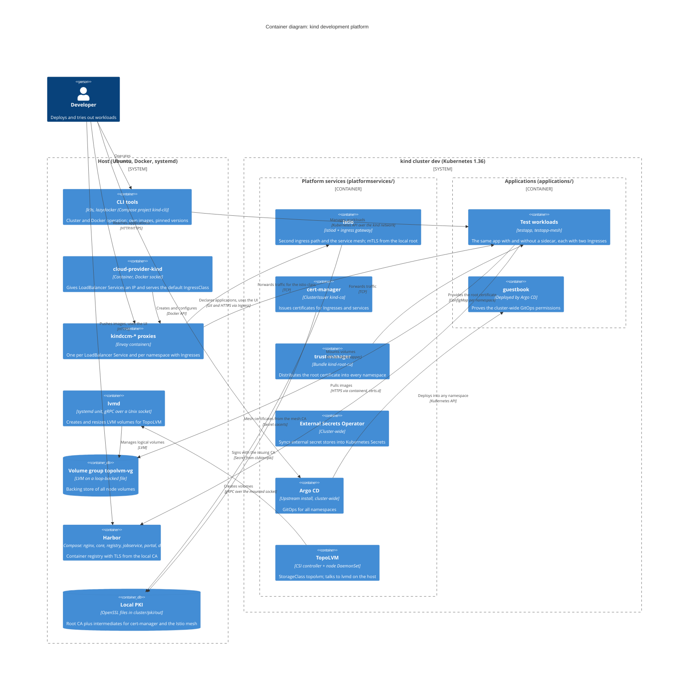
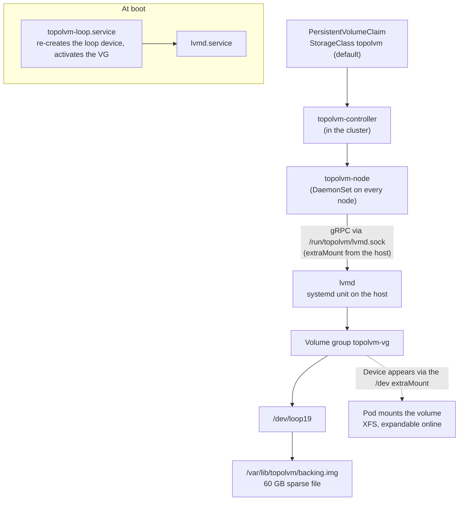
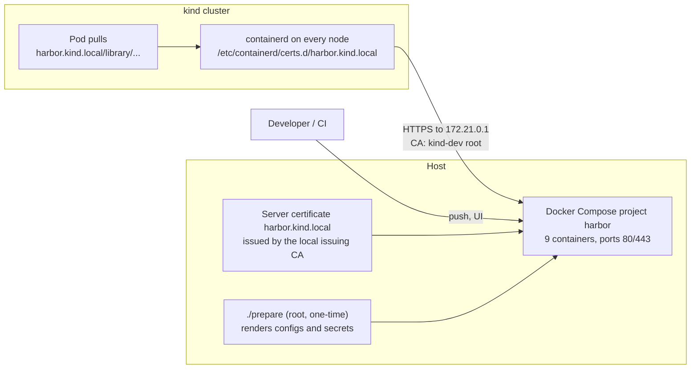

# Architecture

Local Kubernetes development platform on [kind](https://kind.sigs.k8s.io/):
one host, one cluster, everything reproducible from this repository.

- **Purpose:** trying out platform components (ingress, service mesh, GitOps,
  secrets, certificates, storage, registry) close to how they behave in
  production, on a laptop.
- **How it came to be:** [`update-setup-01.md`](update-setup-01.md) (applied
  2026-09-15) and [`update-setup-02.md`](update-setup-02.md) (applied
  2026-09-16). This file describes the result and records the decisions.
- **Operating instructions:** [`README.md`](README.md).

## Quality goals

| Goal | Why |
| --- | --- |
| Reproducible | The whole platform comes back from `cluster/cluster.sh up` plus `./deploy.sh`; versions are pinned |
| Disposable cluster, durable data | Certificates, LVM volumes and registry images survive `cluster.sh down` |
| Production-like | Real ingress paths, mTLS, GitOps, CSI storage and a registry with TLS, rather than shortcuts |
| Modest resources | Runs next to a desktop on a 16 GB laptop |
| Portable | Nothing depends on this machine beyond Docker, LVM and systemd; a move to WSL2 stays possible |

## Constraints

- **Host:** Ubuntu 24.04, Docker on **ZFS**, 16 GB RAM, Wi-Fi with DHCP.
- **kind nodes are containers:** their `/dev` is a tmpfs copy, kubelet and
  containerd run inside them, and host services are reachable over the `kind`
  Docker network (`172.21.0.0/16`).
- **No public DNS or CA:** names end in `.kind.local`, certificates come from a
  local CA.

## C4 container diagram

## Storage

Volumes are LVM logical volumes on the host. `lvmd` runs there as a systemd
unit; the kind nodes reach its socket and the LVM devices through `extraMounts`.

- **Node-local:** `WaitForFirstConsumer`, so the pod is scheduled first and the
  volume is created on its node.
- **Fallback:** kind's `standard` (local-path) stays available.
- **Snapshots** would need a thin pool; the device class for that is prepared in
  `storage/lvmd.yaml` but commented out.

## Registry

Harbor runs on the host, so images outlive the cluster.

- **Trust:** the certificate comes from the same local CA as everything else, so
  the nodes and the host verify it without exceptions.
- **Name resolution:** `registry/kind-trust.sh` writes the `/etc/hosts` entry,
  the CA and `hosts.toml` into the nodes after every cluster creation.
- **Privileges:** only `prepare` needs root; running Harbor does not.

---

# Architecture decisions

Format after Michael Nygard: context, decision, consequences. Status values are
*Accepted*, *Superseded* or *Proposed*.

## ADR-0001: kind as the local Kubernetes platform, versions pinned

**Date:** 2026-09-15 · **Status:** Accepted

**Context.** The setup should be recreatable at will and behave like a real
multi-node cluster. The predecessor (2023) used an unpinned kind v0.20 with
Kubernetes 1.27, which had drifted out of support.

**Decision.** kind v0.33 with a node image pinned by digest (Kubernetes 1.36.4),
one control plane and two workers. All cluster and CLI versions live in
`versions.env`; platform service versions are pinned in their
`kustomization.yaml`.

**Consequences.** Rebuilds are reproducible, and upgrades are single, visible
changes. The node image is tied to Istio's supported Kubernetes range, so
component upgrades have to be coordinated. Three nodes cost roughly 2.8 GB RAM.

## ADR-0002: cloud-provider-kind instead of MetalLB

**Date:** 2026-09-15 · **Status:** Accepted

**Context.** The old setup ran MetalLB with a hard-coded address pool that had to
match the Docker network, defined in three overlapping places. `LoadBalancer`
Services and a default Ingress were needed.

**Decision.** cloud-provider-kind runs as a container on the host. It assigns
LoadBalancer IPs from the kind network and provides the default IngressClass
`cloud-provider-kind`.

**Consequences.** No address pools to maintain, and Ingress with TLS works out of
the box. Each namespace with Ingresses gets its own IP. The client source IP is
lost, because Envoy proxies without PROXY protocol. The container needs the
Docker socket, which is root-equivalent access to the host.

## ADR-0003: Istio as a second ingress path; Traefik removed

**Date:** 2026-09-15 · **Status:** Accepted

**Context.** Traefik and Istio both wanted to be the ingress, and Traefik shipped
old `v1alpha2` Gateway API CRDs that conflicted with Istio. Comparing "plain
Kubernetes" against "service mesh" routing was a goal, though.

**Decision.** Traefik goes; Istio provides a second path through IngressClass
`istio`, next to `cloud-provider-kind`. Applications carry one Ingress per path,
so the same workload is reachable both ways.

**Consequences.** Both paths can be compared directly, with one CRD set in the
cluster. Istio TLS secrets have to live in `istio-system`, which is why there's a
wildcard certificate. Traefik-specific features are gone (nothing used them). The
Traefik folder was a separate git repository with unpushed work, so it was moved
to `~/dev/traefik` rather than deleted.

## ADR-0004: Istio per namespace, sidecar mode

**Date:** 2026-09-15 · **Status:** Accepted

**Context.** Mesh and non-mesh behaviour should be observable side by side, and
platform components shouldn't be dragged into the mesh unintentionally.

**Decision.** Sidecar injection is opt-in per namespace via
`istio-injection=enabled`. Platform namespaces are explicitly `disabled`. The
test application is deployed twice: `testapp` and `testapp-mesh`.

**Consequences.** Policies such as STRICT mTLS can be tried on one namespace
while another stays untouched (verified: the vanilla path then fails, the Istio
path keeps working). Pods need a restart when a namespace changes. Ambient mode
remains a later option.

## ADR-0005: Platform services as one Kustomize tree

**Date:** 2026-09-15 · **Status:** Accepted

**Context.** The old setup mixed Helm releases, a kustomize Helm generator and
plain manifests. A single, reviewable description of the platform was wanted,
ideally one Argo CD could consume later.

**Decision.** Every platform service is a Kustomize directory; Helm charts come
in through `helmCharts`. `platformservices/kustomization.yaml` renders everything
at once (246 resources). Applying happens in dependency order through
`platformservices/deploy.sh`, with controllers and their custom resources in
separate directories.

**Consequences.** One format, one render, `kubectl diff` on the whole platform,
and a tree Argo CD can adopt. Lost: Helm release history and `helm rollback`.
`kubectl apply` doesn't prune, so removals need manual cleanup. Rendering needs
`helm` on `PATH` and network access.

## ADR-0006: Repository layout by lifecycle

**Date:** 2026-09-15 · **Status:** Accepted

**Context.** Everything used to live under `deployments/`, mixing cluster setup,
platform services and test applications.

**Decision.** Top-level folders by purpose and lifecycle: `cluster/` (cluster and
PKI), `cli/` (tools), `platformservices/`, `applications/`, and later `storage/`
and `registry/` for the host-side parts.

**Consequences.** It's obvious where something belongs and what runs on the host
versus in the cluster. Host-side folders contain scripts that need root once,
which is documented in each of them.

## ADR-0007: Local two-tier PKI with name constraints

**Date:** 2026-09-15 · **Status:** Accepted

**Context.** Certificates were needed for Ingress TLS and the service mesh,
without warnings in the browser, and without a public CA. Adding a self-signed
root to the host's trust store is a risk if its key leaks.

**Decision.** An OpenSSL root CA on the host (10 years), **name-constrained** to
`kind.local`, `svc`, `cluster.local` and `localhost`, plus two intermediates:
one for cert-manager (`ClusterIssuer kind-ca`) and one for the Istio mesh CA
(`cacerts`). trust-manager distributes the root certificate to all namespaces.
The root key is only needed to issue intermediates and can be kept offline.

**Consequences.** Every certificate, including mesh certificates, chains to one
root; the host can trust it safely (verified: certificates for `example.com` are
rejected). The intermediate keys live in cluster Secrets. There's no CRL or
OCSP: revocation means re-issuing an intermediate. Renewal of leaf certificates
is automatic, the intermediates expire after three years.

## ADR-0008: Argo CD through the Argo CD Operator

**Date:** 2026-09-15 · **Status:** Superseded by ADR-0009

**Context.** Argo CD 2.5.8 was installed as an 11,000-line manifest. An operator
promised lifecycle management through a custom resource.

**Decision.** Install the Argo CD Operator v0.18.0 without OLM and manage an
`ArgoCD` resource.

**Consequences.** It would have added a CRD, a conversion webhook needing
cert-manager wiring, and a cluster-scope environment variable. It also pinned
Argo CD to v3.3.10, which upstream tests only up to Kubernetes 1.35 — while this
cluster runs 1.36.

## ADR-0009: One Argo CD instance from the upstream manifests

**Date:** 2026-09-15 · **Status:** Accepted (supersedes ADR-0008)

**Context.** See ADR-0008. What was actually needed: one instance that can deploy
into every namespace.

**Decision.** The upstream `install.yaml` at tag v3.5.3, pulled in by Kustomize,
in its cluster-wide variant. `server.insecure` is set through a patch on
`argocd-cmd-params-cm`; TLS is terminated at our own Ingress.

**Consequences.** Fewer moving parts, the current Argo CD version (tested with
Kubernetes 1.36), and its settings are normal Kustomize patches. Argo CD has
cluster-wide permissions, which is what makes one instance for all namespaces
possible; `AppProject`s limit what gets deployed where. Upgrades mean changing a
tag, without a Helm release to roll back.

## ADR-0010: CLI tools as containers with their own images

**Date:** 2026-09-15 · **Status:** Accepted

**Context.** k9s and lazydocker shouldn't have to be installed on the host, must
match the cluster version, and should always use the cluster's kubeconfig
regardless of the current context.

**Decision.** A Compose project `kind-cli` with locally built images (k9s v0.51.0
plus matching kubectl; lazydocker v0.25.2), binaries verified by checksum. k9s
uses `kind get kubeconfig --internal` over the kind network; its port-forwards
listen on `0.0.0.0` in the container and are published on `127.0.0.1:18000-18009`.

**Consequences.** Independent of the host's tooling and kubectl skew, and the
current context can't send commands to the wrong cluster. Upstream images are
unusable (outdated, old kubectl), so the images are ours to rebuild. lazydocker
needs the Docker socket, and port-forwards only work within the published range.

## ADR-0011: Disable local storage capacity isolation (ZFS)

**Date:** 2026-09-15 · **Status:** Accepted

**Context.** The cluster wouldn't start: the kubelet exited with
`failed to get rootfs info` because Docker's storage here is ZFS and the vendored
cAdvisor (v0.56.2) shells out to a `zfs` binary that doesn't exist in the node
image. The fix is upstream but unreleased (kind#4229).

**Decision.** `localStorageCapacityIsolation: false` in the kubelet
configuration. Mounting `/dev/zfs` was rejected: the missing binary is the
problem, not the device.

**Consequences.** The cluster starts. Pods' `ephemeral-storage` requests and
limits are not enforced, and nodes don't report ephemeral-storage capacity. On a
non-ZFS host, or once a release ships the fix, the setting can go. A ZFS-enabled
node image would work here but wouldn't be portable to WSL2.

## ADR-0012: Remove the Gateway API "safe-upgrades" policy

**Date:** 2026-09-15 · **Status:** Accepted

**Context.** The Gateway API v1.6.2 bundle installs a `ValidatingAdmissionPolicy`
that rejects older CRD versions. cloud-provider-kind creates its embedded v1.5.0
CRDs at startup, was denied before the usual "already exists" answer, and stopped
with `Failed to start cloud controller`.

**Decision.** `cluster/cluster.sh` deletes the policy and its binding right after
installing the CRDs.

**Consequences.** cloud-provider-kind starts and keeps our newer CRDs (verified).
Accidental downgrades of the Gateway API CRDs are no longer prevented; only
`cluster.sh` installs them.

## ADR-0013: TopoLVM with lvmd on the host for node volumes

**Date:** 2026-09-16 · **Status:** Accepted

**Context.** Kafka/Strimzi and databases want block-backed local storage;
Strimzi explicitly advises against file storage such as NFS. kind's local-path
offers no expansion, no snapshots and no capacity handling. Alternatives were
weighed: NFS (file storage), JuiceFS (FUSE, no block), Ceph/Rook (gigabytes of
RAM, monitor IPs pinned), OpenEBS ZFS (needs a `zfs` binary in the nodes and
isn't portable), csi-driver-host-path (a demo driver).

**Decision.** TopoLVM (chart 17.2.0) with `lvmd` as a systemd unit on the host,
against a volume group on a loop-backed 60 GB file. The nodes get `/dev` and the
`lvmd` socket through `extraMounts`. `topolvm` becomes the default StorageClass;
`standard` stays as a fallback.

**Consequences.** Real LVM volumes with online expansion (verified 1 → 3 GiB
including the filesystem), no extra data plane, and low memory use. Volumes are
node-local and have no snapshots without a thin pool. Logical volumes outlive the
cluster and need cleaning up. The host mount of `/dev` widens what the (already
privileged) nodes can see. A loop file on ZFS means copy-on-write twice.

## ADR-0014: Harbor on the host as the registry

**Date:** 2026-09-16 · **Status:** Accepted

**Context.** A registry was needed that survives cluster rebuilds and speaks TLS
the cluster trusts. Alternatives: a plain registry (zot, distribution) without a
UI, or Harbor in the cluster via Helm, whose data would then die with the cluster.

**Decision.** Harbor v2.15.2 in Docker Compose on the host, with a server
certificate from the local issuing CA. The nodes learn the host entry, the CA and
a containerd `hosts.toml` through `registry/kind-trust.sh`. Harbor's `install.sh`
is not used: it requires the obsolete `docker-compose` v1 binary.

**Consequences.** Images and Harbor's features (UI, RBAC, scanning) survive
cluster rebuilds; the cluster pulls over TLS without exceptions (verified, 199 ms
with a cleared node cache). Harbor needs about 4 GB RAM when running and can be
stopped when not needed. `kind-trust.sh` has to run after every cluster creation.

## ADR-0015: Root only for Harbor's `prepare`, not for running it

**Date:** 2026-09-16 · **Status:** Accepted

**Context.** Harbor's installer runs everything as root. `prepare` is a
`--privileged` container with the host filesystem mounted at `/hostfs`, and it
writes configs and secrets as root with mode 0640, which initially forced
`docker compose` to run as root as well. Running the installation entirely
without root is an open upstream issue (goharbor/harbor#17494).

**Decision.** `prepare` stays a deliberate, rare root step, guarded by a checksum
of `harbor.yml` so it only re-runs on real changes. Afterwards the four env files
that Compose reads get group read for the invoking user; owners stay untouched,
because Harbor's processes read them as uid 10000. Everyday operation runs
unprivileged.

**Consequences.** The privileged surface shrinks to a single, visible step
(verified: the script completes with `sudo` disabled, and Harbor restarts as a
normal user). `prepare` resets the permissions, so the script re-applies them.
The `--privileged` container with `/hostfs` remains a trust decision; swapping
Harbor for zot would remove it entirely, at the cost of UI, RBAC and scanning.

## ADR-0016: Storage tiers for applications

**Date:** 2026-09-16 · **Status:** Accepted

**Context.** Different workloads want different storage: databases and Kafka want
local block-backed volumes, other workloads want shared volumes or none at all.

**Decision.** Two tiers: `topolvm` (default) for local volumes, `standard`
(local-path) as a fallback for throwaway data. Shared volumes across nodes (RWX)
are deliberately not provided; if needed, JuiceFS or Ceph would be the next step
(see ADR-0013).

**Consequences.** Simple and cheap, matching Strimzi's recommendation. No RWX and
no data outliving a cluster rebuild at the Kubernetes level: logical volumes stay
on the host, but their PVs don't.
