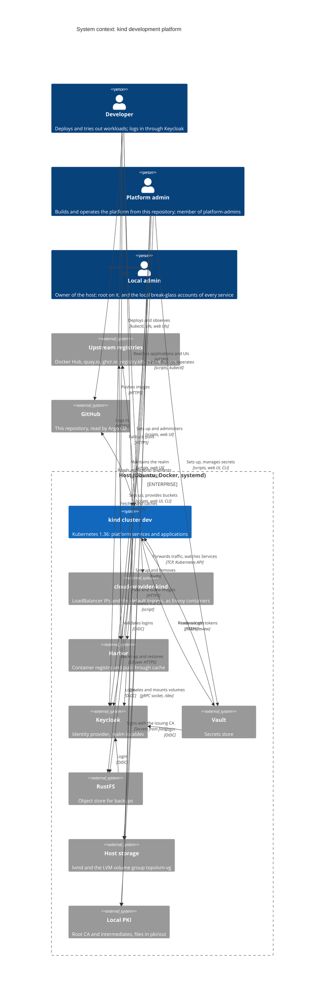
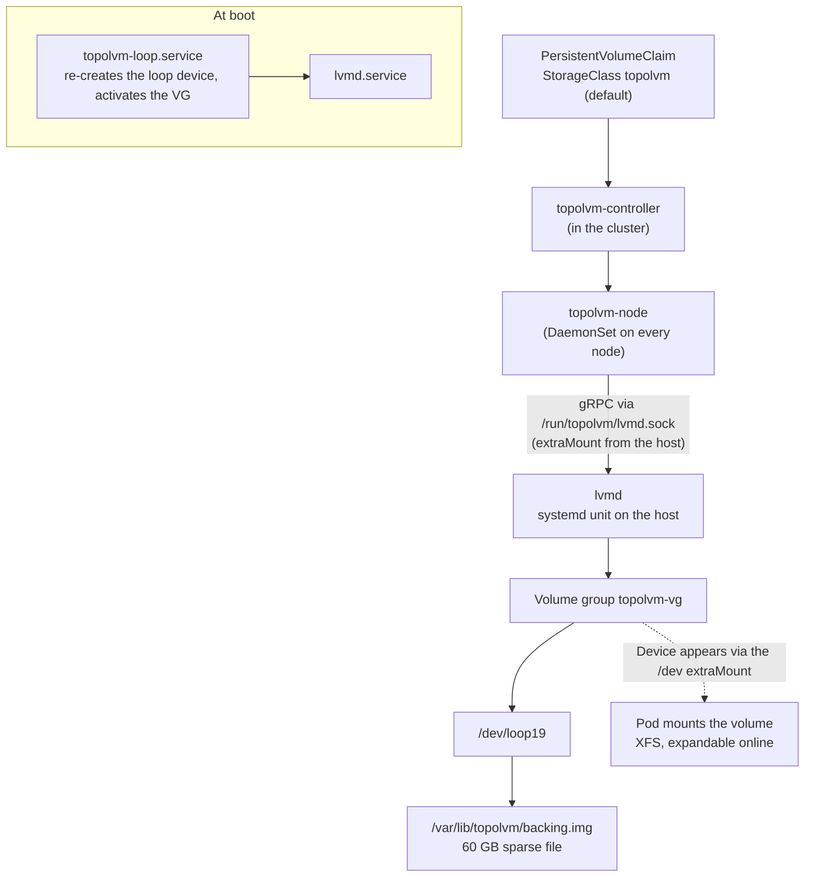
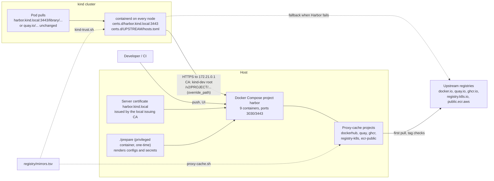
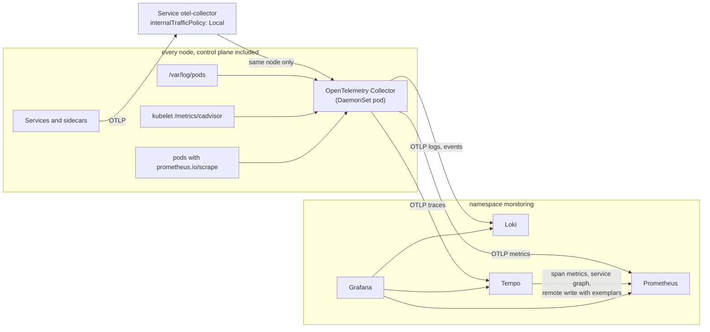
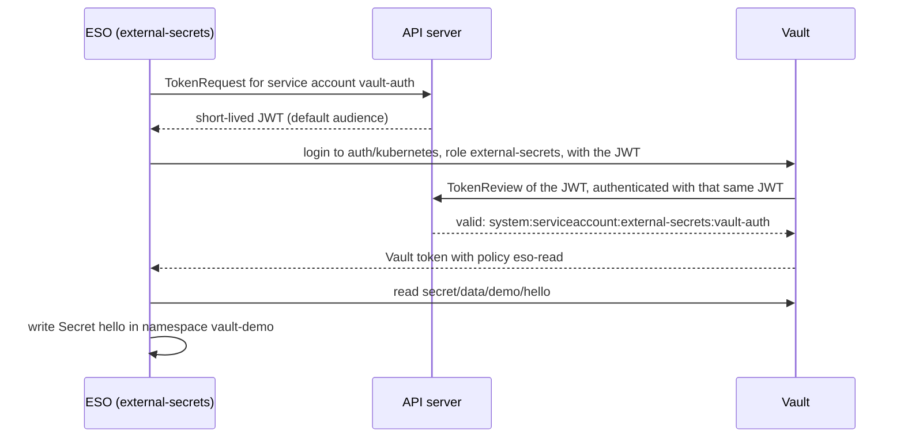
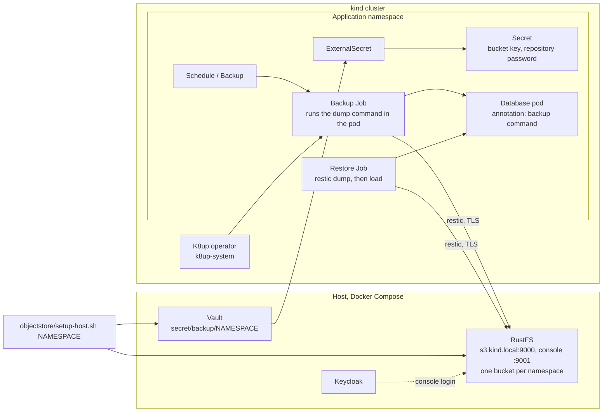
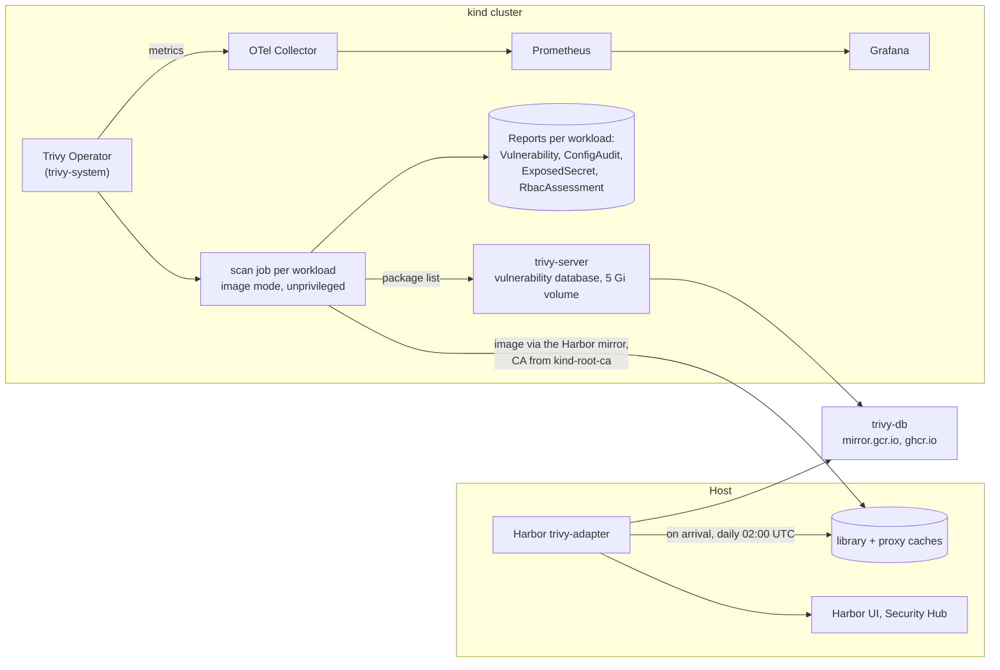
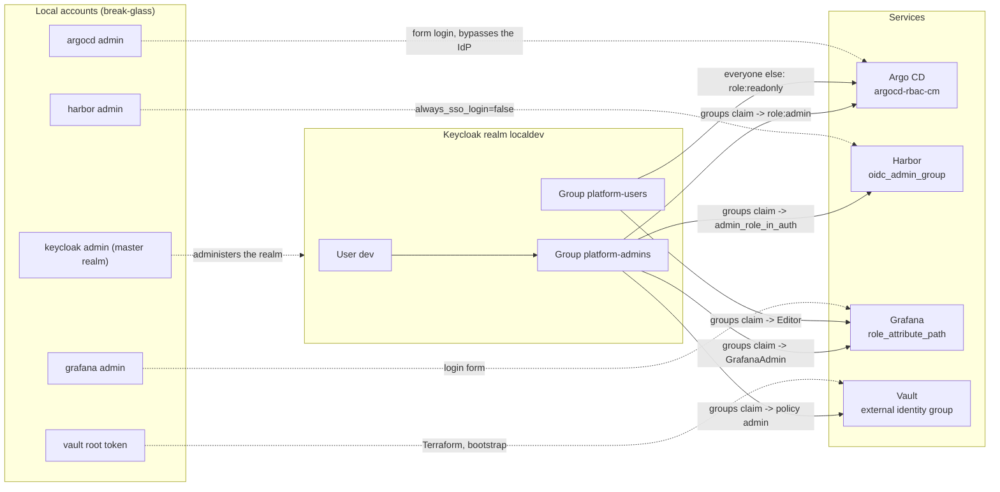

# Architecture

Local Kubernetes development platform on [kind](https://kind.sigs.k8s.io/):
one host, one cluster, everything reproducible from this repository.

- **Purpose:** trying out platform components (ingress, service mesh, GitOps,
  secrets, certificates, storage, registry) close to how they behave in
  production, on a laptop.
- **How it came to be:** [`update-setup-01.md`](update-setup-01.md) (applied
  2026-09-15) and [`update-setup-02.md`](update-setup-02.md) (applied
  2026-09-16). This file describes the result and records the decisions.
- **Operating instructions:** [`README.md`](README.md).

## Quality goals

| Goal | Why |
| --- | --- |
| Reproducible | The whole platform comes back from `cluster/cluster.sh up` plus `./deploy.sh`; versions are pinned |
| Disposable cluster, durable data | Certificates, LVM volumes and registry images survive `cluster.sh down`; application databases are backed up outside the cluster |
| Production-like | Real ingress paths, mTLS, GitOps, CSI storage and a registry with TLS, rather than shortcuts |
| Modest resources | Runs next to a desktop on a 16 GB laptop |
| Portable | Nothing depends on this machine beyond Docker, LVM and systemd; a move to WSL2 stays possible |

## Constraints

- **Host:** Ubuntu 24.04, Docker on **ZFS**, 16 GB RAM, Wi-Fi with DHCP.
- **kind nodes are containers:** their `/dev` is a tmpfs copy, kubelet and
  containerd run inside them, and host services are reachable over the `kind`
  Docker network (`172.21.0.0/16`).
- **No public DNS or CA:** names end in `.kind.local`, certificates come from a
  local CA.

## C4 system context

The cluster is the system in focus. Everything it needs from outside runs on the
same host but outside the cluster, so that it exists before the cluster and
survives a rebuild. The container diagram below opens up both sides.


```mermaid
C4Context
    title System context: kind development platform

    Person(dev, "Developer", "Deploys and tries out workloads; logs in through Keycloak")
    Person(admin, "Platform admin", "Builds and operates the platform from this repository; member of platform-admins")
    Person(localadmin, "Local admin", "Owner of the host: root on it, and the local break-glass accounts of every service")

    Enterprise_Boundary(host, "Host (Ubuntu, Docker, systemd)") {
        System(cluster, "kind cluster dev", "Kubernetes 1.36: platform services and applications")
        System_Ext(lb, "cloud-provider-kind", "LoadBalancer IPs and the default Ingress, as Envoy containers")
        System_Ext(harbor, "Harbor", "Container registry and pull-through cache")
        System_Ext(keycloak, "Keycloak", "Identity provider, realm localdev")
        System_Ext(vault, "Vault", "Secrets store")
        System_Ext(rustfs, "RustFS", "Object store for backups")
        System_Ext(storage, "Host storage", "lvmd and the LVM volume group topolvm-vg")
        System_Ext(pki, "Local PKI", "Root CA and intermediates, files in pki/out")
    }

    System_Ext(upstreams, "Upstream registries", "Docker Hub, quay.io, ghcr.io, registry.k8s.io and others")
    System_Ext(github, "GitHub", "This repository, read by Argo CD")

    Rel(dev, cluster, "Deploys and observes", "kubectl, k9s, web UIs")
    Rel(dev, lb, "Reaches applications and UIs", "HTTPS")
    Rel(dev, keycloak, "Logs in", "HTTPS")
    Rel(dev, harbor, "Pushes images", "HTTPS")
    Rel(dev, github, "Pushes manifests", "git")
    Rel(admin, cluster, "Creates, deploys, operates", "scripts, kubectl")
    Rel(admin, harbor, "Sets up and administers", "scripts, web UI")
    Rel(admin, keycloak, "Maintains the realm", "scripts, web UI")
    Rel(admin, vault, "Sets up, manages secrets", "scripts, web UI, CLI")
    Rel(admin, rustfs, "Sets up, provides buckets", "scripts, web UI, CLI")
    Rel(localadmin, storage, "Sets up and removes", "sudo")
    Rel(localadmin, pki, "Creates the CA", "script")

    Rel(lb, cluster, "Forwards traffic, watches Services", "TCP, Kubernetes API")
    Rel(cluster, harbor, "Pulls and scans images", "HTTPS")
    Rel(cluster, keycloak, "Validates logins", "OIDC")
    Rel(cluster, vault, "Reads secrets", "HTTPS")
    Rel(vault, cluster, "Reviews login tokens", "TokenReview")
    Rel(cluster, rustfs, "Backs up and restores", "S3 over HTTPS")
    Rel(cluster, storage, "Creates and mounts volumes", "gRPC socket, /dev")
    Rel(cluster, pki, "Signs with the issuing CA", "Secrets from files")
    Rel(cluster, github, "Reads application manifests", "git over HTTPS")
    Rel(cluster, upstreams, "Fallback pulls", "HTTPS")
    Rel(harbor, upstreams, "Fetches and caches", "HTTPS")
    Rel(harbor, keycloak, "Login", "OIDC")
    Rel(vault, keycloak, "Login", "OIDC")
    Rel(rustfs, keycloak, "Login", "OIDC")
```

The three actors are roles, not three people: on this laptop one person has all
of them, and the Keycloak user `dev` is a member of `platform-admins`.

| Actor | Identity | Rights |
| --- | --- | --- |
| Developer | A Keycloak user, in `platform-users` or in no group | Read-only or limited in every UI (see *How group membership becomes rights*) |
| Platform admin | A Keycloak user in `platform-admins`; runs the scripts of this repository as the local user | Administrator in every UI; cluster-admin through the kubeconfig |
| Local admin | No Keycloak identity: `root` on the host through `sudo`, and the local accounts listed under *Where the credentials live* | Everything; the way back in when the Keycloak path is broken |

`kubectl` makes no difference between developer and platform admin yet: there is
one kubeconfig with a cluster-admin client certificate. Logging in to the API
server through Keycloak is the postponed update-setup-04.

### Interfaces between the cluster and the host systems

| ID | From → to | Interface | Use cases | Description |
| --- | --- | --- | --- | --- |
| S1 | cloud-provider-kind → cluster | Kubernetes API, through the Docker socket and the `kind` network | Give a `LoadBalancer` Service an address; serve an `Ingress` of class `cloud-provider-kind` | Watches Services and Ingresses and starts one Envoy container (`kindccm-*`) per Service and per namespace with Ingresses |
| S2 | cloud-provider-kind → cluster | TCP from the Envoy containers to the node ports, on the `kind` network (`172.21.0.0/16`) | Reach Argo CD, Grafana and the test applications from the host; reach the Istio ingress gateway | The only way traffic enters the cluster. Addresses can change when the cluster is recreated; `hosts.sh` writes them to `/etc/hosts` |
| S3 | Cluster → Harbor | OCI registry API, `https://harbor.kind.local:3443/v2/`, from containerd on every node | Pull the platform's and the applications' images; pull own images from `library` | Harbor is a mirror for every upstream registry (`certs.d/<registry>/hosts.toml`); image names stay unchanged. Set up per cluster by `registry/kind-trust.sh` |
| S4 | Cluster → Harbor | The same registry API, from the Trivy Operator's scan jobs | Scan the images of running workloads | The jobs fetch images through Harbor's proxy projects; pods resolve the name through CoreDNS (`cluster/host-services-dns.sh`) |
| S5 | Cluster → Keycloak | OIDC, `https://keycloak.kind.local:8443/realms/localdev`: discovery, token and JWKS endpoints | Log people in to Argo CD and Grafana; validate their tokens | Back-channel calls from `argocd-server` and Grafana to the kind gateway; the certificate is checked against the local root CA |
| S6 | Cluster → Vault | Vault HTTP API, `https://vault.kind.local:8200/v1/`: `auth/kubernetes/login`, `secret/data/*` | Turn a secret in Vault into a Kubernetes Secret; refresh it when it changes | The External Secrets Operator logs in with a short-lived token of the service account `vault-auth` and reads KV v2 |
| S7 | Vault → cluster | Kubernetes API `TokenReview`, `https://dev-control-plane:6443`, on the `kind` network | Check that a login token presented by the cluster is genuine | Vault stores no reviewer token; it reviews each login with the token it was given (ADR-0024). The reason Vault joins the `kind` network |
| S8 | Cluster → RustFS | S3 API, `https://s3.kind.local:9000`, one bucket and key per namespace | Back up a database dump; prune old backups; read a dump back for a restore | restic, started by K8up's jobs and by the applications' restore Jobs; repositories are encrypted with a password from Vault |
| S9 | Cluster → host storage | gRPC over the Unix socket `/run/topolvm/lvmd.sock`, mounted into every node | Create, resize and delete the volume of a claim | TopoLVM in the cluster asks `lvmd` on the host, which manages logical volumes in `topolvm-vg` |
| S10 | Cluster → host storage | Block devices under `/dev`, mounted into every node | Mount a volume into a pod | The logical volume appears as a device on the host and, through the mount, in the node |
| S11 | Cluster → local PKI | Files from `pki/out`, written into Secrets and a ConfigMap by `platformservices/deploy.sh` | Issue certificates for Ingresses; issue mesh certificates; distribute the root certificate | A deploy-time interface: cert-manager gets the issuing CA, Istio its own intermediate, trust-manager the root |
| S12 | Cluster → GitHub | git over HTTPS, `https://github.com/leopold2410/devcluster.git` | Deploy `backup-demo`; run its backup and restore by sync | Argo CD reads application manifests from the public repository; it deploys what is pushed |
| S13 | Cluster → upstream registries | OCI registry API over HTTPS | Pull an image while Harbor is down; fetch the vulnerability database | The fallback of S3 (`server` in `hosts.toml`). The Trivy server gets its database from `mirror.gcr.io`; whether that request goes directly or through Harbor's proxy project was not checked |

### Interfaces between the host systems

| ID | From → to | Interface | Use cases | Description |
| --- | --- | --- | --- | --- |
| H1 | Harbor → upstream registries | OCI registry API over HTTPS, one proxy-cache project per registry | Fetch an image on its first pull and cache it | Optional Docker Hub credentials raise the rate limit; unused artifacts are removed after 7 days |
| H2 | Harbor → Keycloak | OIDC, client `harbor` | Log people in to the Harbor UI; decide administrator rights from the `groups` claim | Users are onboarded on first login |
| H3 | Vault → Keycloak | OIDC, client `vault` | Log people in to the Vault UI and CLI; grant policy `admin` to `platform-admins` | Configured by Terraform in `vault/config` |
| H4 | RustFS → Keycloak | OIDC, client `rustfs` | Log people in to the RustFS console; take their policies from the claim `policy` | RustFS only calls Keycloak because its origin is listed in `RUSTFS_OUTBOUND_ALLOW_ORIGINS` |
| H5 | Harbor, Keycloak, Vault, RustFS → local PKI | Files: a server certificate per service, signed by the issuing CA | Serve HTTPS that everything trusting the root CA accepts | Issued by each service's `create-cert.sh`; renewed when less than 30 days remain |
| H6 | RustFS → Vault (through `objectstore/setup-host.sh`) | Vault CLI in the Vault container, `vault kv put secret/backup/<namespace>` | Hand a namespace its bucket key and repository password | A script, not a running connection: it writes what S6 later delivers to the namespace |

### Web interfaces for people

All of them use HTTPS with certificates from the local CA; the browser has to
trust the root certificate once (see `README.md`, *Browser access*).

| ID | Interface | Who | Use cases | Description |
| --- | --- | --- | --- | --- |
| W1 | Keycloak login, `https://keycloak.kind.local:8443/realms/localdev` | Developer, platform admin | Log in once for every UI below | The page every *Login with Keycloak* button leads to; one session covers all services |
| W2 | Keycloak account console, `…/realms/localdev/account` | Developer, platform admin | Change the own password; see sessions | The user's own view of the realm |
| W3 | Keycloak admin console, `https://keycloak.kind.local:8443/admin` | Local admin (`admin`, realm `master`) | Look at users, groups, clients and sessions; debug a login | Changes belong into `identity/realm/localdev.yaml`; what is clicked here is overwritten by the next `identity/setup-host.sh` |
| W4 | Argo CD, `https://argocd.kind.local` | Developer (read only), platform admin (`role:admin`), local admin (`admin`, form login) | See what is deployed and whether it is in sync; sync an application; start the demo's backup or restore | Reached through the default Ingress |
| W5 | Grafana, `https://grafana.kind.local` | Developer (`Editor` or `Viewer`), platform admin (`GrafanaAdmin`), local admin (`admin`, login form) | Explore metrics, logs and traces and jump between them; build dashboards | Data sources for Prometheus, Loki and Tempo are provisioned |
| W6 | Harbor, `https://harbor.kind.local:3443` | Developer (ordinary user), platform admin (administrator), local admin (`admin`, `/account/sign-in?always_sso_login=false`) | Browse projects and images; read scan results; get the CLI secret for `docker login`; manage projects, proxy caches and scan schedules | The port is part of the name: 80 and 443 stay reserved for the cluster ingress |
| W7 | Vault, `https://vault.kind.local:8200/ui` | Developer (policy `default`), platform admin (policy `admin`), local admin (root token) | Read and write secrets under `secret/`; look at auth methods and policies | The OIDC login opens Keycloak in a popup |
| W8 | RustFS console, `https://s3.kind.local:9001/rustfs/console/` | Developer in `platform-users` (read only), platform admin (everything), local admin (admin key) | Look into buckets and backups; manage buckets, users and policies | Someone in neither group cannot log in |
| W9 | Applications, `https://testapp.kind.local`, `https://testapp-mesh.kind.local` and others | Developer | Try out a deployed workload through the default Ingress, the Istio gateway or a `LoadBalancer` address | No login of their own |

### Command-line interfaces for people

| ID | Interface | Who | Use cases | Description |
| --- | --- | --- | --- | --- |
| C1 | `kubectl`, context `kind-dev` | Developer, platform admin | Apply manifests; read logs and events; `exec` into a pod; read backup snapshots and scan reports | Talks to the API server on the host's loopback at the port kind chose; cluster-admin for whoever has the kubeconfig |
| C2 | `cli/k9s.sh`, `cli/lazydocker.sh` | Developer, platform admin | Watch and operate workloads; watch the containers on the host | Containers with pinned versions; k9s reaches the API server over the `kind` network with `cli/kubeconfig` |
| C3 | `docker login`, `docker push` to `harbor.kind.local:3443` | Developer, platform admin | Publish an own image to the project `library` | OIDC users log in with the CLI secret from their Harbor profile. Needs the root CA in `/etc/docker/certs.d` once |
| C4 | `git push` to GitHub | Developer, platform admin | Change what Argo CD deploys | The other half of S12 |
| C5 | `applications/*/deploy.sh`, `applications/backup-demo/sync.sh` | Developer | Deploy a test application; back up or restore the demo database | `sync.sh` starts an Argo CD sync and waits for the result |
| C6 | `vault` CLI, `vault login -method=oidc` | Developer, platform admin | Read and write secrets from a terminal | Logs in through the browser (callback on `localhost:8250`); the CLI also exists in the Vault container |
| C7 | `cluster/cluster.sh`, `./deploy.sh`, `registry/kind-trust.sh`, `cluster/host-services-dns.sh` | Platform admin | Create and delete the cluster; deploy the platform; connect a new cluster to the host services | The whole platform comes back from these; they run as the local user |
| C8 | `registry/`, `identity/`, `vault/`, `objectstore/` `setup-host.sh` | Platform admin | Install, start and reconfigure a host service; unseal Vault; create a namespace's bucket and keys | Idempotent; also the way to bring a service back after a reboot. They use the services' local accounts, so they are the scripted form of the local admin |
| C9 | `vault/tf.sh`, `objectstore/rc.sh` | Platform admin | Change Vault's configuration as code; administer RustFS | Terraform and RustFS's client in containers, with the root token and the admin key |
| C10 | `tests/run.sh` | Platform admin | Check every Keycloak login in a real browser | Playwright in a container on the `kind` network |
| C11 | `pki/create-ca.sh` | Local admin | Create the root CA and the intermediates, once | The keys stay in `pki/out`, outside git |
| C12 | `sudo storage/setup-host.sh`, `sudo storage/teardown-host.sh`, `sudo lvs` / `lvremove` | Local admin | Create or remove the volume group and `lvmd`; remove logical volumes left behind by a deleted cluster | The only part of the platform that needs root to run |
| C13 | `./hosts.sh`, `sudo update-ca-certificates`, `certutil` | Local admin | Make the `*.kind.local` names resolve on the host; make the host and the browsers trust the root CA | `hosts.sh` asks for `sudo` only when `/etc/hosts` changes |
| C14 | Local accounts from a terminal: `vault` with the root token, the Argo CD and Harbor `admin` passwords, the RustFS admin key | Local admin | Get back in when the Keycloak login is broken; bootstrap | Where each credential lives is listed under *Where the credentials live* |

## C4 container diagram


```mermaid
C4Container
    title Container diagram: kind development platform

    Person(dev, "Developer", "Deploys and tries out workloads")
    System_Ext(upstreams, "Upstream registries", "Docker Hub, quay.io, ghcr.io, registry.k8s.io, public.ecr.aws")

    System_Boundary(host, "Host (Ubuntu, Docker, systemd)") {
        Container(cli, "CLI tools", "k9s, lazydocker (Compose project kind-cli)", "Cluster and Docker operation; own images, pinned versions")
        Container(cpk, "cloud-provider-kind", "Container, Docker socket", "Gives LoadBalancer Services an IP and serves the default IngressClass")
        Container(envoys, "kindccm-* proxies", "Envoy containers", "One per LoadBalancer Service and per namespace with Ingresses")
        Container(lvmd, "lvmd", "systemd unit, gRPC over a Unix socket", "Creates and resizes LVM volumes for TopoLVM")
        ContainerDb(vg, "Volume group topolvm-vg", "LVM on a loop-backed file", "Backing store of all node volumes")
        Container(harbor, "Harbor", "Docker Compose: nginx, core, registry, jobservice, portal, db, redis", "Container registry with TLS from the local CA; pull-through cache for five upstream registries")
        Container(keycloak, "Keycloak", "Docker Compose: keycloak + PostgreSQL, port 8443", "Central identity provider standing in for a company IdP; realm localdev as code")
        ContainerDb(vault, "Vault", "Docker Compose, file storage, port 8200; also on the kind network", "Secrets store; configured by Terraform in vault/config")
        ContainerDb(rustfs, "RustFS", "Docker Compose, ports 9000 and 9001", "Object store for backups: one bucket per namespace; outlives the cluster and the volume group")
        ContainerDb(pki, "Local PKI", "OpenSSL files in pki/out", "Root CA plus intermediates for cert-manager, the Istio mesh and the host-side services")
    }

    System_Boundary(cluster, "kind cluster dev (Kubernetes 1.36)") {
        Container(apiserver, "Kubernetes API server", "dev-control-plane:6443", "Also answers Vault's TokenReview calls")
        Container_Boundary(platform, "Platform services (platformservices/)") {
            Container(istio, "Istio", "istiod + ingress gateway", "Second ingress path and the service mesh; mTLS from the local root")
            Container(certmgr, "cert-manager", "ClusterIssuer kind-ca", "Issues certificates for Ingresses and services")
            Container(trustmgr, "trust-manager", "Bundle kind-root-ca", "Distributes the root certificate into every namespace")
            Container(eso, "External Secrets Operator", "Cluster-wide", "Syncs external secret stores into Kubernetes Secrets")
            Container(argocd, "Argo CD", "Upstream install, cluster-wide", "GitOps for all namespaces")
            Container(topolvm, "TopoLVM", "CSI controller + node DaemonSet", "StorageClass topolvm; talks to lvmd on the host")
            Container(otelcol, "OpenTelemetry Collector", "DaemonSet behind Service otel-collector (node-local)", "Collects logs, metrics and traces on every node")
            ContainerDb(prometheus, "Prometheus", "One process, OTLP and remote-write receivers", "Metrics, 15 days; exemplars for recent data")
            ContainerDb(loki, "Loki", "Monolithic, filesystem on TopoLVM", "Logs, 7 days")
            ContainerDb(tempo, "Tempo", "Monolithic, local storage on TopoLVM", "Traces, 72 hours; generates span metrics and the service graph")
            Container(grafana, "Grafana", "Ingress grafana.kind.local", "Explores all three signals, linked; login through Keycloak")
        }
        Container_Boundary(appspace, "Applications (applications/)") {
            Container(apps, "Test workloads", "testapp, testapp-mesh", "The same app with and without a sidecar, each with two Ingresses")
            Container(guestbook, "guestbook", "Deployed by Argo CD", "Proves the cluster-wide GitOps permissions")
        }
    }

    Rel(dev, cli, "Operates", "terminal")
    Rel(dev, harbor, "Pushes images, uses the UI", "HTTPS")
    Rel(dev, envoys, "Reaches applications", "HTTP/HTTPS")
    Rel(dev, argocd, "Declares applications, uses the UI", "Git and HTTPS via Ingress")

    Rel(cli, apps, "Manages workloads", "Kubernetes API over the kind network")
    Rel(cpk, envoys, "Creates and configures", "Docker API")
    Rel(envoys, apps, "Forwards traffic", "TCP")
    Rel(envoys, istio, "Forwards traffic for the istio class", "TCP")

    Rel(topolvm, lvmd, "Creates volumes", "gRPC over the mounted socket")
    Rel(lvmd, vg, "Manages logical volumes", "LVM")
    Rel(apps, vg, "Mounts volumes", "XFS on /dev/mapper")

    Rel(certmgr, pki, "Signs with the issuing CA", "Secret from pki")
    Rel(istio, pki, "Mesh certificates from the mesh CA", "Secret cacerts")
    Rel(trustmgr, apps, "Provides the root certificate", "ConfigMap per namespace")
    Rel(argocd, guestbook, "Deploys into any namespace", "Kubernetes API")
    Rel(apps, harbor, "Pulls images: its own and, as a mirror, all upstream ones", "HTTPS via containerd, certs.d")
    Rel(harbor, upstreams, "Fetches and caches on first pull", "HTTPS, proxy-cache projects")
    Rel(apps, upstreams, "Fallback when Harbor is down", "HTTPS, hosts.toml server")

    Rel(dev, keycloak, "Logs in once for the platform", "HTTPS, browser")
    Rel(argocd, keycloak, "OIDC discovery and token validation", "HTTPS via CoreDNS to the kind gateway")
    Rel(harbor, keycloak, "Authenticates users, groups decide admin rights", "OIDC")
    Rel(keycloak, pki, "Server certificate from the issuing CA", "files in identity/out/tls")

    Rel(apps, otelcol, "Sends telemetry", "OTLP to otel-collector.monitoring.svc")
    Rel(istio, otelcol, "Sends spans", "OTLP")
    Rel(otelcol, prometheus, "Metrics", "OTLP")
    Rel(otelcol, loki, "Logs, events", "OTLP")
    Rel(otelcol, tempo, "Traces", "OTLP")
    Rel(tempo, prometheus, "Span metrics, service graph", "remote write with exemplars")
    Rel(grafana, prometheus, "Queries", "PromQL")
    Rel(grafana, loki, "Queries", "LogQL")
    Rel(grafana, tempo, "Queries", "TraceQL")
    Rel(grafana, keycloak, "Login", "OIDC")
    Rel(dev, grafana, "Explores telemetry", "HTTPS via Ingress")

    Rel(dev, vault, "Manages secrets, UI and CLI", "HTTPS, OIDC login")
    Rel(vault, keycloak, "Login for people", "OIDC")
    Rel(eso, vault, "Logs in as vault-auth, reads secret/", "HTTPS, Kubernetes auth")
    Rel(vault, apiserver, "Reviews the login token", "TokenReview, on the kind network")
    Rel(vault, pki, "Server certificate from the issuing CA", "files in vault/out/tls")
    Rel(apps, rustfs, "Back up and restore their databases", "restic over HTTPS, started by K8up resources")
    Rel(rustfs, keycloak, "Console login for people", "OIDC")
```

## Interfaces between host services and cluster services

The system context lists what crosses the cluster's border. This section names
the service on each end. Three things hold for every connection from the cluster
to a host service:

- **Address:** the host services publish their ports on the gateway address of
  the `kind` Docker network (`172.21.0.1`), which is the host as seen from a
  node or a pod.
- **Name:** pods resolve `harbor.kind.local`, `keycloak.kind.local`,
  `vault.kind.local` and `s3.kind.local` to that address through a `hosts` block
  in CoreDNS, written by `cluster/host-services-dns.sh`. The nodes themselves
  get `harbor.kind.local` in their `/etc/hosts` from `registry/kind-trust.sh`.
- **Trust:** every host service has a certificate from the local CA. Pods verify
  it with the root certificate that trust-manager puts into each namespace as
  the ConfigMap `kind-root-ca`; the nodes' containerd gets it as a file.

### From services in the cluster to services on the host

| ID | From (cluster) → to (host) | Interface | Use cases | Description |
| --- | --- | --- | --- | --- |
| K1 | containerd on every node → Harbor | OCI registry API, `https://harbor.kind.local:3443/v2/<project>/…` | Pull any image a pod needs: platform services, applications, backup and restore Jobs | Harbor is configured as a mirror per upstream registry in `/etc/containerd/certs.d/<registry>/hosts.toml`, with `override_path` to reach the proxy project. When Harbor does not answer, containerd falls back to the original registry |
| K2 | containerd on every node → Harbor | The same API, project `library` | Pull images built and pushed locally | Image names carry the port: `harbor.kind.local:3443/library/…` |
| K3 | Trivy Operator scan jobs (`trivy-system`) → Harbor | OCI registry API, through the proxy projects | Fetch the image of a running workload to scan it | `trivy.registry.mirror` rewrites every registry onto its Harbor project. Unlike containerd, Trivy has no fallback: without Harbor or without the CoreDNS name the scan fails |
| K4 | `argocd-server` (`argocd`) → Keycloak | OIDC back channel, `https://keycloak.kind.local:8443/realms/localdev`: discovery, token endpoint, JWKS | Complete a person's login to the Argo CD UI; validate the token; read the `groups` claim for RBAC | Client `argocd`; the root CA is part of `oidc.config` (`rootCA`), so the issuer is verified, not skipped |
| K5 | Grafana (`monitoring`) → Keycloak | OIDC back channel: `token_url` and `api_url` (userinfo) of the realm | Complete a person's login to Grafana; map the `groups` claim to `GrafanaAdmin`, `Editor` or `Viewer` | Client `grafana`, with PKCE; the client secret comes from the Secret `grafana-oidc` |
| K6 | Service `keycloak.identity.svc.cluster.local` → Keycloak | An `ExternalName` Service pointing at `keycloak.kind.local:8443` | Give workloads a cluster-internal name for the identity provider | A name only; the issuer in tokens stays `keycloak.kind.local`, so clients that verify the issuer use that name |
| K7 | External Secrets Operator (`external-secrets`) → Vault | Vault HTTP API, `https://vault.kind.local:8200/v1/auth/kubernetes/login` | Log in as the cluster | Sends a short-lived token of the service account `vault-auth`; Vault answers with a Vault token carrying the policy `eso-read` |
| K8 | External Secrets Operator → Vault | Vault HTTP API, `/v1/secret/data/<path>` (KV v2) | Create a Kubernetes Secret from a Vault secret; refresh it on the `refreshInterval` | One `ClusterSecretStore` named `vault` serves every namespace. Used for the demo secret, the bucket keys under `secret/backup/<namespace>` and the demo database password |
| K9 | K8up backup and prune Jobs (application namespace) → RustFS | S3 API, `https://s3.kind.local:9000/<namespace>`, as restic | Store a database dump; remove backups past the retention; list snapshots | The Job runs with the namespace's bucket key; the key cannot reach another bucket. The operator in `k8up-system` creates the Jobs but does not talk to RustFS itself |
| K10 | Restore Jobs of the applications → RustFS | S3 API, the same bucket, as restic | Read a dump back to load it into the database | `restic dump` in the Job's first container; read-only use of the repository |
| K11 | `topolvm-node` (DaemonSet, `topolvm-system`) → lvmd | gRPC over the Unix socket `/run/topolvm/lvmd.sock`, mounted into each node | Create, resize and delete the logical volume behind a claim; report free capacity per node | The controller in the cluster decides, `lvmd` on the host executes. The capacity it reports is what the scheduler uses to place pods |
| K12 | kubelet on every node → volume group | Block devices `/dev/topolvm-vg/<volume>`, through the mounted `/dev` | Format and mount a volume into a pod | A node's own `/dev` is a copy; only the mount of the host's `/dev` makes new devices visible |

No service in the cluster talks to cloud-provider-kind or to the local PKI at run
time. No host service sends metrics, logs or traces into the cluster: the
observability stack covers the cluster only.

### From services on the host to services in the cluster

| ID | From (host) → to (cluster) | Interface | Use cases | Description |
| --- | --- | --- | --- | --- |
| N1 | cloud-provider-kind → Kubernetes API server | Kubernetes API (watch on Services, Ingresses, nodes), found through the Docker socket | Notice a new `LoadBalancer` Service or an Ingress of class `cloud-provider-kind`; write the assigned address into its status | Runs with host networking and the Docker socket. It also tries to install its own Gateway API CRDs at start, which is why `cluster/cluster.sh` installs them first |
| N2 | `kindccm-*` Envoy containers → `argocd-server`, Grafana, test applications | TCP to the node ports of the backing Services, on the `kind` network | Carry a browser request for `argocd.kind.local`, `grafana.kind.local` or `testapp.kind.local` to its pod | One Envoy per namespace with Ingresses; TLS ends at the Envoy with a certificate issued by cert-manager |
| N3 | `kindccm-*` Envoy containers → `istio-ingressgateway` (`istio-system`) | TCP to the gateway's node ports (80, 443) | Carry requests for Ingresses of class `istio` | One Envoy for the gateway's `LoadBalancer` Service; TLS ends at the Istio gateway |
| N4 | `kindccm-*` Envoy containers → `LoadBalancer` Services of applications | TCP to the Service's node port | Reach a workload directly on its own address (layer 4) | For example the `nginx` Services of `testapp` and `testapp-mesh` |
| N5 | Vault → Kubernetes API server | `TokenReview`, `https://dev-control-plane:6443`, verified with the cluster's CA | Check the service account token that the External Secrets Operator presented in K7 | Vault is a member of the `kind` network for this call alone. It authenticates with the token under review, so `vault-auth` is bound to `system:auth-delegator` |
| N6 | k9s container (`cli/`) → Kubernetes API server | Kubernetes API, `https://dev-control-plane:6443`, with `cli/kubeconfig` | Watch and operate workloads from a terminal | The kubeconfig written by `kind get kubeconfig --internal` |
| N7 | `kubectl` on the host → Kubernetes API server | Kubernetes API on the host's loopback, at the port kind chose | Everything the scripts and the people do with the cluster | The only published port of the cluster itself |
| N8 | Playwright container (`tests/`) → Argo CD, Grafana | HTTPS to the Ingress addresses, on the `kind` network | Test the Keycloak logins in a real browser | Started by `tests/run.sh`, which passes the addresses as host entries |

Harbor, Keycloak, RustFS and lvmd never open a connection into the cluster; they
only answer.

### Set-up interfaces: scripts that connect a cluster to the host services

These are not running connections. Each is a script that copies something from
one side to the other, and most have to run again after every
`cluster/cluster.sh up`, because a new cluster has none of it.

| ID | Script | From → to | Use cases | Description |
| --- | --- | --- | --- | --- |
| P1 | `registry/kind-trust.sh` | Harbor's name, the root CA and `registry/mirrors.tsv` → every node container | Make K1 and K2 possible | Writes `/etc/hosts` and `/etc/containerd/certs.d/` in the nodes with `docker exec`; only registries whose proxy project exists in Harbor get a mirror |
| P2 | `cluster/host-services-dns.sh` | The names of the host services that are set up → ConfigMap `coredns` | Make K3 to K10 resolvable from pods | Adds a managed `hosts` block and restarts CoreDNS |
| P3 | `platformservices/deploy.sh` | `pki/out` → Secrets `kind-issuing-ca` and `cacerts`, ConfigMap `kind-root-ca-source` | Let cert-manager issue certificates, Istio issue mesh certificates and trust-manager distribute the root | The CA keys reach the cluster as Secrets and are never in git |
| P4 | `platformservices/deploy.sh` | `identity/out` → `argocd-secret`, `argocd-cm`, Secrets `grafana-admin` and `grafana-oidc` | Make K4 and K5 possible | Copies the OIDC client secrets that `identity/setup-host.sh` generated and registered in Keycloak |
| P5 | `vault/setup-host.sh` | The cluster's CA (`kube-root-ca.crt`) → Vault's Kubernetes auth configuration | Make N5 possible | A new cluster has a new CA; the script reads it and applies it through Terraform |
| P6 | `objectstore/setup-host.sh <namespace>` | RustFS bucket key and repository password → Vault, `secret/backup/<namespace>` | Make K9 and K10 possible | Runs once per namespace, not per cluster: the values stay the same across rebuilds, which is what lets a rebuilt application find its old backups |
| P7 | `storage/setup-host.sh` and `cluster/cluster-config.yaml` | `/run/topolvm` and `/dev` on the host → `extraMounts` of every node | Make K11 and K12 possible | The mounts are fixed when the cluster is created. Recreating the socket directory on the host therefore needs a new cluster |

## Storage

Volumes are LVM logical volumes on the host. `lvmd` runs there as a systemd
unit; the kind nodes reach its socket and the LVM devices through `extraMounts`.


```mermaid
flowchart TD
    pvc["PersistentVolumeClaim<br/>StorageClass topolvm (default)"] --> ctrl["topolvm-controller<br/>(in the cluster)"]
    ctrl --> node["topolvm-node<br/>(DaemonSet on every node)"]
    node -->|"gRPC via /run/topolvm/lvmd.sock<br/>(extraMount from the host)"| lvmd["lvmd<br/>systemd unit on the host"]
    lvmd --> vg["Volume group topolvm-vg"]
    vg --> loop["/dev/loop19"]
    loop --> img["/var/lib/topolvm/backing.img<br/>60 GB sparse file"]
    vg -.->|"Device appears via the /dev extraMount"| pod["Pod mounts the volume<br/>XFS, expandable online"]

    subgraph boot["At boot"]
        loopsvc["topolvm-loop.service<br/>re-creates the loop device, activates the VG"] --> lvmdsvc["lvmd.service"]
    end
```

- **Node-local:** `WaitForFirstConsumer`, so the pod is scheduled first and the
  volume is created on its node.
- **Fallback:** kind's `standard` (local-path) stays available.
- **Snapshots** would need a thin pool; the device class for that is prepared in
  `storage/lvmd.yaml` but commented out.

## Registry

Harbor runs on the host, so images outlive the cluster. It also mirrors every
registry the cluster pulls from (update-setup-07, ADR-0025), so a rebuilt cluster
pulls its images from the host rather than from the internet.


```mermaid
flowchart LR
    subgraph hostside["Host"]
        compose["Docker Compose project harbor<br/>9 containers, ports 3030/3443"]
        proxies["Proxy-cache projects<br/>dockerhub, quay, ghcr,<br/>registry-k8s, ecr-public"]
        cert["Server certificate harbor.kind.local<br/>issued by the local issuing CA"]
        prep["./prepare (privileged container, one-time)<br/>renders configs and secrets"]
    end
    subgraph clusterside["kind cluster"]
        containerd["containerd on every node<br/>certs.d/harbor.kind.local:3443<br/>certs.d/UPSTREAM/hosts.toml"]
        pod["Pod pulls<br/>harbor.kind.local:3443/library/...<br/>or quay.io/... unchanged"]
    end
    upstream["Upstream registries<br/>docker.io, quay.io, ghcr.io,<br/>registry.k8s.io, public.ecr.aws"]
    table["registry/mirrors.tsv"]

    prep --> compose
    cert --> compose
    compose --- proxies
    proxies -->|"first pull, tag checks"| upstream
    containerd -->|"HTTPS to 172.21.0.1<br/>CA: kind-dev root<br/>/v2/PROJECT/... (override_path)"| compose
    containerd -.->|"fallback when Harbor fails"| upstream
    pod --> containerd
    dev["Developer / CI"] -->|"push, UI"| compose
    table -.->|"proxy-cache.sh"| proxies
    table -.->|"kind-trust.sh"| containerd
```

- **Trust:** the certificate comes from the same local CA as everything else, so
  the nodes and the host verify it without exceptions.
- **Name resolution:** `registry/kind-trust.sh` writes the `/etc/hosts` entry,
  the CA and `hosts.toml` into the nodes after every cluster creation.
- **Ports:** Harbor listens on 3030/3443 so that 80 and 443 stay free on the host
  for the cluster ingress. `external_url` makes Harbor put that port into the
  URLs it generates, and the port becomes part of the registry name in every
  image tag.
- **Privileges:** the setup runs as the local user, without `sudo`; root exists
  only inside the `prepare` container.
- **Mirrors:** one table, `registry/mirrors.tsv`, drives both sides.
  `registry/proxy-cache.sh` creates a registry endpoint and a public proxy-cache
  project per upstream. `registry/kind-trust.sh` writes
  `/etc/containerd/certs.d/<upstream>/hosts.toml`, pointing at
  `https://harbor.kind.local:3443/v2/<project>` with `override_path`, and uses
  the original registry as `server`, the fallback. Image names stay unchanged,
  and no chart or manifest knows about Harbor.
- **What the cache holds:** only the platforms that were pulled. Harbor stores a
  trimmed index (amd64 only here) under the tag, about six minutes after the
  first pull, so its digest differs from the upstream index digest.
- **Upstream down:** Harbor serves cached tags and platform manifests from its
  store (verified with Docker Hub unreachable from `harbor-core`). A pull pinned
  to the *upstream index digest* is not in the cache, because of the trimming.
- **Harbor down:** containerd logs `trying next host` and pulls from the
  original registry (verified with Harbor's nginx stopped).
- **Size:** each proxy project gets Harbor's default retention rule (keep what
  was pulled in the last 7 days, daily at 00:00 UTC). `proxy-cache.sh` adds a
  weekly garbage collection (Sunday 01:00 UTC), which frees the layers on disk.

## Observability

One collector per node, three stores, one place to look (update-setup-05,
ADR-0019 to ADR-0022).


```mermaid
flowchart LR
    subgraph node["every node, control plane included"]
        app["Services and sidecars"]
        logs["/var/log/pods"]
        kubelet["kubelet /metrics/cadvisor"]
        annotated["pods with prometheus.io/scrape"]
        otel["OpenTelemetry Collector<br/>(DaemonSet pod)"]
    end
    svc["Service otel-collector<br/>internalTrafficPolicy: Local"]
    subgraph mon["namespace monitoring"]
        prom["Prometheus"]
        loki["Loki"]
        tempo["Tempo"]
        grafana["Grafana"]
    end

    app -->|"OTLP"| svc
    svc -->|"same node only"| otel
    logs --> otel
    kubelet --> otel
    annotated --> otel
    otel -->|"OTLP metrics"| prom
    otel -->|"OTLP logs, events"| loki
    otel -->|"OTLP traces"| tempo
    tempo -->|"span metrics, service graph,<br/>remote write with exemplars"| prom
    grafana --> prom & loki & tempo
```

- **One endpoint for every service and for the mesh:**
  `otel-collector.monitoring.svc:4317` (gRPC) and `:4318` (HTTP). The Service's
  `internalTrafficPolicy: Local` delivers each request to the collector on the
  sender's own node; there are no host ports.
- **What each collector gathers on its node:** pod logs (with read positions
  kept on the node), host metrics (in a pipeline of their own that stamps the
  node name), container metrics from the kubelet's `/metrics/cadvisor`, pods
  annotated `prometheus.io/scrape` (Istio, cert-manager), and OTLP. The one
  holding the Lease also collects cluster metrics and Kubernetes events.
- **Metric names are mixed, labels are not.** Cluster and host metrics use
  OpenTelemetry names (`k8s_*`, `system_*`); container metrics use cAdvisor's
  (`container_*`); scraped applications keep their own (`istio_*`). All carry
  `k8s_namespace_name` and `k8s_pod_name`, so queries join across them.
- **The links between signals:**

| From | To | Through |
| --- | --- | --- |
| a metric sample | its trace | exemplars; Tempo's label is `traceID` |
| a trace | its logs | the trace id, stored with each OTLP log line |
| a trace | its metrics | Grafana's trace-to-metrics queries on Prometheus |
| a log line | its trace | the trace id in the line |
| the mesh | a service graph | Tempo's `service-graphs` processor |

- **Retention:** Prometheus 15 days (15 Gi), Loki 7 days (10 Gi), Tempo 72 hours
  (10 Gi), all on TopoLVM volumes.
- **What a collector restart can lose:** no pod logs, which resume at their
  read position; no queued data, since the send queues are on the node's disk;
  a short gap in pulled metrics; and only what services push during the seconds
  the collector is down. Verified: a 74-second Loki outage with a collector
  restart in the middle lost none of 120 log lines.
- **Limits of this host:** the kubelet's `/stats/summary` fails on ZFS, so
  container metrics come from cAdvisor instead; kind's kubelet certificates name
  no IP and are not verified; and host metrics describe the **host machine**,
  because kind's nodes share its kernel.

## Secrets

Vault runs on the host, next to Keycloak and Harbor, and the cluster only
consumes it (update-setup-06, ADR-0023 and ADR-0024). People log in through
Keycloak; the cluster logs in with a service account.


```mermaid
sequenceDiagram
    participant ESO as ESO (external-secrets)
    participant API as API server
    participant V as Vault
    ESO->>API: TokenRequest for service account vault-auth
    API-->>ESO: short-lived JWT (default audience)
    ESO->>V: login to auth/kubernetes, role external-secrets, with the JWT
    V->>API: TokenReview of the JWT, authenticated with that same JWT
    API-->>V: valid: system:serviceaccount:external-secrets:vault-auth
    V-->>ESO: Vault token with policy eso-read
    ESO->>V: read secret/data/demo/hello
    ESO->>ESO: write Secret hello in namespace vault-demo
```

- **Vault stores no reviewer token.** It checks each login by calling
  TokenReview with the token it was given, so `vault-auth` is bound to
  `system:auth-delegator` — its only permission. Without that binding, Vault
  answers the login with `403 permission denied` (verified). The token keeps the
  API server's default audience, because it authenticates that call too.
- **Vault reaches the API server on the `kind` network,** as
  `dev-control-plane:6443`. kind publishes the API server only on the host's
  loopback at a random port, which a container cannot reach.
- **Configuration is code:** `vault/config` is a Terraform project (run in a
  container, local state out of git) for the KV v2 engine at `secret/`, the
  policies, the OIDC login and the Kubernetes auth. It seeds the test secret and
  then leaves its value to Vault.
- **Storage and unsealing:** file storage and one unseal key, kept in
  `vault/out/` next to the data — a dev-only shortcut. Every start leaves Vault
  sealed until `vault/setup-host.sh` runs; meanwhile ESO cannot sync, but
  existing Kubernetes Secrets keep their last value.
- **Names:** `vault.kind.local` is the kind gateway, for the browser through
  `./hosts.sh` and for the pods through `cluster/host-services-dns.sh`.
- **Using it:** a `ClusterSecretStore` named `vault` serves the whole cluster;
  an `ExternalSecret` references a path under `secret/`. A change in Vault
  reaches the Kubernetes Secret within the refresh interval (3 s in the test,
  30 s at most).

## Backup

Application databases are backed up to an object store on the host; nothing
else is (update-setup-09, ADR-0029 and ADR-0030). The cluster and the
deployments come back from git, only data comes from a backup.


```mermaid
flowchart LR
    subgraph host["Host, Docker Compose"]
        rustfs["RustFS<br/>s3.kind.local:9000, console :9001<br/>one bucket per namespace"]
        vault["Vault<br/>secret/backup/NAMESPACE"]
        keycloak["Keycloak"]
    end
    subgraph cluster["kind cluster"]
        k8up["K8up operator<br/>k8up-system"]
        subgraph ns["Application namespace"]
            es["ExternalSecret"] --> sec["Secret<br/>bucket key, repository password"]
            sched["Schedule / Backup"] --> job["Backup Job<br/>runs the dump command in the pod"]
            db["Database pod<br/>annotation: backup command"]
            restore["Restore Job<br/>restic dump, then load"]
        end
    end
    setup["objectstore/setup-host.sh NAMESPACE"] --> rustfs
    setup --> vault
    vault --> es
    k8up --> job
    job --> db
    job -->|"restic, TLS"| rustfs
    restore -->|"restic, TLS"| rustfs
    restore --> db
    keycloak -.->|"console login"| rustfs
```

- **The platform's part:** the operator, and per namespace a bucket, a key
  limited to it and a restic repository password. All three are created on the
  host and kept in RustFS and Vault, so they outlive the cluster; a rebuilt
  application gets the same values and finds its old backups.
- **The application's part:** the dump command as a pod annotation, a `Schedule`
  or `Backup`, the retention, and a restore Job. K8up's `Restore` resource
  handles volume backups only, not dumps.
- **One restic repository per namespace.** A dump is one file in it, named after
  namespace, container and extension, for example `/backup-demo-postgres.dump`.
- **Trust:** the object store's certificate comes from the local CA. K8up's jobs
  and the restore Job mount trust-manager's `kind-root-ca` ConfigMap.
- **People** log in to the RustFS console through Keycloak. RustFS reads policy
  names from the token claim `policy`, which Keycloak fills from client roles of
  `rustfs`; the groups `platform-admins` and `platform-users` hand them out.
- **The demo,** `applications/backup-demo`, is three Argo CD applications: the
  database with its `Schedule`, and two that are synced by hand, where a sync
  creates a `Backup` or runs the restore Job.

## Security scanning

Two scanners, both Trivy, answering different questions (update-setup-08).
**Harbor scans what is stored**, **the Trivy Operator scans what runs.** Neither
blocks anything: a vulnerable image still pulls and still starts, and the result
is a report.

**Status:** the in-cluster side runs. Harbor's `trivy-adapter` arrives with the
next `registry/setup-host.sh` run, which needs one root `prepare`; the Kyverno
warning at admission is still open in update-setup-08.


```mermaid
flowchart LR
    subgraph clusterside["kind cluster"]
        op["Trivy Operator<br/>(trivy-system)"]
        job["scan job per workload<br/>image mode, unprivileged"]
        srv["trivy-server<br/>vulnerability database, 5 Gi volume"]
        rep[("Reports per workload:<br/>Vulnerability, ConfigAudit,<br/>ExposedSecret, RbacAssessment")]
        otel["OTel Collector"]
        prom["Prometheus"]
        graf["Grafana"]
    end
    subgraph hostside["Host"]
        adapter["Harbor trivy-adapter"]
        harbor[("library + proxy caches")]
        ui["Harbor UI, Security Hub"]
    end
    db["trivy-db<br/>mirror.gcr.io, ghcr.io"]

    op --> job
    job -->|"image via the Harbor mirror,<br/>CA from kind-root-ca"| harbor
    job -->|"package list"| srv --> db
    job --> rep
    op -->|"metrics"| otel --> prom --> graf
    adapter -->|"on arrival, daily 02:00 UTC"| harbor
    adapter --> db
    adapter --> ui
```

### What is scanned, and how

| Scan | Scope | How it works | Result |
| --- | --- | --- | --- |
| **Image vulnerabilities, in the cluster** | every image of every workload, `kube-system` and the node image's preloaded ones included | the operator starts a scan job per workload; Trivy fetches the image and has `trivy-server` match its packages against the database | `VulnerabilityReport` |
| **Workload configuration** | pods and their controllers, plus Services, Roles, Ingresses, quotas | static checks (`AVD-KSV-…`) against the manifest as admitted — this is where "your deployment should do X" findings come from | `ConfigAuditReport` |
| **RBAC** | Roles and ClusterRoles | static checks for rules that grant too much | `RbacAssessmentReport` |
| **Secrets in images** | the same images | Trivy's secret scanner looks for credentials baked into the layers | `ExposedSecretReport` |
| **Image vulnerabilities, in the registry** | every artifact Harbor stores: `library` and the seven proxy caches | Harbor's `trivy-adapter` scans on arrival (`auto_scan`) and rescans everything daily at 02:00 UTC | Harbor's UI and API |

How the in-cluster side works, and why:

- **Rescanned every 24 hours** (`scannerReportTTL`), so a CVE published today
  turns up in an image deployed last week.
- **The database lives once,** in the `trivy-server` StatefulSet (ClientServer
  mode) on a TopoLVM volume. Scan jobs send package lists to it instead of each
  downloading tens of MB.
- **Two scan jobs at a time** (`scanJobsConcurrentLimit`), for a laptop.
- **Scan jobs pull through Harbor.** `trivy.registry.mirror` maps each upstream
  onto its proxy project, so a scan reuses the cache of ADR-0025 and doesn't hit
  Docker Hub's rate limit. Harbor's certificate is verified with the kind root
  CA, mounted into the job from trust-manager's `kind-root-ca` ConfigMap; pods
  resolve `harbor.kind.local` through the CoreDNS block of
  `cluster/host-services-dns.sh`.
- **Reports name the original image** (`index.docker.io/grafana/tempo:3.0.3`),
  not the mirrored path, so they are comparable with what the manifests say.
- **Reports belong to their workload:** they live in its namespace and are
  deleted with it.
- **Deliberately off:** SBOM reports (large objects in etcd), infra assessment
  (its node-collector reads node files) and CIS compliance (findings about
  kind's own control plane that nobody here can act on).

### What this is not

- **Not runtime security.** Everything above is static analysis of images and
  manifests. Nothing observes a running container's syscalls, processes or
  traffic — that would be Falco or Tetragon, and neither is installed.
- **Not enforcement.** Harbor's `prevent_vul` stays off, and no admission
  webhook rejects a workload. Kyverno with a warning at admission is the next
  step in update-setup-08.
- **Not the host's containers.** Harbor, Keycloak, Vault and the CLI containers
  run in the host's Docker. Their images are scanned only if Harbor happens to
  store them.
- **One platform per image:** the proxy caches hold amd64 only, so that is what
  gets scanned.

### Where the findings appear

```bash
# In the cluster, per workload
kubectl get vulnerabilityreports -A            # image CVEs, with counts per severity
kubectl get configauditreports -A              # configuration findings
kubectl get exposedsecretreports -A
kubectl get rbacassessmentreports -A
kubectl -n argocd get vulnerabilityreport <name> -o json | \
    python3 -c 'import sys,json; r=json.load(sys.stdin)["report"]; print(r["summary"]); \
      [print(v["vulnerabilityID"], v["severity"], v["resource"], v.get("fixedVersion","-")) for v in r["vulnerabilities"][:10]]'
```

- **Grafana:** the operator's metrics are scraped by the OTel Collector through
  its `prometheus.io/*` annotations, so counts per image and severity
  (`trivy_image_vulnerabilities`) are queryable in Prometheus and can be
  dashboarded next to the rest (update-setup-05).
- **Harbor:** per artifact in the UI (*Projects → repository → tag*), aggregated
  in its *Security Hub*, and at `/api/v2.0/security/summary`.
- **Not in kubectl events or logs:** findings are only in the reports above.

What a first full round looked like (2026-09-19, 25 distinct images): most images
clean, the worst `ghcr.io/dexidp/dex` with 5 CRITICAL, `registry.k8s.io/etcd`
with 3, Argo CD and its Redis with 2 each. The configuration audit flagged
"default security context" and "root file system is not read-only" on 23
workloads each, host networking on 6, and privileged containers on 2 — the
platform's own components. No secrets were found in any image.

### Where it is configured

| Piece | File |
| --- | --- |
| Trivy Operator, its mirrors, the CA mount | `platformservices/trivy-operator/kustomization.yaml` |
| Harbor's scanner (a `prepare` flag) | `versions.env` (`HARBOR_WITH_TRIVY`), `registry/setup-host.sh` |
| Harbor's schedule and `auto_scan` | `registry/scanning.sh` |
| Which upstreams are mirrored, and therefore scanned on arrival | `registry/mirrors.tsv` |

## Identities and roles

Two parallel paths lead into every service: identities from Keycloak, and local
break-glass accounts that Keycloak knows nothing about.


```mermaid
flowchart LR
    subgraph kc["Keycloak realm localdev"]
        dev["User dev"]
        ga["Group platform-admins"]
        gu["Group platform-users"]
        dev --> ga
    end
    subgraph svc["Services"]
        argo["Argo CD<br/>argocd-rbac-cm"]
        harbor["Harbor<br/>oidc_admin_group"]
        grafana["Grafana<br/>role_attribute_path"]
        vault["Vault<br/>external identity group"]
    end
    subgraph local["Local accounts (break-glass)"]
        la["argocd admin"]
        lh["harbor admin"]
        lg["grafana admin"]
        lv["vault root token"]
        lk["keycloak admin (master realm)"]
    end

    ga -->|"groups claim -> role:admin"| argo
    ga -->|"groups claim -> admin_role_in_auth"| harbor
    ga -->|"groups claim -> GrafanaAdmin"| grafana
    gu -->|"everyone else: role:readonly"| argo
    gu -->|"groups claim -> Editor"| grafana
    la -.->|"form login, bypasses the IdP"| argo
    lh -.->|"always_sso_login=false"| harbor
    lg -.->|"login form"| grafana
    ga -->|"groups claim -> policy admin"| vault
    lv -.->|"Terraform, bootstrap"| vault
    lk -.->|"administers the realm"| kc
```

### Where the credentials live

Every password is generated, never committed: `identity/out/` and
`registry/out/` are git-ignored, and `identity/.env` is mode 600.

| Identity | Scope | Password / secret |
| --- | --- | --- |
| `dev` | Realm user, member of `platform-admins`; the account for daily use | `identity/out/dev-password` |
| `admin` (Keycloak) | `master` realm, administers `localdev` | `identity/out/admin-password` |
| `admin` (Argo CD) | Local account, form login only | Secret `argocd-secret` in namespace `argocd`; the first password is in Secret `argocd-initial-admin-secret` |
| `admin` (Harbor) | Local account, `/account/sign-in?always_sso_login=false` | `harbor_admin_password` in `registry/out/harbor/harbor.yml` |
| `admin` (Grafana) | Local account, the login form under the Keycloak button | `identity/out/grafana-admin-password`, copied into Secret `grafana-admin` in namespace `monitoring` |
| Client `argocd` | Confidential OIDC client | `identity/out/argocd-client-secret`, copied into `argocd-secret` as `oidc.keycloak.clientSecret` |
| Client `harbor` | Confidential OIDC client | `identity/out/harbor-client-secret`, stored in Harbor's configuration |
| Client `grafana` | Confidential OIDC client, PKCE | `identity/out/grafana-client-secret`, copied into Secret `grafana-oidc` in namespace `monitoring` |
| PostgreSQL | Keycloak's database | `identity/out/db-password` |
| Root token (Vault) | Everything in Vault; used by Terraform | `vault/out/root-token` (also in `vault/out/init.json`) |
| Unseal key (Vault) | Unseals Vault after every start | `vault/out/unseal-key` |
| Client `vault` | Confidential OIDC client | `identity/out/vault-client-secret`; also in Vault's `oidc` auth method and in `vault/config/terraform.tfstate` |
| ServiceAccount `vault-auth` | ESO's login to Vault; bound to `system:auth-delegator` | nothing stored: short-lived tokens through TokenRequest |
| Admin key (RustFS) | Everything in RustFS; used by `objectstore/setup-host.sh` and `objectstore/rc.sh` | `objectstore/out/admin/access-key` and `secret-key` |
| Client `rustfs` | Confidential OIDC client | `identity/out/rustfs-client-secret`, stored in RustFS's provider configuration |
| Bucket keys (RustFS) | One per namespace, limited to its bucket; with the restic repository password | `objectstore/out/keys/`, and in Vault at `secret/backup/<namespace>` |

### How group membership becomes rights

| Group | Argo CD | Harbor | Grafana | Vault |
| --- | --- | --- | --- | --- |
| `platform-admins` | `policy.csv: g, platform-admins, role:admin` | `oidc_admin_group`, reported as `admin_role_in_auth: true` | `GrafanaAdmin`: server admin and organisation Admin | policy `admin`, through the external group of that name |
| `platform-users` | covered by `policy.default: role:readonly` | ordinary user, projects assigned per project | `Editor` | policy `default` |
| no group | `role:readonly` | ordinary user | `Viewer` | policy `default` |

Four details that cost time to learn, so they are recorded here:

- **Argo CD identifies users by the `email` claim,** so the session username is
  `dev@kind.local`, while Harbor onboards `preferred_username`, i.e. `dev`.
- **Harbor leaves `sysadmin_flag` false for OIDC admins.** That column is for
  locally promoted admins; rights from `oidc_admin_group` are evaluated per
  session and reported as `admin_role_in_auth`.
- **Harbor's OIDC users need the CLI secret** from their profile for
  `docker login`, not their Keycloak password.
- **Grafana grants server admin only for `GrafanaAdmin`.** With
  `allow_assign_grafana_admin`, `role_attribute_path` must return
  `'GrafanaAdmin'`; returning `'Admin'` stops at the organisation. The Grafana
  browser test asserts `isGrafanaAdmin` for exactly this reason.

### Why the local accounts stay

They are the only way back in when the identity path breaks, and during this
setup it broke four times: a rejected `return_url`, a `Secure` state cookie that
a plain-http page never stores, a realm import that failed on an unknown client
scope, and a callback rejected with `invalid_scope`. Each one would have locked
every service out. Disabling Argo CD's local admin (`admin.enabled: "false"`) is
a hardening step for when the OIDC path has proven itself; Harbor's fallback is
worth keeping regardless, because a lockout there also stops image pulls.

---

# Architecture decisions

Format after Michael Nygard: context, decision, consequences. Status values are
*Accepted*, *Superseded* or *Proposed*.

## ADR-0001: kind as the local Kubernetes platform, versions pinned

**Date:** 2026-09-15 · **Status:** Accepted

**Context.** The setup should be recreatable at will and behave like a real
multi-node cluster. The predecessor (2023) used an unpinned kind v0.20 with
Kubernetes 1.27, which had drifted out of support.

**Decision.** kind v0.33 with a node image pinned by digest (Kubernetes 1.36.4),
one control plane and two workers. All cluster and CLI versions live in
`versions.env`; platform service versions are pinned in their
`kustomization.yaml`.

**Consequences.** Rebuilds are reproducible, and upgrades are single, visible
changes. The node image is tied to Istio's supported Kubernetes range, so
component upgrades have to be coordinated. Three nodes cost roughly 2.8 GB RAM.

## ADR-0002: cloud-provider-kind instead of MetalLB

**Date:** 2026-09-15 · **Status:** Accepted

**Context.** The old setup ran MetalLB with a hard-coded address pool that had to
match the Docker network, defined in three overlapping places. `LoadBalancer`
Services and a default Ingress were needed.

**Decision.** cloud-provider-kind runs as a container on the host. It assigns
LoadBalancer IPs from the kind network and provides the default IngressClass
`cloud-provider-kind`.

**Consequences.** No address pools to maintain, and Ingress with TLS works out of
the box. Each namespace with Ingresses gets its own IP. The client source IP is
lost, because Envoy proxies without PROXY protocol. The container needs the
Docker socket, which is root-equivalent access to the host.

## ADR-0003: Istio as a second ingress path; Traefik removed

**Date:** 2026-09-15 · **Status:** Accepted

**Context.** Traefik and Istio both wanted to be the ingress, and Traefik shipped
old `v1alpha2` Gateway API CRDs that conflicted with Istio. Comparing "plain
Kubernetes" against "service mesh" routing was a goal, though.

**Decision.** Traefik goes; Istio provides a second path through IngressClass
`istio`, next to `cloud-provider-kind`. Applications carry one Ingress per path,
so the same workload is reachable both ways.

**Consequences.** Both paths can be compared directly, with one CRD set in the
cluster. Istio TLS secrets have to live in `istio-system`, which is why there's a
wildcard certificate. Traefik-specific features are gone (nothing used them). The
Traefik folder was a separate git repository with unpushed work, so it was moved
to `~/dev/traefik` rather than deleted.

## ADR-0004: Istio per namespace, sidecar mode

**Date:** 2026-09-15 · **Status:** Accepted

**Context.** Mesh and non-mesh behaviour should be observable side by side, and
platform components shouldn't be dragged into the mesh unintentionally.

**Decision.** Sidecar injection is opt-in per namespace via
`istio-injection=enabled`. Platform namespaces are explicitly `disabled`. The
test application is deployed twice: `testapp` and `testapp-mesh`.

**Consequences.** Policies such as STRICT mTLS can be tried on one namespace
while another stays untouched (verified: the vanilla path then fails, the Istio
path keeps working). Pods need a restart when a namespace changes. Ambient mode
remains a later option.

## ADR-0005: Platform services as one Kustomize tree

**Date:** 2026-09-15 · **Status:** Accepted

**Context.** The old setup mixed Helm releases, a kustomize Helm generator and
plain manifests. A single, reviewable description of the platform was wanted,
ideally one Argo CD could consume later.

**Decision.** Every platform service is a Kustomize directory; Helm charts come
in through `helmCharts`. `platformservices/kustomization.yaml` renders everything
at once (246 resources). Applying happens in dependency order through
`platformservices/deploy.sh`, with controllers and their custom resources in
separate directories.

**Consequences.** One format, one render, `kubectl diff` on the whole platform,
and a tree Argo CD can adopt. Lost: Helm release history and `helm rollback`.
`kubectl apply` doesn't prune, so removals need manual cleanup. Rendering needs
`helm` on `PATH` and network access.

## ADR-0006: Repository layout by lifecycle

**Date:** 2026-09-15 · **Status:** Accepted

**Context.** Everything used to live under `deployments/`, mixing cluster setup,
platform services and test applications.

**Decision.** Top-level folders by purpose and lifecycle: `cluster/` (cluster and
PKI), `cli/` (tools), `platformservices/`, `applications/`, and later `storage/`
and `registry/` for the host-side parts.

**Consequences.** It's obvious where something belongs and what runs on the host
versus in the cluster. Host-side folders contain scripts that need root once,
which is documented in each of them.

## ADR-0007: Local two-tier PKI with name constraints

**Date:** 2026-09-15 · **Status:** Accepted

**Context.** Certificates were needed for Ingress TLS and the service mesh,
without warnings in the browser, and without a public CA. Adding a self-signed
root to the host's trust store is a risk if its key leaks.

**Decision.** An OpenSSL root CA on the host (10 years), **name-constrained** to
`kind.local`, `svc`, `cluster.local` and `localhost`, plus two intermediates:
one for cert-manager (`ClusterIssuer kind-ca`) and one for the Istio mesh CA
(`cacerts`). trust-manager distributes the root certificate to all namespaces.
The root key is only needed to issue intermediates and can be kept offline.

**Consequences.** Every certificate, including mesh certificates, chains to one
root; the host can trust it safely (verified: certificates for `example.com` are
rejected). The intermediate keys live in cluster Secrets. There's no CRL or
OCSP: revocation means re-issuing an intermediate. Renewal of leaf certificates
is automatic, the intermediates expire after three years.

## ADR-0008: Argo CD through the Argo CD Operator

**Date:** 2026-09-15 · **Status:** Superseded by ADR-0009

**Context.** Argo CD 2.5.8 was installed as an 11,000-line manifest. An operator
promised lifecycle management through a custom resource.

**Decision.** Install the Argo CD Operator v0.18.0 without OLM and manage an
`ArgoCD` resource.

**Consequences.** It would have added a CRD, a conversion webhook needing
cert-manager wiring, and a cluster-scope environment variable. It also pinned
Argo CD to v3.3.10, which upstream tests only up to Kubernetes 1.35 — while this
cluster runs 1.36.

## ADR-0009: One Argo CD instance from the upstream manifests

**Date:** 2026-09-15 · **Status:** Accepted (supersedes ADR-0008)

**Context.** See ADR-0008. What was actually needed: one instance that can deploy
into every namespace.

**Decision.** The upstream `install.yaml` at tag v3.5.3, pulled in by Kustomize,
in its cluster-wide variant. `server.insecure` is set through a patch on
`argocd-cmd-params-cm`; TLS is terminated at our own Ingress.

**Consequences.** Fewer moving parts, the current Argo CD version (tested with
Kubernetes 1.36), and its settings are normal Kustomize patches. Argo CD has
cluster-wide permissions, which is what makes one instance for all namespaces
possible; `AppProject`s limit what gets deployed where. Upgrades mean changing a
tag, without a Helm release to roll back.

## ADR-0010: CLI tools as containers with their own images

**Date:** 2026-09-15 · **Status:** Accepted

**Context.** k9s and lazydocker shouldn't have to be installed on the host, must
match the cluster version, and should always use the cluster's kubeconfig
regardless of the current context.

**Decision.** A Compose project `kind-cli` with locally built images (k9s v0.51.0
plus matching kubectl; lazydocker v0.25.2), binaries verified by checksum. k9s
uses `kind get kubeconfig --internal` over the kind network; its port-forwards
listen on `0.0.0.0` in the container and are published on `127.0.0.1:18000-18009`.

**Consequences.** Independent of the host's tooling and kubectl skew, and the
current context can't send commands to the wrong cluster. Upstream images are
unusable (outdated, old kubectl), so the images are ours to rebuild. lazydocker
needs the Docker socket, and port-forwards only work within the published range.

## ADR-0011: Disable local storage capacity isolation (ZFS)

**Date:** 2026-09-15 · **Status:** Accepted

**Context.** The cluster wouldn't start: the kubelet exited with
`failed to get rootfs info` because Docker's storage here is ZFS and the vendored
cAdvisor (v0.56.2) shells out to a `zfs` binary that doesn't exist in the node
image. The fix is upstream but unreleased (kind#4229).

**Decision.** `localStorageCapacityIsolation: false` in the kubelet
configuration. Mounting `/dev/zfs` was rejected: the missing binary is the
problem, not the device.

**Consequences.** The cluster starts. Pods' `ephemeral-storage` requests and
limits are not enforced, and nodes don't report ephemeral-storage capacity. On a
non-ZFS host, or once a release ships the fix, the setting can go. A ZFS-enabled
node image would work here but wouldn't be portable to WSL2.

## ADR-0012: Remove the Gateway API "safe-upgrades" policy

**Date:** 2026-09-15 · **Status:** Accepted

**Context.** The Gateway API v1.6.2 bundle installs a `ValidatingAdmissionPolicy`
that rejects older CRD versions. cloud-provider-kind creates its embedded v1.5.0
CRDs at startup, was denied before the usual "already exists" answer, and stopped
with `Failed to start cloud controller`.

**Decision.** `cluster/cluster.sh` deletes the policy and its binding right after
installing the CRDs.

**Consequences.** cloud-provider-kind starts and keeps our newer CRDs (verified).
Accidental downgrades of the Gateway API CRDs are no longer prevented; only
`cluster.sh` installs them.

## ADR-0013: TopoLVM with lvmd on the host for node volumes

**Date:** 2026-09-16 · **Status:** Accepted

**Context.** Kafka/Strimzi and databases want block-backed local storage;
Strimzi explicitly advises against file storage such as NFS. kind's local-path
offers no expansion, no snapshots and no capacity handling. Alternatives were
weighed: NFS (file storage), JuiceFS (FUSE, no block), Ceph/Rook (gigabytes of
RAM, monitor IPs pinned), OpenEBS ZFS (needs a `zfs` binary in the nodes and
isn't portable), csi-driver-host-path (a demo driver).

**Decision.** TopoLVM (chart 17.2.0) with `lvmd` as a systemd unit on the host,
against a volume group on a loop-backed 60 GB file. The nodes get `/dev` and the
`lvmd` socket through `extraMounts`. `topolvm` becomes the default StorageClass;
`standard` stays as a fallback.

**Consequences.** Real LVM volumes with online expansion (verified 1 → 3 GiB
including the filesystem), no extra data plane, and low memory use. Volumes are
node-local and have no snapshots without a thin pool. Logical volumes outlive the
cluster and need cleaning up. The host mount of `/dev` widens what the (already
privileged) nodes can see. A loop file on ZFS means copy-on-write twice.

## ADR-0014: Harbor on the host as the registry

**Date:** 2026-09-16 · **Status:** Accepted

**Context.** A registry was needed that survives cluster rebuilds and speaks TLS
the cluster trusts. Alternatives: a plain registry (zot, distribution) without a
UI, or Harbor in the cluster via Helm, whose data would then die with the cluster.

**Decision.** Harbor v2.15.2 in Docker Compose on the host, with a server
certificate from the local issuing CA. The nodes learn the host entry, the CA and
a containerd `hosts.toml` through `registry/kind-trust.sh`. Harbor's `install.sh`
is not used: it requires the obsolete `docker-compose` v1 binary.

**Consequences.** Images and Harbor's features (UI, RBAC, scanning) survive
cluster rebuilds; the cluster pulls over TLS without exceptions (verified, 199 ms
with a cleared node cache). Harbor needs about 4 GB RAM when running and can be
stopped when not needed. `kind-trust.sh` has to run after every cluster creation.

## ADR-0015: Root only for Harbor's `prepare`, not for running it

**Date:** 2026-09-16 · **Status:** Accepted

**Context.** Harbor's installer runs everything as root. `prepare` is a
`--privileged` container with the host filesystem mounted at `/hostfs`, and it
writes configs and secrets as root with mode 0640, which initially forced
`docker compose` to run as root as well. Running the installation entirely
without root is an open upstream issue (goharbor/harbor#17494).

**Decision.** `prepare` stays a deliberate, rare root step, guarded by a checksum
of `harbor.yml` so it only re-runs on real changes. Afterwards the four env files
that Compose reads get group read for the invoking user; owners stay untouched,
because Harbor's processes read them as uid 10000. Everyday operation runs
unprivileged.

**Consequences.** The privileged surface shrinks to a single, visible step
(verified: the script completes with `sudo` disabled, and Harbor restarts as a
normal user). `prepare` resets the permissions, so the script re-applies them.

**Amended 2026-09-30.** The script no longer calls `sudo` at all. `prepare` is a
`docker run`, so the `docker` group is enough to start it, and the group change
on the env files now happens in a container of the same image. Reason: on
2026-09-29 the env files were left `root:root` after a `prepare` run, and the
repair needed a password prompt, which blocked `docker compose up` after the
next reboot. The rule for the whole setup is local user and group first, root
only in exceptional cases. The trust decision is unchanged: `docker` group
membership is root-equivalent, and `prepare` is still privileged.
The `--privileged` container with `/hostfs` remains a trust decision; swapping
Harbor for zot would remove it entirely, at the cost of UI, RBAC and scanning.

## ADR-0016: Storage tiers for applications

**Date:** 2026-09-16 · **Status:** Accepted

**Context.** Different workloads want different storage: databases and Kafka want
local block-backed volumes, other workloads want shared volumes or none at all.

**Decision.** Two tiers: `topolvm` (default) for local volumes, `standard`
(local-path) as a fallback for throwaway data. Shared volumes across nodes (RWX)
are deliberately not provided; if needed, JuiceFS or Ceph would be the next step
(see ADR-0013).

**Consequences.** Simple and cheap, matching Strimzi's recommendation. No RWX and
no data outliving a cluster rebuild at the Kubernetes level: logical volumes stay
on the host, but their PVs don't.

## ADR-0017: Keycloak outside the cluster as the central identity provider

**Date:** 2026-09-17 · **Status:** Accepted

**Context.** Every platform service brought its own login: Argo CD's local admin,
Harbor's admin. That gives no per-person identity, does not scale past one
person, and does not resemble production. An identity provider *inside* the dev
cluster would disappear with every rebuild, while everything else depends on it —
a company IdP behaves the other way round: it is there, and systems register with
it.

**Decision.** Keycloak 26.7.3 with PostgreSQL in Docker Compose on the host, on
port 8443, because 80/443 stay reserved for the cluster ingress and Harbor holds
3030/3443. One realm, `localdev`, applied from `identity/realm/localdev.yaml` by
keycloak-config-cli, which updates an existing realm instead of only creating
one — so the realm is code rather than state on the host. Argo CD and Harbor are
the first clients, authorization comes from the `groups` claim
(`platform-admins`), and the server certificate is issued by the local issuing
CA, so clients verify it against the same root as everything else. Local admin
accounts stay as break-glass.

**Consequences.** One login for the platform, identity survives cluster rebuilds,
and each further service is one client plus its own OIDC settings. Argo CD
verifies the issuer through `rootCA` instead of skipping verification, and pods
resolve the issuer through a CoreDNS hosts entry that `cluster/host-services-dns.sh`
re-applies after every cluster creation. Against that: logging in now depends on
Keycloak running, the port appears in the issuer URL and in every redirect URI,
Harbor's trust step needs one root-owned copy of the root CA, and the in-cluster
operator path is not practised. Secrets (client secrets, admin and user
passwords) live in `identity/out/`, outside git.

ADR-0018 is reserved by the postponed update-setup-04 (OIDC for the API server).

## ADR-0019: Collection with the OpenTelemetry Collector

**Date:** 2026-09-18 · **Status:** Accepted

**Context.** Metrics, logs and traces have to be collected from the nodes, the
workloads and the mesh. Grafana's `k8s-monitoring` chart and the upstream
collector both do it. Alloy is Grafana's distribution of the same OpenTelemetry
components with its own configuration language, and `k8s-monitoring` 4.x still
needs collectors defined and every feature assigned by hand.

**Decision.** The upstream collector, Kubernetes distribution
(`otel/opentelemetry-collector-k8s` 0.160.0) from chart 0.173.1, sending OTLP to
every backend. The chart's presets are used where they fit this cluster; three
did not, and their receivers are configured by hand: annotation discovery
follows OpenTelemetry's own annotations rather than `prometheus.io/*`; kubelet
metrics fail on this host (below); and host metrics from the three nodes collided
into one series until they got a pipeline that stamps the node name.

**Consequences.** Vendor-neutral configuration in plain YAML, checked with
`otelcol-k8s validate` before it is applied. Chart and image are upgraded
together, because the presets rely on component-name aliases that 0.160 still
accepts. The configuration is longer than a preset-only one, and each hand-made
receiver is commented with the reason it exists.

## ADR-0020: The collector as a DaemonSet behind one node-local Service

**Date:** 2026-09-18 · **Status:** Accepted

**Context.** Pod logs exist only as files on each node, and the collector has no
receiver that reads them through the Kubernetes API. Services should have one
endpoint. A single Service name is not a single processing point, and nothing
planned needs one: cluster-wide receivers can use leader election, and Tempo
computes span metrics from every span itself. Considered: a gateway Deployment
only (loses pod logs), agent plus gateway (a second component with no work yet),
and `hostPort` (a second way in, reachable from outside the pod network).

**Decision.** A DaemonSet on every node, the control plane included (its API
server, etcd and scheduler logs are the most useful). Service `otel-collector`
with `internalTrafficPolicy: Local` is the only endpoint, for services and Istio
alike; no host ports. Cluster metrics and events run on one pod at a time,
through Leases. Send queues are on the node's disk. A gateway is added when tail
sampling, central filtering or an export outside the cluster requires it.

**Consequences.** One address, no cross-node hop, the sending pod identified by
its connection. A restart loses only what services push during the seconds it is
down: logs resume from their read position and queued data survives — verified
with a 74-second backend outage and a collector restart, 120 of 120 log lines
delivered. The exporters' retry gives up after its default five minutes, which
bounds how long a backend may stay down without loss. The queues last as long as
the node.

## ADR-0021: Prometheus as the metrics store, fed over OTLP

**Date:** 2026-09-18 · **Status:** Accepted

**Context.** Mimir was the first choice. Its chart (`mimir-distributed` 6.2.0)
enables Kafka, MinIO and a dozen components and has no monolithic mode, and
Mimir's strengths — scale-out, object-storage retention, multi-tenancy — do not
apply to one node. `kube-prometheus-stack` would duplicate the collection layer
and bring its own Grafana.

**Decision.** Prometheus 3.14 for storage and queries only: an OTLP receiver for
the collector, a remote-write receiver for Tempo's span metrics, exemplar
storage, the Kubernetes resource attributes promoted to labels, and every scrape
job but its own disabled.

**Consequences.** One process from a maintained chart; Grafana is unaffected if
Mimir is ever added behind remote write. Without promotion no metric could be
filtered by namespace — it is verified in place. Exemplars live in memory, so
metric → trace links exist for recent data only, and their label is `traceID`,
which Grafana's data source names explicitly. Retention is bound by a 15 GiB
volume.

## ADR-0022: Monolithic Loki and Tempo on local volumes

**Date:** 2026-09-18 · **Status:** Accepted

**Context.** Scalable modes and object storage serve throughput and availability
this cluster does not need. The charts moved: `grafana`, `tempo` and
`tempo-distributed` are deprecated in `grafana/helm-charts`, and Loki's chart
there is for Grafana Enterprise Logs only.

**Decision.** Loki in `Monolithic` mode and Tempo 3 monolithic, filesystem
storage on TopoLVM, 7 days and 72 hours of retention, charts from
`grafana-community`. Tempo's metrics generator gets its processors through the
tenant overrides — the chart's default enables none.

**Consequences.** A small footprint and no object store to run; no high
availability; the data lives and dies with the cluster. The charts come from a
community repository, whose releases need watching. Tempo's chart keeps an
unused Jaeger receiver: its Service template requires the block, and kustomize
drops the `null` that would remove it.

## ADR-0023: Vault outside the cluster, file storage, configured by Terraform

**Date:** 2026-09-18 · **Status:** Accepted

**Context.** Application secrets need a store the cluster consumes but does not
own, like the identity provider: one that exists before the cluster and
survives a rebuild. The External Secrets Operator is already installed.

**Decision.** Vault 2.1.1 in Docker Compose on the host, with file storage and a
single unseal key, running as the host user. A Terraform project in
`vault/config` — Terraform 1.16.3 in a container, provider 5.12.0, local state
kept out of git — configures the KV v2 engine, the policies, the OIDC login with
Keycloak and the Kubernetes auth. Vault joins the `kind` network as a second
network, because a container can reach the API server only there
(`dev-control-plane:6443`); kind publishes it on the host's loopback only, at a
random port. Taking kubectl's route instead — host networking plus a pinned API
server port — was considered and rejected: it needs a recreated cluster and
still depends on the `kind` network for the pods.

**Consequences.** The configuration is code and can be rebuilt; secrets outlive
the cluster. Every start leaves Vault sealed until `vault/setup-host.sh` runs,
and the unseal key lives beside the data — acceptable only for a dev cluster.
The Terraform state holds secrets, and Terraform uses the root token; a
narrower token is the next hardening step. Vault depends on the `kind` network
existing when it starts. Vault is under the Business Source License; OpenBao is
the open-source alternative with the same API.

## ADR-0024: Kubernetes auth without a stored reviewer token

**Date:** 2026-09-18 · **Status:** Accepted

**Context.** Vault's Kubernetes auth checks a service-account token by calling
the TokenReview API. Vault can do that with a long-lived reviewer token stored
in its configuration, or with the token of the client that is logging in.

**Decision.** No reviewer token in Vault (`token_reviewer_jwt` unset,
`disable_local_ca_jwt = true`). ESO logs in as a dedicated service account,
`vault-auth` in `external-secrets`, whose only permission is
`system:auth-delegator`; Vault's role `external-secrets` binds exactly that name
and namespace and grants policy `eso-read`. Neither the role nor the store sets a
custom audience.

**Consequences.** Nothing long-lived to store, rotate or leak; ESO's tokens are
short-lived and requested per login. The permission is visibly load-bearing:
without the binding, Vault answers the login with `403 permission denied`
(verified), and it recovers when the binding returns. The token must keep the
API server's default audience, because it also authenticates the TokenReview
call — a Vault-only audience would be rejected by the API server first.

## ADR-0025: Harbor as a transparent pull-through cache for every upstream registry

**Date:** 2026-09-19 · **Status:** Accepted

**Context.** Every cluster rebuild pulls the same images again from five
registries — Docker Hub, quay.io, ghcr.io, registry.k8s.io and public.ecr.aws.
Those pulls depend on each registry's availability and on Docker Hub's rate limit,
although Harbor already runs on the host and outlives the cluster.

**Decision.** One proxy-cache project in Harbor per upstream, used by the nodes
through a containerd `hosts.toml` per upstream. The file uses `override_path` to
reach Harbor's `/v2/<project>` path and keeps the original registry as `server`,
the fallback. Image names stay unchanged. One table, `registry/mirrors.tsv`,
drives Harbor's side (`registry/proxy-cache.sh`) and the nodes' side
(`registry/kind-trust.sh`). Optional Docker Hub credentials live in
`registry/out/dockerhub-credentials`, out of git. Harbor's default 7-day
retention stays, plus a weekly garbage collection. Rewriting image names to
`harbor.kind.local:3443/<project>/...` in the manifests was rejected: every chart
would need changes, and every pull would fail while Harbor is down.

**Consequences.** Repeat pulls come from the host and survive cluster rebuilds:
3.0 s instead of 10.4 s for a 35 MB image, with no internet round trip for the
layers. No chart or manifest changes. Harbor is on the pull path but is not a
single point of failure, and it serves cached tags while an upstream is down.
The first pull of each image still goes upstream. The cache holds only the pulled
platform, so a pull pinned to the upstream index digest bypasses it. The host's
own Docker (Harbor, Keycloak, Vault, test containers) is not covered.

ADR-0026 to ADR-0028 are reserved by update-setup-08 (security scanning).

## ADR-0029: K8up as the backup operator; applications manage their own backups

**Date:** 2026-09-30 · **Status:** Accepted

**Context.** The cluster is disposable, and it is torn down and recreated in
normal use. Data on persistent volumes does not survive that. The logical
volumes stay on the host, but the PersistentVolume and TopoLVM `LogicalVolume`
objects that bind them to a claim are deleted with the cluster (ADR-0013,
ADR-0016). On 2026-09-30 a rebuild left the old volumes behind as occupied
space, and the volume group had to be recreated. For metrics, logs, traces and
the Trivy database that is acceptable: they refill. It is not acceptable for a
dev application that hosts a database.

Such an application needs a platform service with these properties:

- The application asks for a backup or a restore by creating a Kubernetes
  resource in its own namespace. Restore is not tied to redeploying the cluster.
- The backup of a database is consistent, not a copy of the files of a running
  server.
- Only data is backed up. The state of the cluster (etcd) and of the
  deployments needs no backup: the cluster comes back from
  `cluster/cluster.sh up`, the platform and the applications from `./deploy.sh`
  and their manifests in git. That is the quality goal *Reproducible*.
- The backups lie outside the cluster and outside the TopoLVM volume group.
- It fits a 16 GB laptop that already runs Harbor, Keycloak and Vault.

The current options, compared. The statements come from the projects'
documentation; only K8up was tried here.

| | K8up | CloudNativePG + Barman Cloud plugin | VolSync | Velero | KubeStash |
| --- | --- | --- | --- | --- | --- |
| **Backup resource** | `Backup`, `Schedule` | `Backup`, `ScheduledBackup` | `ReplicationSource` | `Backup`, `Schedule` | `BackupConfiguration`, `BackupSession` |
| **Restore resource** | `Restore` for volume backups, into a volume or a bucket; a command dump comes back only with `restic dump`, for example in a Job | none of its own: a new `Cluster` with `bootstrap.recovery` | `ReplicationDestination`, also as the data source of a new claim | `Restore` | `RestoreSession` |
| **What it backs up** | volumes, and the output of a command run in the pod | PostgreSQL only: base backups and the WAL | volumes | cluster objects and volumes | volumes and databases through add-ons |
| **Database consistency** | yes, through a dump command set as a pod annotation | yes, with point-in-time recovery | no: file copy; snapshots would need a thin pool | only through hooks written per application | yes, through the add-ons |
| **Runs in the cluster** | one operator; a job per backup | one operator and the plugin; backup runs in the database pod | one operator; a job per sync | a server and an agent on every node; 1.5 to 2.2 GB peak measured by the project | one operator and add-on jobs |
| **Licence, state** | Apache-2.0, CNCF sandbox, restic inside, v2.16.0 from July 2026 | Apache-2.0, CNCF; plugin replaces the in-tree backup that is removed in 1.30 | AGPL-3.0, active | Apache-2.0, active | commercial AppsCode product with its own licence |

Stash (stash.run) is not in the table, because KubeStash is its successor
("Stash 2.0") with a new API, and database backup was an Enterprise feature of
Stash. All five need an S3-compatible object store; ADR-0030 selects it.

What working with K8up looks like for an application, with a PostgreSQL database
as the example. The annotation, a `Backup` and the restore Job were run on
2026-09-30 in a throwaway test (update-setup-09); the `Schedule` was not. The
endpoint, the bucket and the Secret names are placeholders for what ADR-0030
and the External Secrets Operator will provide.

The database pod says how it is dumped. K8up runs the command in the pod and
stores its output as one file in the repository. `-Fc` is PostgreSQL's custom
format, which `pg_restore` reads; `-Z0` leaves it uncompressed, so that restic
can deduplicate between runs and does the compressing itself:

```yaml
# in the pod template of the PostgreSQL StatefulSet
metadata:
  annotations:
    k8up.io/backupcommand: sh -c 'PGDATABASE="$POSTGRES_DB" PGUSER="$POSTGRES_USER" PGPASSWORD="$POSTGRES_PASSWORD" pg_dump -Fc -Z0'
    k8up.io/file-extension: .dump
```

The data volume is left out, because a file copy of a running server is not a
backup: the claim gets the annotation `k8up.io/backup: "false"`.

A backup on request is one resource; `kubectl apply` starts it:

```yaml
apiVersion: k8up.io/v1
kind: Backup
metadata:
  name: before-teardown
  namespace: myapp
spec:
  failedJobsHistoryLimit: 2
  successfulJobsHistoryLimit: 2
  backend:
    repoPasswordSecretRef:
      name: backup-repo
      key: password
    s3:
      endpoint: https://s3.kind.local:9000
      bucket: myapp
      accessKeyIDSecretRef:
        name: backup-s3
        key: access-key
      secretAccessKeySecretRef:
        name: backup-s3
        key: secret-key
```

A regular backup is a `Schedule` with the same `backend`:

```yaml
apiVersion: k8up.io/v1
kind: Schedule
metadata:
  name: nightly
  namespace: myapp
spec:
  backend: {}            # as above
  backup:
    schedule: '0 2 * * *'
  prune:
    schedule: '0 4 * * 0'
    retention:
      keepLast: 5
      keepDaily: 7
```

K8up lists what is in the repository as `Snapshot` resources
(`kubectl -n myapp get snapshots`); the path of a snapshot is the name of the
dump file.

The restore is a Job. The first container fetches the newest dump from the
repository, the second loads it into the running database:

```yaml
apiVersion: batch/v1
kind: Job
metadata:
  name: restore-db
  namespace: myapp
spec:
  backoffLimit: 0
  template:
    spec:
      restartPolicy: Never
      volumes:
      - name: dump
        emptyDir: {}
      initContainers:
      - name: fetch
        image: restic/restic            # version to be pinned
        command: ["sh", "-c"]
        # DUMP_FILE: the path shown by "kubectl get snapshots -o yaml"
        args: ['restic dump --path "$DUMP_FILE" latest "$DUMP_FILE" > /dump/db.dump']
        env:
        - name: DUMP_FILE
          value: /myapp-postgres.dump
        - name: RESTIC_REPOSITORY
          value: s3:https://s3.kind.local:9000/myapp
        - name: RESTIC_PASSWORD
          valueFrom: {secretKeyRef: {name: backup-repo, key: password}}
        - name: AWS_ACCESS_KEY_ID
          valueFrom: {secretKeyRef: {name: backup-s3, key: access-key}}
        - name: AWS_SECRET_ACCESS_KEY
          valueFrom: {secretKeyRef: {name: backup-s3, key: secret-key}}
        volumeMounts:
        - {name: dump, mountPath: /dump}
      containers:
      - name: load
        image: postgres                 # same version as the database
        command: ["sh", "-c"]
        args: ['pg_restore --clean --if-exists --no-owner --exit-on-error -d "$PGDATABASE" /dump/db.dump']
        env:
        - name: PGHOST
          value: postgres
        - name: PGDATABASE
          valueFrom: {secretKeyRef: {name: postgres, key: database}}
        - name: PGUSER
          valueFrom: {secretKeyRef: {name: postgres, key: username}}
        - name: PGPASSWORD
          valueFrom: {secretKeyRef: {name: postgres, key: password}}
        volumeMounts:
        - {name: dump, mountPath: /dump}
```

`pg_restore --clean --if-exists` drops the objects it is about to create, so the
Job can run against an empty database after a rebuild as well as against a
filled one, and `--exit-on-error` makes the Job fail instead of leaving a
half-loaded database unnoticed. `--no-owner` gives the objects to the user that
restores them. Single tables can be restored from the same dump with `-t`. The
dump file is named after the namespace, the container and the extension:
`/myapp-postgres.dump`. Both K8up and restic have to trust the local root CA for
the `https` endpoint: K8up with `backend.tlsOptions.caCert` and a mounted
volume, restic with `--cacert`; both are left out above for brevity and are in
update-setup-09.

**Decision.** K8up is the platform's backup operator, installed in
`platformservices/`. It is chosen because it is:

- **Tool-agnostic:** it backs up whatever a command in the pod writes to its
  output, and any volume. PostgreSQL, MariaDB, MongoDB or a directory of files
  are the same to it; no operator or add-on per database engine is needed.
- **Lightweight:** one operator in the cluster. Backups run as jobs that exist
  only while they work; there is no agent on every node.
- **Declarative:** a backup is a `Backup` or `Schedule` resource in the
  application's namespace, next to the application's other manifests.
- **Open:** Apache-2.0 and a CNCF project, with restic as the repository format.
  The backups stay readable with plain restic, without K8up and without a
  cluster.

The platform provides the operator, one bucket per namespace in the object store
on the host (ADR-0030), and the credentials: the access key and the restic
repository password are stored in Vault and delivered by the External Secrets
Operator (ADR-0023). It also provides the restore Job shown above as a template.

The platform does not back anything up by itself. Logs, metrics, traces and scan
results are not backed up at all.

**No cluster or deployment state is backed up:** no etcd snapshot, no copy of
Deployments, Services, Secrets or other Kubernetes objects. A rebuilt cluster is
deployed from git, not restored; only the data inside the databases comes from a
backup.

This is the main argument against Velero. Velero is built to save and restore
the objects of a cluster together with its volumes, which is the part this setup
does not need, and restoring objects next to a fresh deployment from git would
give two sources for the same state. Its resource use on this host is the second
argument. Also set aside: VolSync because it cannot give a
consistent database copy on thick LVM volumes, KubeStash because of its licence.
CloudNativePG is a PostgreSQL operator, not a backup service; an application
that runs its database with it may use its backup resources against the same
object store, but it is not installed by this decision.

**Consequences.** Applications are responsible for their own backups. Each
application that holds data worth keeping:

- declares how its database is dumped, as the annotation on its pod;
- decides when backups happen: a `Schedule`, a `Backup` before a planned
  teardown, or both;
- decides how long backups are kept, in the `prune` part of its `Schedule`;
- brings its own restore Job, from the platform's template, and runs it when it
  wants the data back: after a rebuild, or to return to an earlier state;
- tests that its restore works.

An application that does none of this loses its data with the cluster, as today.
The application itself is never lost that way: it is deployed again from its
manifests, and only then, if it wants, restores its data.
Data written after the last backup is lost in any case.

What the platform gains is one small operator and one way of doing backups for
every database engine. What it gives up is symmetry and comfort: the backup is a
K8up resource, but the restore of a database is a plain Job that talks to the
repository itself, because K8up's `Restore` handles volume backups only. Dumps
give no point-in-time recovery. The backups sit on the same disk as the data, so
this protects against rebuilding the cluster and the volume group, not against
losing the laptop.

Shown working on 2026-09-30 with the test application `applications/backup-demo`
(update-setup-09): backup on request and by schedule, prune, and a restore into
a redeployed, empty database. The operator uses about 30 MB.

## ADR-0030: RustFS as the object store for backups

**Date:** 2026-09-30 · **Status:** Accepted

**Context.** ADR-0029 needs a small S3-compatible object store that exists
before the cluster and outlives it. It runs in Docker Compose on the host, like
Harbor, Keycloak and Vault, under the same rules: as the local user without
`sudo`, a certificate from the local CA, a `*.kind.local` name through
`hosts.sh` and `cluster/host-services-dns.sh`, data in a git-ignored `out/`
directory. Its clients are restic (K8up) and later Barman Cloud
(CloudNativePG). MinIO, the usual choice, is out: its community repository was
archived on 2026-04-25.

The candidates that are maintained today. Memory use is taken from the projects
or from reports, not measured here.

| | RustFS | SeaweedFS | Garage | Versity S3 Gateway |
| --- | --- | --- | --- | --- |
| **What it is** | MinIO-like object server in Rust | master, volume server, filer and S3 gateway; `weed mini` runs them as one process | geo-distributed object store in Rust | stateless S3 gateway in front of a directory |
| **Licence** | Apache-2.0 | Apache-2.0 | AGPL-3.0 | Apache-2.0 |
| **Maturity** | 1.0.0 on 2026-09-16, open source since July 2025 | more than ten years, near-weekly releases | several years, v2.3.0 | active, smaller user base |
| **Single node** | supported mode | supported, `weed mini` is meant for it | works with `replication_factor = 1`, which its docs call test-only | yes, it has no cluster mode |
| **Administration** | web console, MinIO-style users and keys | admin UI, keys in a config file or by shell | command line only, plus a layout step at first start | accounts by command line or file |
| **Footprint** | 104 to 151 MiB measured here | not measured | about 100 MB idle reported | not measured; one Go binary |
| **Data on disk** | own format | own volume files | own blocks and metadata database | plain files, readable without the gateway |

Ceph RGW is not a candidate at this size.

**Decision.** RustFS, single node, one container in Docker Compose in a new
`objectstore/` directory with a `setup-host.sh` like the other host services.
Buckets and access keys are created by that script, one pair per namespace, and
the keys go into Vault. SeaweedFS is the fallback.

The reasons: RustFS is the closest replacement for what MinIO was, so the many
S3 clients tested against MinIO have the best chance of working unchanged, and
Barman Cloud names MinIO as its only verified S3-compatible store. It has a
console for looking into buckets, single node is a supported mode rather than a
test setting, and the licence is permissive. SeaweedFS is more proven, but it is
four components behind one command, which is more to understand and to debug
for a store that holds a few dumps. Garage is the smallest, but it has no
console and treats one node as a test setup. The Versity gateway is the simplest
idea; it stays the option if plain files on disk turn out to matter more than a
console.

**Consequences.** One more host service: it has to be running for backups and
restores, and its behaviour after a reboot needs the same attention as Harbor's
and Vault's. The clients only know an endpoint and a key pair, so changing the
product later means changing the Compose file and copying the buckets across.

RustFS is two weeks past its first stable release. For backups that is the main
risk, accepted here because the data is dev data and the fallback is cheap.

Installed and verified on 2026-09-30 (update-setup-09): RustFS 1.0.0 runs as the
local user with TLS from the local CA and uses about 160 MiB. Each namespace
has a key limited to its bucket, K8up and restic back up to it and restore from
it, and the console uses the Keycloak login. Console rights come from the token
claim `policy`, which has to name stored policies; the built-in ones are not
accepted there. Not shown: Barman Cloud against RustFS, which matters only once
an application uses CloudNativePG.
