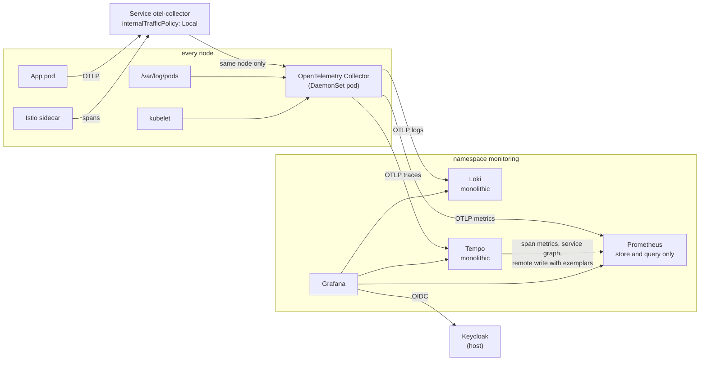

# Update setup 05: Observability — OpenTelemetry Collector, Prometheus, Loki, Tempo, Grafana

| | |
| --- | --- |
| Date | 2026-09-18 |
| Status | **Planned, not yet applied.** Revision 3: metrics in Prometheus instead of Mimir; collection by the OpenTelemetry Collector as a DaemonSet, reached through one node-local Service, instead of Grafana's `k8s-monitoring`/Alloy (see *Decisions*) |
| Scope | `/home/leo/dev/kind`, builds on [`update-setup-01.md`](update-setup-01.md) (platform services, cert-manager, trust-manager), [`update-setup-02.md`](update-setup-02.md) (TopoLVM) and [`update-setup-03.md`](update-setup-03.md) (Keycloak) |

## Goals

1. **Metrics, logs and traces for the cluster and its workloads**, collected by
   the OpenTelemetry Collector, stored in Prometheus, Loki and Tempo, explored in
   Grafana.
2. **One endpoint for every service:** `otel-collector.monitoring.svc`, which
   always answers on the caller's own node.
3. **All of it as platform services in a dedicated `monitoring` namespace,**
   rendered by Kustomize like every other part of `platformservices/`.
4. **Grafana logs in through Keycloak,** with the same realm, groups and
   break-glass pattern as Argo CD and Harbor.
5. **Correlation, not three silos:** a metric links to the trace behind it, a
   trace links to its logs and metrics, a log line links to its trace, and the
   service graph comes from the traces themselves.
6. **Sized for this machine.** One host with ~5.9 GB of free memory.

## What was verified before writing this

Checked on 2026-09-18 against the chart repositories, the released binaries and
this host.

**The collector** — its configuration in Step 5 was rendered from the real chart
and accepted by the real binary:

- **`opentelemetry-collector` chart 0.173.1, collector 0.160.0.** The chart leaves
  `image.repository` and `mode` empty on purpose; both must be chosen.
- **The Kubernetes distribution (`otel/opentelemetry-collector-k8s:0.160.0`) has
  every component this needs** — `otlp`, `file_log`, `kubelet_stats`,
  `host_metrics`, `k8s_cluster`, `k8s_objects`, `prometheus`, `receiver_creator`,
  `k8s_attributes`, `otlp_grpc`, `otlp_http`, `k8s_observer`,
  `k8s_leader_elector` — but **no `prometheusremotewrite` exporter** and **no
  receiver that tails pod logs through the Kubernetes API**. Metrics therefore go
  to Prometheus as OTLP, and pod logs can only be read from each node's
  `/var/log/pods` — which is what makes a DaemonSet necessary.
- **Component IDs were renamed to snake_case in 0.160** (`file_log`,
  `k8s_attributes`, `otlp_grpc`, `otlp_http`, …). The chart's presets still emit
  some old names (`hostmetrics`, `kubeletstats`), and the binary still accepts
  them as aliases — so chart and image are pinned together.
- **The final configuration validates.** `helm template` with exactly the values
  in Step 5, then `otelcol-k8s validate` on the rendered config: exit 0 (with a
  stand-in service account; without one it stops only at the pod-only paths
  `/hostfs`, `/var/lib/otelcol` and the service-account certificate).
- **The send queues survive a restart.** `sending_queue: { storage: file_storage }`
  on each exporter validates, and the chart already keeps `file_storage` at
  `/var/lib/otelcol` as a **hostPath** on the node (it holds the log checkpoints),
  so the queue outlives the pod — not the node. The DaemonSet rolls out with
  `RollingUpdate`, one node at a time, with a 30 s termination grace period.
- **In DaemonSet mode the chart adds leader election for `k8s_cluster` itself**
  (`k8s_leader_elector/k8s_cluster`), so cluster-level metrics are collected once,
  not once per node.
- **The `kubernetesEvents` preset adds nothing in DaemonSet mode.** Events come
  from `k8s_objects`, added by hand with its own leader election; `k8s_objects`
  and `k8s_events` both accept a `k8s_leader_elector` (validated).
- **The Service is the single endpoint, and it is node-local.** In DaemonSet mode
  the chart creates no Service unless `service.enabled: true`; with it, Service
  `otel-collector` gets `internalTrafficPolicy: Local` on 4317/4318.
- **Host ports are removed.** The chart binds `hostPort` 4317 and 4318 by default;
  with `hostPort: 0` the render has none. The chart's Jaeger and Zipkin ports,
  also open by default, are disabled.
- **The preset already associates data with the sending pod** in the right order
  — the pod's IP attribute, then its UID, then the connection address — so no
  override is needed.
- **The rendered RBAC covers the plan:** leases (`coordination.k8s.io`) for
  leader election, events, nodes, `nodes/stats`, pods, namespaces and workloads.

**The backends:**

- **Prometheus v3.14.0** has `--web.enable-otlp-receiver`, and started with
  `--enable-feature=exemplar-storage --web.enable-remote-write-receiver` it logs
  *"Experimental in-memory exemplar storage enabled"* and becomes ready. The
  `native-histograms` feature flag is a no-op in 3.14.
- **The `prometheus` chart (29.30.2)** enables `alertmanager`,
  `kube-state-metrics`, `prometheus-node-exporter` and `prometheus-pushgateway`
  by default and ships ten scrape jobs; it has `server.extraFlags`,
  `server.exemplars`, `server.otlp` (`promote_resource_attributes`),
  `server.retention`, `server.persistentVolume`, service port 80, and a
  Deployment with `strategy: Recreate`.
- **Charts moved:** `grafana`, `tempo` and `tempo-distributed` are deprecated in
  `grafana/helm-charts`; the maintained ones are in `grafana-community`. Loki's
  chart in `grafana/` is, per its README, *"now maintained for Grafana Enterprise
  Logs (GEL) users only"*; the OSS line is `grafana-community/loki` 18.x.
- **Tempo 3 runs monolithic without Kafka** (per its chart's upgrade notes); the
  `local_blocks` processor is gone.

**The platform:**

- **No metrics store exists yet** — no Prometheus, no Prometheus Operator CRDs.
  cert-manager, istiod, the Istio gateway and the `testapp-mesh` sidecars are
  already annotated for scraping.
- **trust-manager publishes the root CA** as ConfigMap `kind-root-ca`, key
  `ca.crt`, in every namespace.
- **Istio's `istiod` chart has no `valuesInline` yet.**
- **Host headroom:** 15 GiB RAM, 5.9 GiB available; TopoLVM ~52.6 GB free.

## Versions

| Component | Chart | Chart version | App / image | Repository |
| --- | --- | --- | --- | --- |
| OpenTelemetry Collector | `opentelemetry-collector` | **0.173.1** | `otel/opentelemetry-collector-k8s:0.160.0` | open-telemetry |
| Prometheus | `prometheus` | **29.30.2** | v3.14.0 | prometheus-community |
| Grafana | `grafana` | **13.2.5** | 13.2.2 | grafana-community |
| Loki | `loki` | **18.13.3** | 3.7.8 | grafana-community |
| Tempo | `tempo` (monolithic) | **3.0.0** | 3.0.3 | grafana-community |

## Architecture



Every service sends to the same name, and the Service delivers each request to
the collector on the sender's own node. That collector also reads the node's
logs and kubelet, and adds the Kubernetes metadata (namespace, pod, workload)
that makes the three signals joinable. One of the three, elected through a Lease,
additionally collects the cluster-wide signals.

## Decisions

- **The OpenTelemetry Collector, not Grafana Alloy.** Alloy is Grafana's
  distribution of the same OpenTelemetry components; nothing in the stack needs
  it. The upstream collector is vendor-neutral, configured in plain YAML, and
  what the rest of the OpenTelemetry ecosystem assumes.
- **Not `k8s-monitoring`.** Grafana's assembler chart turns features into Alloy
  configuration, but 4.x still requires defining collectors and assigning every
  feature, and deploys no kube-state-metrics or node-exporter unless told to —
  less turnkey than it looks, and Alloy-specific.
- **A DaemonSet, because logs live on the nodes.** Pod logs are files in each
  node's `/var/log/pods`, and the collector has no receiver that tails them
  through the Kubernetes API; host metrics need the node's `/proc` and `/sys`.
  Only a pod on every node can read those.
- **One endpoint: the node-local Service.** Every service and Istio send OTLP to
  `otel-collector.monitoring.svc:4317/4318`. With `internalTrafficPolicy: Local`,
  the name always reaches the collector on the sender's own node — one address
  for everyone, no cross-node hop.
- **No `hostPort`.** It would add a second way in, reachable by anything that can
  reach a node's address, and it is the path where a request can arrive with the
  node's address instead of the pod's. Through the Service, the pod's own address
  is kept, so the collector can tell which pod sent what.
- **No gateway Deployment.** A single Service name is not a single processing
  point: each node's collector handles its own share. That only matters for work
  that needs every span of a trace in one place, and none is planned here —
  cluster-wide receivers use leader election, and span metrics and the service
  graph come from Tempo, which sees every span. A gateway is added when tail
  sampling, central filtering or redaction, or an export outside the cluster
  arrives; the node collectors then forward to it.
- **Persistent send queues.** Each exporter queues on disk (`file_storage`, the
  hostPath the log checkpoints already use) instead of in memory. Data the
  collector has accepted then survives a crash or an out-of-memory kill, and a
  backend restart no longer loses what was waiting for it. What no queue can
  cover is data a service pushes while its node's collector is not running; SDK
  retries bridge the few seconds of a restart.
- **OTLP end to end.** Collector → Prometheus (`/api/v1/otlp`), Loki (`/otlp`)
  and Tempo, all OTLP. Prometheus keeps its remote-write receiver as well,
  because Tempo's metrics generator writes span metrics that way.
- **OpenTelemetry metric names for the infrastructure.** `kubelet_stats`,
  `host_metrics` and `k8s_cluster` produce OpenTelemetry semantics
  (`k8s_pod_cpu_usage`, `k8s_node_memory_usage`, …), not cAdvisor,
  kube-state-metrics or node-exporter names. Dashboards are chosen accordingly.
  Istio's and cert-manager's own metrics are scraped as Prometheus metrics and
  keep their names, so Istio's dashboards apply unchanged.
- **Prometheus promotes the Kubernetes resource attributes to labels.** By
  default OTLP resource attributes land in a separate `target_info` series;
  without promotion no metric could be filtered by namespace or pod.
- **Prometheus, not Mimir, as the metrics store.** Mimir's strengths —
  scale-out, long object-storage retention, multi-tenancy — do not apply to one
  node; its current chart defaults to Kafka and a dozen components with no
  monolithic mode. Grafana does not see a difference, and Mimir can be added
  behind Prometheus later.
- **Exemplars on, knowingly in memory.** `exemplar-storage` keeps trace ids on
  samples; Prometheus holds them in a fixed buffer, so the links exist for recent
  data only.
- **Monolithic backends on TopoLVM volumes,** no object store; Grafana, Loki and
  Tempo from `grafana-community`.
- **Grafana logs in through Keycloak** as a third client in `localdev`.
- **No sidecar injection in `monitoring`.** The telemetry stack must not depend
  on the mesh it observes.
- **Retention sized to the disk:** Prometheus 15 days, Loki 7 days, Tempo 72
  hours.

## Resource budget

| Component | Pods | Request | Limit | Volume |
| --- | --- | --- | --- | --- |
| OpenTelemetry Collector (DaemonSet) | 3 | 128 Mi each | 512 Mi each | — |
| Prometheus | 1 | 256 Mi | 1 Gi | 15 Gi |
| Loki | 1 | 256 Mi | 768 Mi | 10 Gi |
| Tempo | 1 | 256 Mi | 768 Mi | 10 Gi |
| Grafana | 1 | 128 Mi | 384 Mi | 1 Gi |
| **Total** | **7** | **~1.25 Gi** | **~4.4 Gi** | **36 Gi** |

Expected use is roughly 1.2–2 GiB against 5.9 GiB available. If memory gets
tight, stop Harbor first. The 36 Gi of volumes leave ~16 GB of the volume group
for everything else.

## Layout

```
platformservices/monitoring/
├── kustomization.yaml          # aggregates the parts below
├── namespace.yaml              # monitoring, deliberately without istio-injection
├── otel-collector/             # helmCharts: open-telemetry/opentelemetry-collector (DaemonSet)
├── prometheus/                 # helmCharts: prometheus-community/prometheus
├── loki/                       # helmCharts: grafana-community/loki
├── tempo/                      # helmCharts: grafana-community/tempo
└── grafana/                    # helmCharts: grafana-community/grafana, Ingress, dashboards
```

## Step 1: Namespace

`platformservices/monitoring/namespace.yaml`:

```yaml
apiVersion: v1
kind: Namespace
metadata:
  name: monitoring
  # Deliberately no istio-injection label: the telemetry stack must keep working
  # when the mesh it observes does not.
```

## Step 2: Prometheus as the metrics store

`platformservices/monitoring/prometheus/kustomization.yaml`:

```yaml
helmCharts:
- name: prometheus
  repo: https://prometheus-community.github.io/helm-charts
  version: 29.30.2
  releaseName: prometheus
  namespace: monitoring
  valuesInline:
    server:
      extraFlags:
        - web.enable-lifecycle             # the chart's default, kept for config reloads
        - web.enable-otlp-receiver         # the collector sends OTLP to /api/v1/otlp
        - web.enable-remote-write-receiver # Tempo's span metrics arrive via /api/v1/write
        - enable-feature=exemplar-storage  # trace ids on samples, for metric -> trace links
      otlp:
        # Without this, resource attributes only exist in target_info, and no metric
        # could be filtered by namespace, pod or node.
        promote_resource_attributes:
          - k8s.namespace.name
          - k8s.pod.name
          - k8s.node.name
          - k8s.container.name
          - k8s.deployment.name
          - k8s.statefulset.name
          - k8s.daemonset.name
          - service.name
      exemplars:
        max_exemplars: 100000              # in-memory ring buffer; recent data only
      retention: 15d
      persistentVolume:
        enabled: true
        size: 15Gi
        storageClass: topolvm
      resources:
        requests: { memory: 256Mi }
        limits: { memory: 1Gi }
      # strategy stays at the chart's default, Recreate: never two servers on one TSDB
    # The collector does the collecting: Prometheus only scrapes itself.
    scrapeConfigs:
      kubernetes-api-servers: { enabled: false }
      kubernetes-nodes: { enabled: false }
      kubernetes-nodes-cadvisor: { enabled: false }
      kubernetes-service-endpoints: { enabled: false }
      kubernetes-service-endpoints-slow: { enabled: false }
      prometheus-pushgateway: { enabled: false }
      kubernetes-services: { enabled: false }
      kubernetes-pods: { enabled: false }
      kubernetes-pods-slow: { enabled: false }
    alertmanager: { enabled: false }             # alerting is out of scope
    kube-state-metrics: { enabled: false }       # the collector's k8s_cluster receiver covers it
    prometheus-node-exporter: { enabled: false } # the collector's host_metrics receiver covers it
    prometheus-pushgateway: { enabled: false }
```

Endpoints:

- OTLP from the collector: `http://prometheus-server.monitoring.svc/api/v1/otlp`
  (the exporter appends `/v1/metrics`)
- remote write from Tempo: `http://prometheus-server.monitoring.svc/api/v1/write`
- query: `http://prometheus-server.monitoring.svc` (service port 80)

## Step 3: Loki, monolithic

`platformservices/monitoring/loki/kustomization.yaml`:

```yaml
helmCharts:
- name: loki
  repo: https://grafana-community.github.io/helm-charts
  version: 18.13.3
  releaseName: loki
  namespace: monitoring
  valuesInline:
    deploymentMode: Monolithic
    loki:
      auth_enabled: false            # single tenant
      commonConfig:
        replication_factor: 1
      storage:
        type: filesystem
      schemaConfig:
        configs:
          - from: "2026-09-18"
            store: tsdb
            object_store: filesystem
            schema: v13
            index: { prefix: loki_index_, period: 24h }
      limits_config:
        retention_period: 168h       # 7 days
        allow_structured_metadata: true   # OTLP attributes that do not become labels
      compactor:
        retention_enabled: true
        delete_request_store: filesystem
    singleBinary:
      replicas: 1
      persistence:
        enabled: true
        size: 10Gi
        storageClass: topolvm
      resources:
        requests: { memory: 256Mi }
        limits: { memory: 768Mi }
    backend: { replicas: 0 }
    read: { replicas: 0 }
    write: { replicas: 0 }
    chunksCache: { enabled: false }
    resultsCache: { enabled: false }
    lokiCanary: { enabled: false }
    test: { enabled: false }
    minio: { enabled: false }
    gateway: { enabled: false }
```

OTLP endpoint for the collector: `http://loki.monitoring.svc:3100/otlp` (the
exporter appends `/v1/logs`). Loki maps a default set of resource attributes —
the common `k8s.*` ones and `service.name` — to index labels and keeps the rest
as structured metadata; confirm which labels appear before building queries on
them.

## Step 4: Tempo, monolithic

`platformservices/monitoring/tempo/kustomization.yaml`:

```yaml
helmCharts:
- name: tempo
  repo: https://grafana-community.github.io/helm-charts
  version: 3.0.0
  releaseName: tempo
  namespace: monitoring
  valuesInline:
    tempo:
      storage:
        trace:
          backend: local
      retention: 72h
      receivers:
        otlp:
          protocols:
            grpc: { endpoint: "0.0.0.0:4317" }
            http: { endpoint: "0.0.0.0:4318" }
      # Span metrics and the service graph, written to Prometheus with exemplars:
      # this gives un-instrumented workloads metric -> trace links.
      metricsGenerator:
        enabled: true
        remoteWriteUrl: http://prometheus-server.monitoring.svc/api/v1/write
      resources:
        requests: { memory: 256Mi }
        limits: { memory: 768Mi }
    persistence:
      enabled: true
      size: 10Gi
      storageClassName: topolvm
```

Tempo 3 dropped the `local_blocks` processor, so only `service-graphs` and
`span-metrics` are enabled, and the remote write must send exemplars
(`send_exemplars: true`). Check these value names against
`helm show values tempo --version 3.0.0` — the chart was restructured for 3.0.

## Step 5: The OpenTelemetry Collector as a DaemonSet

`platformservices/monitoring/otel-collector/kustomization.yaml`. These are exactly
the values rendered and validated with `otelcol-k8s validate`, plus `resources`:

```yaml
helmCharts:
- name: opentelemetry-collector
  repo: https://open-telemetry.github.io/opentelemetry-helm-charts
  version: 0.173.1
  releaseName: otel-collector
  namespace: monitoring
  valuesInline:
    fullnameOverride: otel-collector       # Service: otel-collector.monitoring.svc
    mode: daemonset                        # pod logs and host metrics only exist per node
    image:
      repository: otel/opentelemetry-collector-k8s
      tag: 0.160.0                         # pinned with the chart: the presets rely on name aliases
    command:
      name: otelcol-k8s
    resources:
      requests: { memory: 128Mi }
      limits: { memory: 512Mi }

    # The single endpoint for every service and for Istio. Not created in
    # DaemonSet mode unless asked for; with it, the chart sets
    # internalTrafficPolicy: Local, so the name reaches the sender's own node.
    service:
      enabled: true

    presets:
      logsCollection:                      # file_log on /var/log/pods of this node
        enabled: true
        includeCollectorLogs: false
        storeCheckpoints: true             # resume where it stopped after a restart
      kubernetesAttributes: { enabled: true }   # namespace, pod, workload on every signal
      kubeletMetrics: { enabled: true }         # kubelet_stats: pods and containers on this node
      hostMetrics: { enabled: true }            # host_metrics: the node itself
      clusterMetrics: { enabled: true }         # k8s_cluster; the chart adds leader election in this mode
      annotationDiscovery:                      # scrape pods annotated prometheus.io/scrape on this node
        metrics: { enabled: true }              # (Istio, cert-manager, istiod)

    ports:
      # Reached only through the Service: no hostPort on the nodes.
      otlp: { hostPort: 0 }
      otlp-http: { hostPort: 0 }
      jaeger-compact: { enabled: false }
      jaeger-thrift: { enabled: false }
      jaeger-grpc: { enabled: false }
      zipkin: { enabled: false }

    config:
      extensions:
        # The events preset adds nothing in DaemonSet mode, so events come from
        # k8s_objects - collected by one pod only, through its own Lease.
        k8s_leader_elector/k8s_objects:
          auth_type: serviceAccount
          lease_name: otel-k8s-objects
          lease_namespace: monitoring
      receivers:
        jaeger: null
        zipkin: null
        k8s_objects:
          auth_type: serviceAccount
          k8s_leader_elector: k8s_leader_elector/k8s_objects
          objects:
            - { name: events, mode: watch }
      exporters:
        # Queues on disk, not in memory: accepted data survives a collector crash
        # and waits out a backend restart. file_storage is the node hostPath the
        # log checkpoints already use.
        otlp_http/prometheus:
          endpoint: http://prometheus-server.monitoring.svc/api/v1/otlp
          sending_queue: { enabled: true, storage: file_storage }
          retry_on_failure: { enabled: true }
        otlp_http/loki:
          endpoint: http://loki.monitoring.svc:3100/otlp
          sending_queue: { enabled: true, storage: file_storage }
          retry_on_failure: { enabled: true }
        otlp_grpc/tempo:
          endpoint: tempo.monitoring.svc:4317
          tls: { insecure: true }
          sending_queue: { enabled: true, storage: file_storage }
          retry_on_failure: { enabled: true }
      service:
        extensions:
          - health_check
          - file_storage                   # log checkpoints and the send queues
          - k8s_observer                   # annotation discovery
          - k8s_leader_elector/k8s_cluster # added by the clusterMetrics preset
          - k8s_leader_elector/k8s_objects
        pipelines:
          traces:
            receivers: [otlp]
            processors: [memory_limiter, k8s_attributes, batch]
            exporters: [otlp_grpc/tempo]
          metrics:
            receivers: [otlp, prometheus, kubeletstats, hostmetrics, k8s_cluster, receiver_creator/metrics]
            processors: [memory_limiter, k8s_attributes, batch]
            exporters: [otlp_http/prometheus]
          logs:
            receivers: [otlp, file_log, k8s_objects]
            processors: [memory_limiter, k8s_attributes, batch]
            exporters: [otlp_http/loki]
```

What the render produced with these values: a DaemonSet whose container declares
`otlp` 4317 and `otlp-http` 4318 with no `hostPort`; Service `otel-collector`
with `internalTrafficPolicy: Local` on 4317/4318; and a ClusterRole covering
leases, events, nodes, `nodes/stats`, pods, namespaces and workloads.

### How services send telemetry

Every service uses the same endpoint; no per-pod configuration beyond it:

```yaml
env:
  - name: OTEL_EXPORTER_OTLP_ENDPOINT
    value: http://otel-collector.monitoring.svc:4318
  - name: OTEL_EXPORTER_OTLP_PROTOCOL
    value: http/protobuf
```

The collector identifies the sending pod by the connection address, which the
Service path preserves, and adds namespace, pod and workload itself.

## Step 6: Grafana

`platformservices/monitoring/grafana/kustomization.yaml`:

```yaml
helmCharts:
- name: grafana
  repo: https://grafana-community.github.io/helm-charts
  version: 13.2.5
  releaseName: grafana
  namespace: monitoring
  valuesInline:
    admin:
      existingSecret: grafana-admin      # created by deploy.sh; the break-glass account
      userKey: admin-user
      passwordKey: admin-password
    persistence:
      enabled: true
      size: 1Gi
      storageClassName: topolvm
    resources:
      requests: { memory: 128Mi }
      limits: { memory: 384Mi }
    ingress:
      enabled: true
      ingressClassName: cloud-provider-kind
      annotations:
        cert-manager.io/cluster-issuer: kind-ca
      hosts: [grafana.kind.local]
      tls:
        - hosts: [grafana.kind.local]
          secretName: grafana-tls
    datasources:
      datasources.yaml:
        apiVersion: 1
        datasources:
          - name: Prometheus
            uid: prometheus
            type: prometheus
            url: http://prometheus-server.monitoring.svc
            isDefault: true
            jsonData:
              exemplarTraceIdDestinations:          # metric -> trace
                - { name: trace_id, datasourceUid: tempo }
          - name: Loki
            uid: loki
            type: loki
            url: http://loki.monitoring.svc:3100
            jsonData:
              derivedFields:                         # log -> trace
                - name: traceID
                  matcherRegex: '(?:traceID|trace_id|traceId)[=:"\s]+(\w+)'
                  url: '$${__value.raw}'
                  datasourceUid: tempo
          - name: Tempo
            uid: tempo
            type: tempo
            url: http://tempo.monitoring.svc:3200
            jsonData:
              tracesToLogsV2: { datasourceUid: loki, filterByTraceID: true }   # trace -> logs
              tracesToMetrics: { datasourceUid: prometheus }                   # trace -> metrics
              serviceMap: { datasourceUid: prometheus }                        # service graph
              nodeGraph: { enabled: true }
```

Logs that arrive through OTLP carry the trace id as structured metadata as well;
the derived field covers ids written into the log line itself.

**Dashboards,** pinned by grafana.com id **and revision**: Kubernetes views built
for OpenTelemetry metric names (the classic kube-state-metrics dashboards will
not find their series), and Istio's official dashboards (Mesh 7639, Service
7636, Workload 7630), which apply unchanged. Revisions are chosen and pinned
while implementing.

`./hosts.sh` picks up `grafana.kind.local` on its own, because it is an Ingress
host.

## Step 7: Grafana logs in through Keycloak

The same pattern as Argo CD and Harbor, applying everything update-setup-03
taught.

**The client in `identity/realm/localdev.yaml`:**

```yaml
  - clientId: grafana
    name: Grafana
    enabled: true
    publicClient: false
    standardFlowEnabled: true
    directAccessGrantsEnabled: false
    secret: $(env:GRAFANA_CLIENT_SECRET)
    rootUrl: https://grafana.kind.local
    redirectUris:
      - https://grafana.kind.local/login/generic_oauth
    webOrigins:
      - https://grafana.kind.local
    attributes:
      pkce.code.challenge.method: S256
    # Client scopes only: "openid" is the request scope, not one of these, and
    # listing it crashes keycloak-config-cli. Add optionalClientScopes:
    # [offline_access] only if Grafana is configured to request it.
    defaultClientScopes: [basic, profile, email, roles, web-origins, groups]
```

`identity/setup-host.sh` gains `gen grafana-client-secret` and
`gen grafana-admin-password`, and passes `GRAFANA_CLIENT_SECRET` to
keycloak-config-cli.

**Grafana's side,** in the chart's `grafana.ini`:

```yaml
    grafana.ini:
      server:
        # https, not http: the redirect URI is built from this, and the Argo CD
        # detour showed what a scheme mismatch costs.
        root_url: https://grafana.kind.local
      auth.generic_oauth:
        enabled: true
        name: Keycloak
        client_id: grafana
        client_secret: $__env{GRAFANA_OIDC_CLIENT_SECRET}
        scopes: openid profile email groups
        auth_url: https://keycloak.kind.local:8443/realms/localdev/protocol/openid-connect/auth
        token_url: https://keycloak.kind.local:8443/realms/localdev/protocol/openid-connect/token
        api_url: https://keycloak.kind.local:8443/realms/localdev/protocol/openid-connect/userinfo
        use_pkce: true
        # The token and userinfo calls go from Grafana's server to Keycloak, so
        # the server must trust the local root CA - trust-manager's ConfigMap.
        tls_client_ca: /etc/ssl/kind/ca.crt
        login_attribute_path: preferred_username
        email_attribute_path: email
        role_attribute_path: >-
          contains(groups[*], 'platform-admins') && 'Admin' ||
          contains(groups[*], 'platform-users') && 'Editor' || 'Viewer'
        allow_assign_grafana_admin: true
        role_attribute_strict: false     # no matching group -> Viewer, not locked out
      auth:
        disable_login_form: false        # the local admin stays reachable
```

Plus `extraConfigmapMounts` mounting ConfigMap `kind-root-ca` (key `ca.crt`) at
`/etc/ssl/kind`, and `envValueFrom` setting `GRAFANA_OIDC_CLIENT_SECRET` from
Secret `grafana-oidc`.

**`platformservices/deploy.sh`,** inside the existing `identity/out` block:

```bash
from_files kubectl -n monitoring create secret generic grafana-oidc \
    --from-file=client-secret="$IDENTITY/grafana-client-secret"
from_files kubectl -n monitoring create secret generic grafana-admin \
    --from-literal=admin-user=admin \
    --from-literal=admin-password="$(cat "$IDENTITY/grafana-admin-password")"
```

**The resulting mapping,** to be added to the *Identities and roles* section of
`architecture.md` with the new credential rows
(`identity/out/grafana-client-secret`, `identity/out/grafana-admin-password`):

| Group | Grafana role |
| --- | --- |
| `platform-admins` | `Admin`, plus Grafana server admin |
| `platform-users` | `Editor` |
| no group | `Viewer` |

Grafana resolves `keycloak.kind.local` through the CoreDNS hosts entry that
`identity/cluster-dns.sh` already writes.

## Step 8: Traces from the mesh

In `platformservices/istio/kustomization.yaml`, the `istiod` chart gets its first
`valuesInline`, pointing the mesh at the same Service every other service uses:

```yaml
  valuesInline:
    meshConfig:
      extensionProviders:
        - name: otel
          opentelemetry:
            service: otel-collector.monitoring.svc.cluster.local
            port: 4317
```

and a mesh-wide `Telemetry` resource in `platformservices/istio/config/`:

```yaml
apiVersion: telemetry.istio.io/v1
kind: Telemetry
metadata:
  name: mesh-default
  namespace: istio-system
spec:
  tracing:
    - providers: [{ name: otel }]
      randomSamplingPercentage: 100   # a dev cluster: every request is interesting
```

`testapp-mesh` then produces traces with no code changes; Tempo turns them into
span metrics with exemplars, and those land in Prometheus — the end-to-end path
for metric → trace links in this cluster.

## Step 9: Wiring into the platform

- **Aggregate** `platformservices/kustomization.yaml` gains `monitoring`.
- **`platformservices/deploy.sh`** applies it after Istio, backends first:

```bash
# 6. Monitoring: storage first, then the collector that writes to it, then Grafana
apply monitoring/namespace
apply monitoring/prometheus;      kubectl -n monitoring rollout status deployment/prometheus-server --timeout=300s
apply monitoring/loki;            kubectl -n monitoring rollout status statefulset/loki --timeout=300s
apply monitoring/tempo;           kubectl -n monitoring rollout status statefulset/tempo --timeout=300s
apply monitoring/otel-collector;  kubectl -n monitoring rollout status daemonset/otel-collector --timeout=300s
apply monitoring/grafana;         available monitoring
```

## Step 10: Verification

**One collector per node, node-local Service, no host ports, cluster-wide work
done once:**

```bash
kubectl -n monitoring get daemonset otel-collector            # DESIRED = READY = 3
kubectl -n monitoring get svc otel-collector -o jsonpath='{.spec.internalTrafficPolicy}'; echo   # Local
kubectl -n monitoring get daemonset otel-collector -o jsonpath='{..hostPort}'; echo              # empty
kubectl -n monitoring get lease                               # one holder per lease
```

**A service reaches the collector through the Service name:**

```bash
kubectl run otlp-test --image=harbor.kind.local:3443/library/busybox:1.36 --restart=Never --rm -i \
  --command -- sh -c 'nc -z -w3 otel-collector.monitoring.svc 4318 && echo reachable'
```

**Prometheus has the data, with Kubernetes labels, and not three times over:**

```bash
kubectl -n monitoring port-forward svc/prometheus-server 9090:80 &
q() { curl -s "localhost:9090/api/v1/query" --data-urlencode "query=$1"; echo; }
q 'count by (k8s_namespace_name) (k8s_pod_phase)'     # per-namespace series: promotion works
q 'count(k8s_node_condition_ready)'                   # 3, not 9: leader election works
q 'prometheus_http_requests_total{handler=~"/api/v1/(otlp|write).*"}'
```

**A collector restart loses no logs and no queued data:**

```bash
# Stop Loki, let the collectors queue for a minute, restart one collector, bring Loki back.
kubectl -n monitoring scale statefulset loki --replicas=0
node=dev-worker; pod=$(kubectl -n monitoring get pod -l app.kubernetes.io/name=opentelemetry-collector \
  --field-selector spec.nodeName=$node -o name)
kubectl -n monitoring delete $pod                       # its queue is on the node, not in the pod
kubectl -n monitoring scale statefulset loki --replicas=1
# Then in Grafana: the logs from pods on $node show no gap across the outage.
```

**Exemplars, logs and traces** (after some traffic to `testapp-mesh.kind.local`):

```bash
curl -s 'localhost:9090/api/v1/query_exemplars?query=traces_spanmetrics_latency_bucket&start=-15m' | head -c 400
kubectl -n monitoring port-forward svc/loki 3100 &
curl -s 'localhost:3100/loki/api/v1/query_range' --data-urlencode 'query={k8s_namespace_name="argocd"}' | head -c 300
kubectl -n monitoring port-forward svc/tempo 3200 &
curl -s 'localhost:3200/api/search?limit=5' | head -c 300
```

**Grafana, in the browser** at `https://grafana.kind.local`: *Sign in with
Keycloak* as `dev` lands as **Admin**; a latency graph for `testapp-mesh` shows
exemplar dots that open a trace; that trace opens its logs and metrics; the
service graph shows the mesh.

**A Playwright suite, `tests/specs/grafana.spec.ts`:**

- log in through Keycloak and assert `/api/user` reports `dev` with
  `isGrafanaAdmin: true`, and `/api/org` role `Admin`;
- call `/api/datasources/uid/{prometheus,loki,tempo}/health` in the logged-in
  session and assert all three are `OK`.

## Step 11: Document the architecture in `architecture.md`

After Step 10 has passed, so the documentation describes what was proven rather
than what was planned. `architecture.md` keeps one decision per ADR, in Michael
Nygard's form — context, decision, consequences — and its diagrams must render
on GitHub.

### 11.1 Four ADRs, one decision each

ADR-0018 stays reserved by the postponed update-setup-04, so these continue at
0019. Each records the alternatives that were weighed: this plan went through
three revisions, and the reasons are the part worth keeping.

| ADR | Decision | Alternatives on record |
| --- | --- | --- |
| **0019** | Collect with the OpenTelemetry Collector | Grafana Alloy; Grafana's `k8s-monitoring` |
| **0020** | Run it as a DaemonSet behind one node-local Service, with persistent send queues | Deployment-only gateway; agent plus gateway; `hostPort` |
| **0021** | Prometheus as the metrics store, fed over OTLP | Mimir (plain manifests or `mimir-distributed`); `kube-prometheus-stack` |
| **0022** | Monolithic Loki and Tempo on TopoLVM volumes, charts from `grafana-community` | Scalable modes; object storage; the deprecated or GEL-only charts in `grafana/` |

Drafts, to be adjusted to what Step 10 showed:

**ADR-0019: Collection with the OpenTelemetry Collector.**
*Context.* Metrics, logs and traces have to be collected from the nodes, the
workloads and the mesh. Grafana's `k8s-monitoring` chart and the upstream
collector both do it. Alloy is Grafana's distribution of the same OpenTelemetry
components with its own configuration language, and `k8s-monitoring` 4.x still
needs collectors defined and every feature assigned by hand.
*Decision.* The upstream collector, Kubernetes distribution
(`otel/opentelemetry-collector-k8s`), configured through the chart's presets,
sending OTLP to every backend.
*Consequences.* Vendor-neutral configuration in plain YAML. Infrastructure
metrics carry OpenTelemetry names, so dashboards are chosen for them. Chart and
image are upgraded together and re-checked with `otelcol-k8s validate`, because
the presets rely on component-name aliases that 0.160 still accepts.

**ADR-0020: The collector as a DaemonSet behind one node-local Service.**
*Context.* Pod logs exist only as files on each node, and the collector has no
receiver that reads them through the Kubernetes API. Services should have a
single endpoint. A single Service name is not a single processing point, and
nothing planned needs one.
*Decision.* A DaemonSet. Service `otel-collector` with
`internalTrafficPolicy: Local` as the only endpoint, for services and Istio
alike; no `hostPort`; cluster-wide receivers under leader election; send queues
on the node's disk. A gateway is added when tail sampling, central filtering or
an export outside the cluster requires it.
*Consequences.* One address, no cross-node hop, the sending pod identified by
its connection. A restart loses only what services push during the seconds it
is down; logs resume from their checkpoint and queued data survives. The queues
last as long as the node, not longer.

**ADR-0021: Prometheus as the metrics store, fed over OTLP.**
*Context.* Mimir was the first choice. Its chart (`mimir-distributed` 6.2.0)
enables Kafka, MinIO and a dozen components and has no monolithic mode, and
Mimir's strengths — scale-out, object-storage retention, multi-tenancy — do not
apply to one node. `kube-prometheus-stack` would duplicate the collection layer
and bring its own Grafana.
*Decision.* Prometheus 3 for storage and queries only: an OTLP receiver for the
collector, a remote-write receiver for Tempo's span metrics, exemplar storage,
Kubernetes resource attributes promoted to labels, every scrape job but its own
disabled.
*Consequences.* One process from a maintained chart; Grafana is unaffected if
Mimir is ever added behind remote write. Exemplars live in memory, so
metric → trace links exist for recent data only. Retention is bound by a 15 GiB
volume.

**ADR-0022: Monolithic Loki and Tempo on local volumes.**
*Context.* Scalable modes and object storage serve throughput and availability
this cluster does not need. The charts moved: `grafana`, `tempo` and
`tempo-distributed` are deprecated in `grafana/helm-charts`, and Loki's chart
there is for Grafana Enterprise Logs only.
*Decision.* Loki in `Monolithic` mode and Tempo 3 monolithic, filesystem storage
on TopoLVM, 7 days and 72 hours of retention, charts from `grafana-community`.
*Consequences.* A small footprint and no object store to run; no high
availability; the data lives and dies with the cluster; the charts come from a
community repository, whose releases need watching.

Grafana's Keycloak login needs no ADR of its own: it applies ADR-0017's pattern
and is documented under *Identities and roles* (11.4).

### 11.2 The C4 container diagram

Add the five components to the *Platform services* boundary, with their
relations:

- containers `otelcol` (OpenTelemetry Collector, DaemonSet behind Service
  `otel-collector`), `prometheus`, `loki`, `tempo`, `grafana`;
- `apps → otelcol` (telemetry, OTLP); `otelcol → prometheus`, `→ loki`,
  `→ tempo` (OTLP); `tempo → prometheus` (span metrics, remote write);
  `grafana → prometheus`, `→ loki`, `→ tempo` (queries);
  `grafana → keycloak` (OIDC); `dev → grafana` (explores telemetry, HTTPS).

Relations must name containers, never boundaries: Mermaid's C4 renderer rejects
a relation that targets a boundary — the error met when the diagram was first
split into boundaries.

### 11.3 An *Observability* section

Next to *Storage* and *Registry*, in the same shape:

- the data-flow diagram from this plan's *Architecture* section;
- the single endpoint for services, `otel-collector.monitoring.svc:4317/4318`,
  and why it is node-local;
- what a collector restart can lose (from *Known limitations*);
- retention per signal, and the correlation paths: metric → trace,
  trace → logs and metrics, log → trace, the service graph.

### 11.4 *Identities and roles*

- the flow diagram gains Grafana, reached by `platform-admins` (Admin and server
  admin) and `platform-users` (Editor), with its local `admin` as one more
  break-glass account;
- the credentials table gains `identity/out/grafana-client-secret`,
  `identity/out/grafana-admin-password`, and the Secrets `grafana-oidc` and
  `grafana-admin` in `monitoring`;
- the group-to-rights table gains a Grafana column.

### 11.5 README and this plan's status

- README: a *Monitoring* section — how to open Grafana, the endpoint for
  services, and the smoke test (`tests/run.sh specs/grafana.spec.ts`).
- This file: status *applied*, with Step 10's evidence, and implementation notes
  for whatever differed from the plan — as update-setup-03 did.

### 11.6 Check

Every Mermaid diagram in `architecture.md` renders: extract each block and run
it through `mermaid-cli`, as for the existing diagrams.

## Known limitations and open points

- **What a collector restart can lose.** `internalTrafficPolicy: Local` has no
  fallback to another node, so it depends on where the data is at that moment:
  - *pod log files* — nothing: the checkpoint resumes at the last read position;
  - *pulled metrics* (kubelet, host, cluster, annotated pods) — a gap of an
    interval or two; those samples were simply never taken;
  - *accepted but not yet exported* — nothing: the send queues are on disk;
  - *pushed by services while the collector is down* — at risk. SDK retries with
    backoff usually bridge a restart of a few seconds; Envoy's spans in that
    window are lost. Planned restarts are rolling and graceful, one node at a
    time, so the exposure is mainly a crash, which the memory limiter guards
    against.
- **The queues outlive the pod, not the node.** They sit on the node's
  `/var/lib/otelcol`; recreating the cluster discards whatever was still queued.
- **Mesh clients: to be observed.** Pods with a sidecar reach the Service through
  Envoy, which picks endpoints itself. Whether Envoy honours
  `internalTrafficPolicy: Local` decides only locality, not correctness — every
  collector exports the same way — so this is noted, not a blocker.
- **The presets rely on deprecated component names** (`hostmetrics`,
  `kubeletstats`) that 0.160 still accepts. Upgrading the image without the chart,
  or the chart past the point where the aliases go, can break the config — upgrade
  them together and re-run `validate`.
- **Validated, not yet run.** The collector configuration passes
  `otelcol-k8s validate`; behaviour against the live API server and the leader
  election in practice are confirmed only once deployed (Step 10).
- **Dashboards need OpenTelemetry-aware choices.** Community Kubernetes
  dashboards built on kube-state-metrics, cAdvisor and node-exporter names will
  show no data. If they are wanted, kube-state-metrics and node-exporter can be
  added and scraped alongside.
- **Loki's default label mapping** for OTLP decides which attributes become
  index labels; confirm before relying on queries such as
  `{k8s_namespace_name="…"}`.
- **Exemplars are in-memory and experimental** in Prometheus 3.14; the exemplar
  label name (`trace_id` vs `traceID`) must match what Tempo writes.
- **Unverified: Tempo 3.0 value keys**, including the remote-write exemplar
  switch.
- **cAdvisor-style filesystem metrics may be missing** because of ZFS
  (ADR-0011); `kubelet_stats` reads the kubelet's own summary API, which may
  behave differently — to be seen.
- **No high availability, by design; retention is disk-bound; alerting is out of
  scope.**
