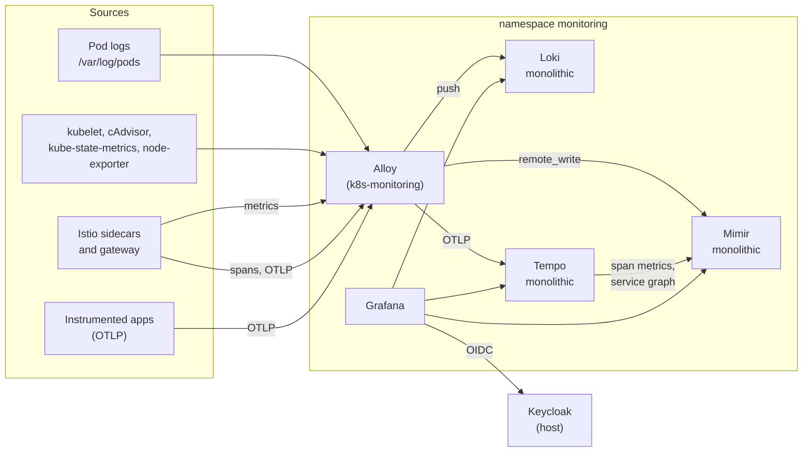

# Update setup 05: Observability with the Grafana stack — Mimir, Loki, Tempo, Grafana

| | |
| --- | --- |
| Date | 2026-09-18 |
| Status | **Planned, not yet applied** |
| Scope | `/home/leo/dev/kind`, builds on [`update-setup-01.md`](update-setup-01.md) (platform services, cert-manager, trust-manager), [`update-setup-02.md`](update-setup-02.md) (TopoLVM) and [`update-setup-03.md`](update-setup-03.md) (Keycloak) |

## Goals

1. **Metrics, logs and traces for the cluster and its workloads**, stored in
   Mimir, Loki and Tempo and explored in Grafana.
2. **All of it as platform services in a dedicated `monitoring` namespace,**
   rendered by Kustomize like every other part of `platformservices/`.
3. **Grafana logs in through Keycloak,** with the same realm, groups and
   break-glass pattern as Argo CD and Harbor.
4. **Correlation, not three silos:** a trace links to its logs, a log line links
   to its trace, and the service graph comes from the traces themselves.
5. **Sized for this machine.** One host with ~5.9 GB of free memory, not a
   production cluster.

## What was verified before writing this

Checked on 2026-09-18 against the chart repositories and this host:

- **Three charts changed repository.** `grafana`, `tempo` and
  `tempo-distributed` are marked **deprecated** in `grafana/helm-charts` (last
  release January 2026). Their maintained versions are in
  **`grafana-community/helm-charts`** (`https://grafana-community.github.io/helm-charts`).
- **Loki moved as well, less visibly.** Its chart in Grafana's repo is *not*
  flagged deprecated, but its README says: *"As of March 16, 2026, the Grafana
  Loki Helm chart for OSS users has moved to grafana-community/helm-charts … The
  chart in this repository is now maintained for Grafana Enterprise Logs (GEL)
  users only."* The two lines have diverged (7.3.0 vs 18.13.3), so picking the
  wrong one would silently mean an enterprise-oriented chart.
- **Mimir 3's chart enables Kafka by default.** `mimir-distributed` 6.2.0 turns
  on `kafka`, `minio`, `rollout_operator`, `gateway` and about a dozen
  microservices — Mimir's ingest-storage architecture. The chart has no
  monolithic mode (no `deploymentMode` key).
- **Tempo 3 still runs monolithic without Kafka.** From the chart's upgrade notes:
  *"Monolithic mode still runs every component in one process and needs no
  Kafka."* Tempo 3.0 removed the ingester and compactor; the `local_blocks`
  metrics-generator processor is gone.
- **Loki's community chart** defaults to `deploymentMode: Monolithic` (the old
  name `SingleBinary` is deprecated).
- **`k8s-monitoring` ships every feature disabled and no destinations**
  (`destinations: {}`), so nothing is collected until configured.
- **trust-manager already publishes the root CA** as ConfigMap `kind-root-ca`,
  key `ca.crt`, in every namespace — Grafana can verify Keycloak with it.
- **Istio's `istiod` chart has no `valuesInline` yet** in
  `platformservices/istio/kustomization.yaml`, so mesh tracing is a new block.
- **Host headroom:** 15 GiB RAM, **5.9 GiB available** with the cluster, Harbor
  and Keycloak running. TopoLVM reports **~52.6 GB free** in the shared volume
  group.

## Versions

| Component | Chart | Chart version | App version | Repository |
| --- | --- | --- | --- | --- |
| Grafana | `grafana` | **13.2.5** | 13.2.2 | grafana-community |
| Loki | `loki` | **18.13.3** | 3.7.8 | grafana-community |
| Tempo | `tempo` (monolithic) | **3.0.0** | 3.0.3 | grafana-community |
| Mimir | *no chart, see decisions* | — | 3.2.0 | image `grafana/mimir` |
| Collection | `k8s-monitoring` | **4.5.2** | — | grafana |
| ↳ kube-state-metrics | subchart | (8.5.0 upstream) | 2.20.0 | via k8s-monitoring |
| ↳ node-exporter | subchart | (4.57.0 upstream) | 1.12.1 | via k8s-monitoring |

Chart versions are pinned in each part's `kustomization.yaml`, as for every
platform service; `versions.env` stays for host-side tools.

## Architecture



Everything flows through Alloy: it adds the Kubernetes metadata (namespace, pod,
workload) that makes the three signals joinable in Grafana.

## Decisions

- **Monolithic everywhere.** One process each for Loki, Tempo and Mimir. The
  scalable modes are for throughput and availability this cluster does not need,
  and their memory cost is exactly what this host lacks.
- **Mimir runs from plain manifests, not from `mimir-distributed`.** The chart
  has no monolithic mode, and its default of Kafka plus a dozen components would
  not fit in the host's free memory. Mimir itself supports `-target=all` with
  filesystem block storage, which is what runs here — a StatefulSet, a
  ConfigMap and a Service in `platformservices/monitoring/mimir/`. The chart
  remains the path if this ever needs to scale; see *Open points*.
- **The classic write path, not ingest storage.** Mimir 3 defaults to the
  Kafka-based architecture; the monolithic setup disables it
  (`ingest_storage.enabled: false`) so no Kafka is needed.
- **Charts from `grafana-community`** for Grafana, Loki and Tempo — the
  maintained OSS line. The deprecated `grafana/` copies are not used, and Loki
  deliberately not from `grafana/` either.
- **Filesystem storage on TopoLVM volumes,** no object store. MinIO would add a
  component whose only purpose is to be S3; local volumes survive pod restarts,
  and the data does not need to outlive the cluster.
- **`k8s-monitoring` as the collection layer.** It is Grafana's supported way to
  wire Alloy, kube-state-metrics and node-exporter to self-hosted backends, and
  it turns hundreds of lines of Alloy configuration into feature flags. The cost
  is one more abstraction to debug through; the alternative is the `alloy` chart
  with hand-written pipelines.
- **Grafana logs in through Keycloak**, as a third client in the `localdev`
  realm, with roles from the `groups` claim. The local admin stays as
  break-glass, as for Argo CD and Harbor.
- **No sidecar injection in `monitoring`.** The namespace is not labelled for
  Istio: the telemetry stack must not depend on the mesh it observes.
- **Retention sized to the disk:** Mimir 15 days, Loki 7 days, Tempo 72 hours.

## Resource budget

Steady-state figures are estimates for this cluster's size; limits are what the
manifests will set.

| Component | Pods | Request | Limit | Volume |
| --- | --- | --- | --- | --- |
| Mimir | 1 | 256 Mi | 1 Gi | 15 Gi |
| Loki | 1 | 256 Mi | 768 Mi | 10 Gi |
| Tempo | 1 | 256 Mi | 768 Mi | 10 Gi |
| Grafana | 1 | 128 Mi | 384 Mi | 1 Gi |
| Alloy, logs (DaemonSet) | 3 | 64 Mi each | 256 Mi each | — |
| Alloy, metrics and OTLP receiver | 2 | 128 Mi each | 512 Mi each | — |
| kube-state-metrics | 1 | 64 Mi | 128 Mi | — |
| node-exporter | 3 | 16 Mi each | 64 Mi each | — |
| **Total** | **13** | **~1.6 Gi** | **~4.9 Gi** | **36 Gi** |

Expected use is 1.5–2.5 GiB against 5.9 GiB available — workable, not generous.
If memory gets tight, Harbor is the first thing to stop
(`docker compose -f registry/out/harbor/docker-compose.yml stop`). The 36 Gi of
volumes leave ~16 GB of the volume group for everything else.

## Layout

```
platformservices/monitoring/
├── kustomization.yaml          # aggregates the parts below
├── namespace.yaml              # monitoring, deliberately without istio-injection
├── mimir/                      # plain manifests: ConfigMap, StatefulSet, Service
├── loki/                       # helmCharts: grafana-community/loki
├── tempo/                      # helmCharts: grafana-community/tempo
├── grafana/                    # helmCharts: grafana-community/grafana, Ingress, dashboards
└── collection/                 # helmCharts: grafana/k8s-monitoring
```

## Step 1: Namespace

`platformservices/monitoring/namespace.yaml`:

```yaml
apiVersion: v1
kind: Namespace
metadata:
  name: monitoring
  # Deliberately no istio-injection label: the telemetry stack must keep working
  # when the mesh it observes does not.
```

## Step 2: Mimir, monolithic

`platformservices/monitoring/mimir/config.yaml` — the Mimir configuration as a
ConfigMap:

```yaml
target: all
multitenancy_enabled: false          # one tenant, "anonymous"; no X-Scope-OrgID needed

server:
  http_listen_port: 8080
  grpc_listen_port: 9095

ingest_storage:
  enabled: false                     # Mimir 3 defaults to Kafka; the classic path needs none

common:
  storage:
    backend: filesystem
    filesystem:
      dir: /data/blocks

blocks_storage:
  storage_prefix: blocks
  tsdb:
    dir: /data/tsdb

compactor:
  data_dir: /data/compactor
  sharding_ring:
    kvstore: { store: memberlist }

limits:
  compactor_blocks_retention_period: 15d
  max_global_series_per_user: 500000

ingester:
  ring:
    replication_factor: 1            # a single ingester
    kvstore: { store: memberlist }

store_gateway:
  sharding_ring:
    replication_factor: 1

ruler_storage:
  backend: filesystem
  filesystem: { dir: /data/rules }

alertmanager_storage:
  backend: filesystem
  filesystem: { dir: /data/alertmanager }
```

A StatefulSet with one replica runs `grafana/mimir:3.2.0` with
`-config.file=/etc/mimir/mimir.yaml`, a `volumeClaimTemplate` of 15 Gi on
StorageClass `topolvm` mounted at `/data`, and the limits from the budget. The
Service `mimir` exposes 8080 (HTTP) and 9095 (gRPC); readiness is `/ready`.

The endpoints the rest of the stack uses:

- write: `http://mimir.monitoring.svc:8080/api/v1/push`
- query (Prometheus API): `http://mimir.monitoring.svc:8080/prometheus`

## Step 3: Loki, monolithic

`platformservices/monitoring/loki/kustomization.yaml`:

```yaml
helmCharts:
- name: loki
  repo: https://grafana-community.github.io/helm-charts
  version: 18.13.3
  releaseName: loki
  namespace: monitoring
  valuesInline:
    deploymentMode: Monolithic
    loki:
      auth_enabled: false            # single tenant
      commonConfig:
        replication_factor: 1
      storage:
        type: filesystem
      schemaConfig:
        configs:
          - from: "2026-09-18"
            store: tsdb
            object_store: filesystem
            schema: v13
            index: { prefix: loki_index_, period: 24h }
      limits_config:
        retention_period: 168h       # 7 days
      compactor:
        retention_enabled: true
        delete_request_store: filesystem
    singleBinary:
      replicas: 1
      persistence:
        enabled: true
        size: 10Gi
        storageClass: topolvm
      resources:
        requests: { memory: 256Mi }
        limits: { memory: 768Mi }
    # Everything a monolithic Loki does not need on this host:
    backend: { replicas: 0 }
    read: { replicas: 0 }
    write: { replicas: 0 }
    chunksCache: { enabled: false }  # memcached would cost more than it saves here
    resultsCache: { enabled: false }
    lokiCanary: { enabled: false }
    test: { enabled: false }
    minio: { enabled: false }
    gateway: { enabled: false }      # Alloy and Grafana talk to the service directly
```

Push endpoint for Alloy: `http://loki.monitoring.svc:3100/loki/api/v1/push`.
The exact service name depends on the chart's naming in Monolithic mode; confirm
it in the render before wiring Alloy and Grafana to it.

## Step 4: Tempo, monolithic

`platformservices/monitoring/tempo/kustomization.yaml`:

```yaml
helmCharts:
- name: tempo
  repo: https://grafana-community.github.io/helm-charts
  version: 3.0.0
  releaseName: tempo
  namespace: monitoring
  valuesInline:
    tempo:
      storage:
        trace:
          backend: local
      retention: 72h
      receivers:
        otlp:
          protocols:
            grpc: { endpoint: "0.0.0.0:4317" }
            http: { endpoint: "0.0.0.0:4318" }
      # Service graph and span metrics, written to Mimir: Grafana draws the
      # service map from these, without any extra instrumentation.
      metricsGenerator:
        enabled: true
        remoteWriteUrl: http://mimir.monitoring.svc:8080/api/v1/push
      resources:
        requests: { memory: 256Mi }
        limits: { memory: 768Mi }
    persistence:
      enabled: true
      size: 10Gi
      storageClassName: topolvm
```

Tempo 3 dropped the `local_blocks` processor, so only the `service-graphs` and
`span-metrics` processors are enabled. Check the value names against
`helm show values tempo --version 3.0.0` — the chart was restructured for 3.0.

## Step 5: Collection with k8s-monitoring

`platformservices/monitoring/collection/kustomization.yaml`, the parts that
matter:

```yaml
helmCharts:
- name: k8s-monitoring
  repo: https://grafana.github.io/helm-charts
  version: 4.5.2
  releaseName: k8s-monitoring
  namespace: monitoring
  includeCRDs: true
  valuesInline:
    cluster:
      name: kind-dev
    destinations:
      mimir:
        type: prometheus
        url: http://mimir.monitoring.svc:8080/api/v1/push
      loki:
        type: loki
        url: http://loki.monitoring.svc:3100/loki/api/v1/push
      tempo:
        type: otlp
        url: tempo.monitoring.svc:4317
        protocol: grpc
        tls: { insecure: true }
        metrics: { enabled: false }
        logs: { enabled: false }
        traces: { enabled: true }
    clusterMetrics:
      enabled: true                    # kubelet, cAdvisor, kube-state-metrics, node-exporter
    clusterEvents:
      enabled: true
    podLogsViaLoki:
      enabled: true                    # /var/log/pods from every node
    annotationAutodiscovery:
      enabled: true                    # prometheus.io/scrape annotations, incl. Istio's merged metrics
    applicationObservability:
      enabled: true                    # the OTLP receiver apps and the mesh send spans to
      receivers:
        otlp:
          grpc: { enabled: true, port: 4317 }
          http: { enabled: true, port: 4318 }
```

The feature and key names are from the chart's default values (all features
present, all disabled); the nesting under each feature must be confirmed against
`helm show values k8s-monitoring --version 4.5.2` while implementing. The chart
brings the Alloy operator and its CRDs, so `deploy.sh` applies this part last
and waits for the CRDs.

## Step 6: Grafana

`platformservices/monitoring/grafana/kustomization.yaml`:

```yaml
helmCharts:
- name: grafana
  repo: https://grafana-community.github.io/helm-charts
  version: 13.2.5
  releaseName: grafana
  namespace: monitoring
  valuesInline:
    admin:
      existingSecret: grafana-admin      # created by deploy.sh; the break-glass account
      userKey: admin-user
      passwordKey: admin-password
    persistence:
      enabled: true
      size: 1Gi
      storageClassName: topolvm
    resources:
      requests: { memory: 128Mi }
      limits: { memory: 384Mi }
    ingress:
      enabled: true
      ingressClassName: cloud-provider-kind
      annotations:
        cert-manager.io/cluster-issuer: kind-ca
      hosts: [grafana.kind.local]
      tls:
        - hosts: [grafana.kind.local]
          secretName: grafana-tls
    datasources:
      datasources.yaml:
        apiVersion: 1
        datasources:
          - name: Mimir
            uid: mimir
            type: prometheus
            url: http://mimir.monitoring.svc:8080/prometheus
            isDefault: true
            jsonData:
              exemplarTraceIdDestinations:
                - { name: traceID, datasourceUid: tempo }
          - name: Loki
            uid: loki
            type: loki
            url: http://loki.monitoring.svc:3100
            jsonData:
              derivedFields:                     # a trace id in a log line links to Tempo
                - name: traceID
                  matcherRegex: '(?:traceID|trace_id|traceId)[=:"\s]+(\w+)'
                  url: '$${__value.raw}'
                  datasourceUid: tempo
          - name: Tempo
            uid: tempo
            type: tempo
            url: http://tempo.monitoring.svc:3200
            jsonData:
              tracesToLogsV2: { datasourceUid: loki, filterByTraceID: true }
              tracesToMetrics: { datasourceUid: mimir }
              serviceMap: { datasourceUid: mimir }
              nodeGraph: { enabled: true }
```

Dashboards, pinned by grafana.com id **and revision** so an upstream edit cannot
change them underneath: the Kubernetes views that `k8s-monitoring` documents,
and Istio's official dashboards (Mesh 7639, Service 7636, Workload 7630). The
revisions are chosen and pinned while implementing.

`./hosts.sh` picks up `grafana.kind.local` on its own, because it is an Ingress
host — no change to the script.

## Step 7: Grafana logs in through Keycloak

The same pattern as Argo CD and Harbor, applying everything update-setup-03
taught.

**The client in `identity/realm/localdev.yaml`:**

```yaml
  - clientId: grafana
    name: Grafana
    enabled: true
    publicClient: false
    standardFlowEnabled: true
    directAccessGrantsEnabled: false
    secret: $(env:GRAFANA_CLIENT_SECRET)
    rootUrl: https://grafana.kind.local
    redirectUris:
      - https://grafana.kind.local/login/generic_oauth
    webOrigins:
      - https://grafana.kind.local
    attributes:
      pkce.code.challenge.method: S256
    # Client scopes only: "openid" is the request scope, not one of these, and
    # listing it crashes keycloak-config-cli. Add optionalClientScopes:
    # [offline_access] only if Grafana is configured to request it.
    defaultClientScopes: [basic, profile, email, roles, web-origins, groups]
```

`identity/setup-host.sh` gains `gen grafana-client-secret` and passes
`GRAFANA_CLIENT_SECRET` to keycloak-config-cli, like the two existing clients.

**Grafana's side,** in the chart's `grafana.ini`:

```yaml
    grafana.ini:
      server:
        # https, not http: the redirect URI is built from this, and the Argo CD
        # detour showed what a scheme mismatch costs.
        root_url: https://grafana.kind.local
      auth.generic_oauth:
        enabled: true
        name: Keycloak
        client_id: grafana
        client_secret: $__env{GRAFANA_OIDC_CLIENT_SECRET}
        scopes: openid profile email groups
        auth_url: https://keycloak.kind.local:8443/realms/localdev/protocol/openid-connect/auth
        token_url: https://keycloak.kind.local:8443/realms/localdev/protocol/openid-connect/token
        api_url: https://keycloak.kind.local:8443/realms/localdev/protocol/openid-connect/userinfo
        use_pkce: true
        # The token and userinfo calls go from Grafana's server to Keycloak, so
        # the server must trust the local root CA - trust-manager's ConfigMap.
        tls_client_ca: /etc/ssl/kind/ca.crt
        login_attribute_path: preferred_username
        email_attribute_path: email
        role_attribute_path: >-
          contains(groups[*], 'platform-admins') && 'Admin' ||
          contains(groups[*], 'platform-users') && 'Editor' || 'Viewer'
        allow_assign_grafana_admin: true
        role_attribute_strict: false     # no matching group -> Viewer, not locked out
      auth:
        disable_login_form: false        # the local admin stays reachable
```

Plus, in the chart values: `extraConfigmapMounts` mounting ConfigMap
`kind-root-ca` (key `ca.crt`) at `/etc/ssl/kind`, and `envValueFrom`
setting `GRAFANA_OIDC_CLIENT_SECRET` from Secret `grafana-oidc`.

**`platformservices/deploy.sh`,** inside the existing `identity/out` block,
creates the two Secrets that must not be in git:

```bash
from_files kubectl -n monitoring create secret generic grafana-oidc \
    --from-file=client-secret="$IDENTITY/grafana-client-secret"
from_files kubectl -n monitoring create secret generic grafana-admin \
    --from-literal=admin-user=admin \
    --from-literal=admin-password="$(cat "$IDENTITY/grafana-admin-password")"
```

(`grafana-admin-password` is generated by `identity/setup-host.sh` with the
others.)

**The resulting mapping,** to be added to the *Identities and roles* section of
`architecture.md`:

| Group | Grafana role |
| --- | --- |
| `platform-admins` | `Admin`, plus Grafana server admin |
| `platform-users` | `Editor` |
| no group | `Viewer` |

Grafana resolves `keycloak.kind.local` through the CoreDNS hosts entry that
`identity/cluster-dns.sh` already writes — no new DNS step.

## Step 8: Traces from the mesh

Istio sends spans to Alloy's OTLP receiver. In
`platformservices/istio/kustomization.yaml`, the `istiod` chart gets its first
`valuesInline`:

```yaml
  valuesInline:
    meshConfig:
      extensionProviders:
        - name: otel
          opentelemetry:
            service: k8s-monitoring-alloy-receiver.monitoring.svc.cluster.local
            port: 4317
```

and a mesh-wide `Telemetry` resource in `platformservices/istio/config/`:

```yaml
apiVersion: telemetry.istio.io/v1
kind: Telemetry
metadata:
  name: mesh-default
  namespace: istio-system
spec:
  tracing:
    - providers: [{ name: otel }]
      randomSamplingPercentage: 100   # a dev cluster: every request is interesting
```

`testapp-mesh` then produces traces with no code changes. The receiver's service
name is the chart's; confirm it in the render.

## Step 9: Wiring into the platform

- **Aggregate** `platformservices/kustomization.yaml` gains `monitoring`.
- **`platformservices/deploy.sh`** applies it after Istio, in dependency order:

```bash
# 6. Monitoring: storage first, then the collectors that write to it, then Grafana
apply monitoring/namespace
apply monitoring/mimir;       kubectl -n monitoring rollout status statefulset/mimir --timeout=300s
apply monitoring/loki;        kubectl -n monitoring rollout status statefulset/loki --timeout=300s
apply monitoring/tempo;       kubectl -n monitoring rollout status statefulset/tempo --timeout=300s
apply monitoring/collection   # CRDs for the Alloy operator come first in the render
apply monitoring/grafana;     available monitoring
```

(Istio's `meshConfig` change is part of the `istio` step already applied
earlier; `istiod` picks it up on restart.)

## Step 10: Verification

**Backends answer:**

```bash
kubectl -n monitoring get pods,pvc
kubectl -n monitoring port-forward svc/mimir 8080 &
curl -s localhost:8080/ready                              # ready
curl -s 'localhost:8080/prometheus/api/v1/query?query=up' | head -c 300
```

**Each signal arrives:**

```bash
# Metrics: series from kube-state-metrics and the kubelet
curl -s 'localhost:8080/prometheus/api/v1/query?query=count(kube_pod_info)'
# Logs: a namespace's recent lines
kubectl -n monitoring port-forward svc/loki 3100 &
curl -s 'localhost:3100/loki/api/v1/query_range' --data-urlencode 'query={namespace="argocd"}' | head -c 300
# Traces: after a few requests against testapp-mesh.kind.local
kubectl -n monitoring port-forward svc/tempo 3200 &
curl -s 'localhost:3200/api/search?limit=5' | head -c 300
```

**Grafana, in the browser** at `https://grafana.kind.local`: *Sign in with
Keycloak* as `dev` lands as **Admin**; *Explore* shows all three data sources
healthy; a trace from `testapp-mesh` opens its logs; the service graph shows the
mesh.

**A Playwright suite, `tests/specs/grafana.spec.ts`,** so this login is proven
the same way as Argo CD's and Harbor's:

- log in through Keycloak and assert `/api/user` reports `dev` with
  `isGrafanaAdmin: true`, and `/api/org` role `Admin`;
- call `/api/datasources/uid/{mimir,loki,tempo}/health` in the logged-in session
  and assert all three are `OK`.

The datasource health checks are what turn "Grafana is up" into "the stack is
wired".

## Known limitations and open points

- **Unverified: Mimir 3 monolithic with ingest storage disabled.** Mimir 3 made
  the Kafka path the default; the plan assumes the classic path is still
  supported in monolithic mode. If `ingest_storage.enabled: false` is refused,
  the fallback is `mimir-distributed` trimmed to one replica per component with
  Kafka, MinIO and memcached kept small — measurably heavier.
- **Unverified: exact value keys** in `k8s-monitoring` 4.5.2 below the feature
  level, in the Tempo 3.0 chart, and the service names each chart renders.
  Every one is checked against `helm show values` and the rendered manifests
  before wiring the next component to it.
- **cAdvisor filesystem metrics may be missing.** The nodes run with
  `localStorageCapacityIsolation: false` because of ZFS (ADR-0011), and cAdvisor
  is what could not read ZFS in the first place.
- **No high availability, by design.** One replica of each backend; a pod
  restart is a short gap in ingestion, and the local volumes keep the data.
- **Retention is disk-bound.** 36 Gi for 15 d / 7 d / 72 h is sized for this
  cluster's volume; heavier workloads fill it sooner.
- **Alerting is out of scope.** Mimir ships an Alertmanager and Grafana has
  alerting; neither is configured here.

## Planned ADR (for `architecture.md` once applied)

**ADR-0019: Observability with the Grafana stack, monolithic, on local volumes.**
(ADR-0018 is reserved by the postponed update-setup-04.)
Context: the platform had no metrics, logs or traces, and debugging meant
`kubectl logs`. The Grafana stack covers all three signals with correlation
between them, and Grafana fits the existing Keycloak login. Decision: Mimir,
Loki and Tempo in monolithic mode in namespace `monitoring`, on TopoLVM volumes
without an object store; Mimir from plain manifests because its chart has no
monolithic mode and defaults to Kafka; charts from `grafana-community`, where
Grafana, Loki and Tempo are maintained now; collection through `k8s-monitoring`
and Alloy; Grafana as a Keycloak client with roles from the groups claim.
Consequences: one place for metrics, logs and traces with links between them,
at ~1.5–2.5 GiB of memory; no high availability and disk-bound retention; the
Mimir setup is hand-maintained rather than chart-managed, and scaling it means
moving to `mimir-distributed`.
