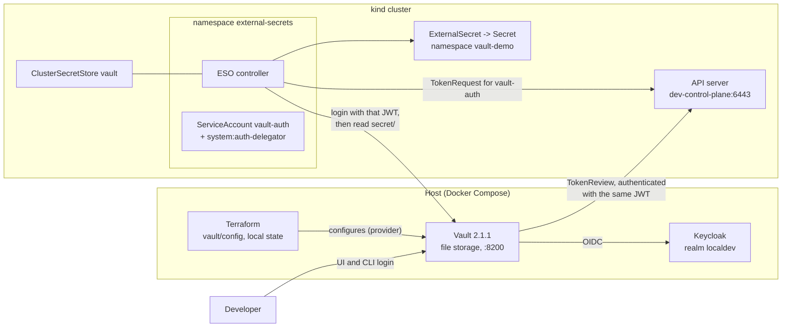

# Update setup 06: HashiCorp Vault outside the cluster — Keycloak login, KV v2, Kubernetes auth for ESO

| | |
| --- | --- |
| Date | 2026-09-18 |
| Status | **Planned, not yet applied** |
| Scope | `/home/leo/dev/kind`, builds on [`update-setup-01.md`](update-setup-01.md) (ESO, trust-manager), [`update-setup-03.md`](update-setup-03.md) (Keycloak) and the local PKI |

## Goals

1. **Vault on the host, in Docker Compose,** like Keycloak and Harbor: it exists
   before the cluster and survives `cluster/cluster.sh down`. File storage,
   because this Vault only serves the dev cluster.
2. **Vault configured as code:** a small Terraform project in `vault/config/`
   with a local state file, using the Vault provider.
3. **People log in through Keycloak** (OIDC), with rights from the same
   `groups` claim as Argo CD, Harbor and Grafana.
4. **A KV v2 secrets engine** for application secrets.
5. **The cluster reads secrets through Kubernetes auth:** a service account in
   the cluster, bound to `system:auth-delegator` so Vault can have its tokens
   checked by the TokenReview API, used by an ESO `ClusterSecretStore`.
6. **Proven end to end:** a test secret written to Vault by Terraform appears as
   a Kubernetes Secret through the External Secrets Operator, and a change in
   Vault reaches the cluster.

## What was verified before writing this

Checked on 2026-09-18:

- **Vault is at 2.x.** The community image's newest tag is `hashicorp/vault:2.1.1`
  (the 1.21 line is still maintained). Started with a `file` storage block, the
  2.1.1 binary reports `Storage Type file`, `Initialized false`, `Sealed true` —
  **file storage still works in 2.x**. It warns when `api_addr` is not set, so
  the config sets it.
- **Terraform 1.16.3** (released 2026-09-16), image `hashicorp/terraform:1.16.3`;
  **Vault provider 5.12.0** (2026-09-17).
- **Port 8200 is free** on the host.
- **A container reaches the API server only on the `kind` network.** kind
  publishes the API server on the host's loopback only, at a new random port with
  every cluster — the route kubectl uses, which a container cannot take:

  | From | Target | Result |
  | --- | --- | --- |
  | host, like kubectl | `127.0.0.1:44929` | HTTP 200 |
  | container on its own network | `127.0.0.1:44929` | unreachable: the container's own loopback |
  | container via the host gateway | `host:44929` | unreachable: bound to the host's loopback only |
  | container on the `kind` network | `dev-control-plane:6443` | HTTP 200 |

  `DNS:dev-control-plane` is in the API server certificate. The service-account
  issuer (and default token audience) is
  `https://kubernetes.default.svc.cluster.local`.
- **ESO is v2.10.0 and serves only the `v1` API.** Its Vault provider has
  `server`, `path`, `version`, `caProvider` (`type`, `name`, `namespace`, `key`),
  and `auth.kubernetes` with `mountPath`, `role` and `serviceAccountRef`
  (`name`, `namespace`, `audiences`).
- **ESO may mint tokens for other service accounts:** its
  `external-secrets-controller` ClusterRole grants `create` on
  `serviceaccounts/token`, which `serviceAccountRef` needs. (A first check said
  no — wrong `kubectl auth can-i` syntax; with `--subresource=token` it is yes.)
- **trust-manager's `kind-root-ca` ConfigMap exists in `external-secrets`**, so
  the store can trust Vault's certificate from the local CA.

## Versions

| Component | Version | Notes |
| --- | --- | --- |
| Vault | **2.1.1** | `hashicorp/vault:2.1.1`; Business Source License — free for this use |
| Terraform | **1.16.3** | run as `hashicorp/terraform:1.16.3`, nothing installed on the host |
| Vault provider | **5.12.0** | pinned in `versions.tf`, locked in `.terraform.lock.hcl` |
| ESO | 2.10.0 (installed) | `ClusterSecretStore`, API `external-secrets.io/v1` |

New entries in `versions.env`:

```bash
# update-setup-06
VAULT_VERSION=2.1.1
TERRAFORM_VERSION=1.16.3
VAULT_HOSTNAME=vault.kind.local
VAULT_PORT=8200
```

## Architecture



**How the Kubernetes login works:**

1. ESO asks the API server for a short-lived token of service account
   `vault-auth` (TokenRequest).
2. ESO logs in to Vault's `kubernetes` auth method with that token and role
   `external-secrets`.
3. Vault checks the token with the API server's TokenReview API — and, since no
   reviewer token is stored in Vault, it **authenticates that call with the very
   same token**. That is why `vault-auth` needs `system:auth-delegator`.
4. Vault returns a Vault token carrying policy `eso-read`; ESO reads
   `secret/data/...` and writes the Kubernetes Secret.

## Decisions

- **Vault on the host, like Keycloak and Harbor.** A secrets store that lives
  inside the dev cluster would disappear with it, and the point is to practise
  an external store the cluster only consumes.
- **File storage, one unseal key.** The dev cluster does not need Raft or
  high availability. `vault operator init` runs once with one key share and
  threshold one; the unseal key and root token go to `vault/out/` (git-ignored,
  mode 600), and `vault/setup-host.sh` unseals after every start. Keeping the key
  next to the data is a dev-only shortcut, and is recorded as such.
- **Vault joins the `kind` network as a second network.** It reaches the API
  server at a stable name (`dev-control-plane:6443`) for TokenReview, with no
  change to the cluster, and keeps its own Compose network and published port,
  so everything else reaches it exactly like Keycloak. Considered instead: taking
  kubectl's route literally, with `network_mode: host` and a pinned
  `networking.apiServerPort` in the kind config. That needs a recreated cluster,
  and Vault would still have to listen on the kind gateway for the pods — the
  same dependency on the `kind` network, moved rather than removed.
- **Published on `127.0.0.1:8200` and on the kind gateway `172.21.0.1:8200`,**
  as `vault.kind.local`, with a certificate from the local issuing CA. Pods
  resolve the name through CoreDNS, the browser through `./hosts.sh`.
- **No reviewer token stored in Vault** (`token_reviewer_jwt` unset,
  `disable_local_ca_jwt = true`): Vault uses each client's own JWT for TokenReview,
  so the service account ESO logs in with is bound to `system:auth-delegator`.
  Nothing long-lived to rotate or leak.
- **Default token audience.** Because the client's JWT also authenticates the
  TokenReview call, it must carry the API server's audience. The Vault role
  therefore sets no `audience`, and the store no `serviceAccountRef.audiences` —
  a Vault-only audience would be rejected by the API server first.
- **A dedicated service account, `vault-auth`, in `external-secrets`,** rather
  than ESO's own: it holds exactly one permission (`system:auth-delegator`), and
  Vault's role binds exactly that name and namespace.
- **Terraform in a container, local state, state git-ignored.** The state file
  contains the Keycloak client secret and the test secret's value, so it never
  enters git; `.terraform.lock.hcl` does, pinning the provider.
- **Rights from Keycloak groups:** an external Vault identity group
  `platform-admins`, aliased to the OIDC group of that name, gets policy
  `admin`; everyone else gets `default`.
- **Vault, not OpenBao.** OpenBao is the open-source fork with the same API; Vault
  was asked for, and its licence allows this use.

## Layout

```
vault/
├── compose.yaml            # vault, networks: own + kind (external)
├── vault.hcl               # file storage, TLS listener, api_addr, UI
├── create-cert.sh          # server certificate for vault.kind.local from the local CA
├── setup-host.sh           # certificate, start, init once, unseal, then Terraform
├── config/                 # the Terraform project
│   ├── versions.tf         # terraform 1.16, provider hashicorp/vault 5.12.0
│   ├── main.tf             # provider, kv v2, policies, oidc, kubernetes auth, test secret
│   ├── variables.tf
│   ├── .terraform.lock.hcl # committed
│   └── terraform.tfstate   # git-ignored: contains secrets
├── tf.sh                   # runs Terraform in hashicorp/terraform:1.16.3
└── out/                    # git-ignored: data, tls, init keys, root token, k8s CA
```

`.gitignore` gains `/vault/out/`, `/vault/config/terraform.tfstate*` and
`/vault/config/.terraform/`.

## Step 1: Vault in Compose

`vault/vault.hcl`:

```hcl
storage "file" {
  path = "/vault/file"
}

listener "tcp" {
  address       = "0.0.0.0:8200"
  tls_cert_file = "/vault/tls/tls.crt"   # server certificate + issuing CA
  tls_key_file  = "/vault/tls/tls.key"
}

api_addr      = "https://vault.kind.local:8200"
ui            = true
disable_mlock = true                     # single-user dev host; no IPC_LOCK needed
```

`vault/compose.yaml`:

```yaml
name: vault
services:
  vault:
    image: hashicorp/vault:${VAULT_VERSION:?set in ../versions.env}
    restart: unless-stopped
    command: ["server"]
    user: "${UID:-1000}:${GID:-1000}"     # data files stay owned by the host user
    environment:
      VAULT_ADDR: https://127.0.0.1:8200
      VAULT_CACERT: /vault/tls/ca.crt
    volumes:
      - ./vault.hcl:/vault/config/vault.hcl:ro
      - ./out/file:/vault/file
      - ./out/tls:/vault/tls:ro
    ports:
      - "127.0.0.1:8200:8200"
      - "172.21.0.1:8200:8200"
    networks: [default, kind]
networks:
  kind:
    external: true                         # created by kind; Vault reaches dev-control-plane:6443 here
```

`vault/create-cert.sh` mirrors `identity/create-cert.sh`: a certificate for
`vault.kind.local` from `pki/out/issuing-ca.*`, chain written to
`out/tls/tls.crt`, key to `out/tls/tls.key`, root CA to `out/tls/ca.crt`.

`vault/setup-host.sh`:

1. certificate; `docker compose up -d`; wait until `vault status` answers;
2. **once:** `vault operator init -key-shares=1 -key-threshold=1 -format=json`
   → `out/init.json` (mode 600), from which `out/unseal-key` and `out/root-token`;
3. **every run:** unseal if sealed;
4. export the cluster's CA for Terraform: the `kube-root-ca.crt` ConfigMap →
   `out/k8s-ca.crt`;
5. `./tf.sh init && ./tf.sh apply -auto-approve`.

## Step 2: Keycloak — the `vault` client

In `identity/realm/localdev.yaml`, with everything update-setup-03 taught:

```yaml
  - clientId: vault                    # update-setup-06
    name: Vault
    enabled: true
    publicClient: false
    standardFlowEnabled: true
    directAccessGrantsEnabled: false
    secret: $(env:VAULT_CLIENT_SECRET)
    rootUrl: https://vault.kind.local:8200
    redirectUris:
      - https://vault.kind.local:8200/ui/vault/auth/oidc/oidc/callback   # UI
      - http://localhost:8250/oidc/callback                               # vault login -method=oidc
    webOrigins:
      - https://vault.kind.local:8200
    # Client scopes only - "openid" is the request scope and would crash keycloak-config-cli.
    defaultClientScopes: [basic, profile, email, roles, web-origins, groups]
```

`identity/setup-host.sh` gains `gen vault-client-secret` and passes
`VAULT_CLIENT_SECRET` to keycloak-config-cli. Vault resolves
`keycloak.kind.local` through Docker's DNS, which reads the host's `/etc/hosts`
(the entry `./hosts.sh` writes, pointing at the kind gateway).

## Step 3: The Terraform project

`vault/config/versions.tf`:

```hcl
terraform {
  required_version = "~> 1.16"
  required_providers {
    vault = {
      source  = "hashicorp/vault"
      version = "5.12.0"
    }
  }
  # Local state, next to this file. It contains secrets and is git-ignored.
}
```

`vault/config/variables.tf` — everything comes from `vault/out/` and
`identity/out/`, passed by `tf.sh` as `TF_VAR_*`:

```hcl
variable "vault_addr"            { default = "https://vault.kind.local:8200" }
variable "keycloak_issuer"       { default = "https://keycloak.kind.local:8443/realms/localdev" }
variable "oidc_client_secret"    { sensitive = true }
variable "root_ca_pem"           {}          # pki/out/root-ca.crt
variable "kubernetes_host"       { default = "https://dev-control-plane:6443" }
variable "kubernetes_ca_pem"     {}          # vault/out/k8s-ca.crt
```

`vault/config/main.tf`, the parts that matter:

```hcl
provider "vault" {
  address = var.vault_addr          # token and CA from VAULT_TOKEN / VAULT_CACERT
}

# --- KV v2 -------------------------------------------------------------------
resource "vault_mount" "secret" {
  path    = "secret"
  type    = "kv"
  options = { version = "2" }
}

# --- Policies ----------------------------------------------------------------
resource "vault_policy" "admin" {
  name   = "admin"
  policy = <<-EOT
    path "*" { capabilities = ["create", "read", "update", "delete", "list", "sudo"] }
  EOT
}

resource "vault_policy" "eso_read" {
  name   = "eso-read"
  policy = <<-EOT
    path "secret/data/*"     { capabilities = ["read"] }
    path "secret/metadata/*" { capabilities = ["read", "list"] }
  EOT
}

# --- People: OIDC with Keycloak ------------------------------------------------
resource "vault_jwt_auth_backend" "oidc" {
  path                  = "oidc"
  type                  = "oidc"
  oidc_discovery_url    = var.keycloak_issuer
  oidc_discovery_ca_pem = var.root_ca_pem       # Keycloak's certificate is from the local CA
  oidc_client_id        = "vault"
  oidc_client_secret    = var.oidc_client_secret
  default_role          = "default"
}

resource "vault_jwt_auth_backend_role" "default" {
  backend        = vault_jwt_auth_backend.oidc.path
  role_name      = "default"
  role_type      = "oidc"
  user_claim     = "preferred_username"
  groups_claim   = "groups"
  oidc_scopes    = ["profile", "email", "groups"]
  bound_audiences = ["vault"]
  allowed_redirect_uris = [
    "https://vault.kind.local:8200/ui/vault/auth/oidc/oidc/callback",
    "http://localhost:8250/oidc/callback",
  ]
  token_policies = ["default"]
}

# Keycloak group platform-admins -> Vault policy admin
resource "vault_identity_group" "platform_admins" {
  name     = "platform-admins"
  type     = "external"
  policies = [vault_policy.admin.name]
}

resource "vault_identity_group_alias" "platform_admins" {
  name           = "platform-admins"                      # the value in the groups claim
  mount_accessor = vault_jwt_auth_backend.oidc.accessor
  canonical_id   = vault_identity_group.platform_admins.id
}

# --- The cluster: Kubernetes auth ----------------------------------------------
resource "vault_auth_backend" "kubernetes" {
  type = "kubernetes"
  path = "kubernetes"
}

resource "vault_kubernetes_auth_backend_config" "kind" {
  backend              = vault_auth_backend.kubernetes.path
  kubernetes_host      = var.kubernetes_host     # dev-control-plane:6443, on the kind network
  kubernetes_ca_cert   = var.kubernetes_ca_pem
  disable_local_ca_jwt = true                    # Vault is not a pod
  # No token_reviewer_jwt: Vault reviews each login with the client's own JWT,
  # which is why the service account is bound to system:auth-delegator.
}

resource "vault_kubernetes_auth_backend_role" "external_secrets" {
  backend                          = vault_auth_backend.kubernetes.path
  role_name                        = "external-secrets"
  bound_service_account_names      = ["vault-auth"]
  bound_service_account_namespaces = ["external-secrets"]
  token_policies                   = [vault_policy.eso_read.name]
  token_ttl                        = 3600
  # No audience: the same JWT authenticates the TokenReview call, so it must keep
  # the API server's default audience.
}

# --- The test secret -------------------------------------------------------------
resource "vault_kv_secret_v2" "hello" {
  mount = vault_mount.secret.path
  name  = "demo/hello"
  data_json = jsonencode({
    greeting = "hello from vault"
  })
}
```

`vault/tf.sh` runs `hashicorp/terraform:${TERRAFORM_VERSION}` with
`vault/config` mounted, `VAULT_TOKEN` from `out/root-token`, `VAULT_CACERT`
from the root CA, and the `TF_VAR_*` values read from their files. The container
resolves `vault.kind.local` through Docker's DNS, like Vault resolves Keycloak.

## Step 4: The cluster side

`platformservices/external-secrets/vault/` — a Kustomize part applied after
ESO:

```yaml
# The identity ESO logs in to Vault with. It holds one permission: letting Vault
# review tokens with it (TokenReview), because Vault stores no reviewer token.
apiVersion: v1
kind: ServiceAccount
metadata:
  name: vault-auth
  namespace: external-secrets
---
apiVersion: rbac.authorization.k8s.io/v1
kind: ClusterRoleBinding
metadata:
  name: vault-auth-tokenreview
roleRef:
  apiGroup: rbac.authorization.k8s.io
  kind: ClusterRole
  name: system:auth-delegator
subjects:
  - kind: ServiceAccount
    name: vault-auth
    namespace: external-secrets
---
apiVersion: external-secrets.io/v1
kind: ClusterSecretStore
metadata:
  name: vault
spec:
  provider:
    vault:
      server: https://vault.kind.local:8200
      path: secret
      version: v2
      caProvider:                       # trust-manager's copy of the local root CA
        type: ConfigMap
        name: kind-root-ca
        namespace: external-secrets
        key: ca.crt
      auth:
        kubernetes:
          mountPath: kubernetes
          role: external-secrets
          serviceAccountRef:
            name: vault-auth
            namespace: external-secrets
```

**Name resolution for pods:** the CoreDNS `hosts` block that
`identity/cluster-dns.sh` writes becomes a list of host services
(`keycloak.kind.local`, `vault.kind.local`), both at the kind gateway. The
script moves to `cluster/host-services-dns.sh`, since it no longer belongs to
one service. `./hosts.sh` adds `vault.kind.local` once `vault/out/` exists.

## Step 5: The proof — a secret from Vault in the cluster

`applications/vault-demo/`, with its own `deploy.sh` like the other test
applications:

```yaml
apiVersion: v1
kind: Namespace
metadata:
  name: vault-demo
---
apiVersion: external-secrets.io/v1
kind: ExternalSecret
metadata:
  name: hello
  namespace: vault-demo
spec:
  refreshInterval: 30s                  # short, so a change in Vault is seen quickly
  secretStoreRef:
    kind: ClusterSecretStore
    name: vault
  target:
    name: hello
  data:
    - secretKey: greeting
      remoteRef:
        key: demo/hello
        property: greeting
```

## Step 6: Wiring

- `platformservices/deploy.sh`: apply `external-secrets/vault` after ESO, once
  `vault/out/root-token` exists (Vault is optional, like Keycloak); wait for the
  store to become `Ready`.
- `cluster/cluster.sh up` needs Vault's network: kind creates the `kind` network,
  and Vault attaches to it. After `cluster.sh down` the network stays, so Vault
  keeps running; if the network is ever removed, `docker compose up` in `vault/`
  fails until kind recreates it.
- After every `cluster.sh up`, the Kubernetes auth config must be refreshed:
  a new cluster has a new CA. `vault/setup-host.sh` re-exports `k8s-ca.crt` and
  re-runs Terraform, which updates only that resource.

## Step 7: Verification

**Vault itself:**

```bash
docker compose -f vault/compose.yaml ps                       # running
docker compose -f vault/compose.yaml exec vault vault status  # Initialized true, Sealed false, Storage file
vault/tf.sh plan -detailed-exitcode                           # exit 0: nothing to change
```

**People — Keycloak login:**

```bash
VAULT_ADDR=https://vault.kind.local:8200 VAULT_CACERT=pki/out/root-ca.crt \
  vault login -method=oidc          # opens the browser; dev -> policies: default, admin
```

and a Playwright suite, `tests/specs/vault.spec.ts`: log in to the Vault UI
through Keycloak and assert the resulting token carries policy `admin`
(`/v1/auth/token/lookup-self`, `identity_policies`).

**The cluster — Kubernetes auth and ESO:**

```bash
kubectl get clustersecretstore vault                          # READY True, "store validated"
kubectl -n vault-demo get externalsecret hello                # SecretSynced
kubectl -n vault-demo get secret hello -o jsonpath='{.data.greeting}' | base64 -d; echo
# -> hello from vault
```

**A change in Vault reaches the cluster** within the refresh interval:

```bash
vault kv put -mount=secret demo/hello greeting="rotated $(date +%T)"
# within 30 s:
kubectl -n vault-demo get secret hello -o jsonpath='{.data.greeting}' | base64 -d; echo
```

**The TokenReview permission is what makes it work** — remove it and the login
must fail, put it back and it must recover:

```bash
kubectl delete clusterrolebinding vault-auth-tokenreview
kubectl annotate externalsecret -n vault-demo hello force-sync=$(date +%s) --overwrite
kubectl get clustersecretstore vault -o jsonpath='{.status.conditions[0].message}'; echo
# -> a permission error from Vault's TokenReview call
kubectl apply -k platformservices/external-secrets/vault      # restores it
```

**Survives a restart:** `docker compose -f vault/compose.yaml restart`, then
`vault/setup-host.sh` unseals, and the store turns `Ready` again.

## Step 8: Documentation

- `architecture.md`: Vault in the C4 diagram (host boundary) with its relations
  to Keycloak, the API server and ESO; a *Secrets* section with the login flow
  above; Vault in *Identities and roles* (root token, unseal key and client
  secret, and where they live); the ADRs below.
- README: a *Vault* section — start, unseal, log in, write a secret, use it
  through an `ExternalSecret`.
- This file: status, implementation notes and evidence, as for 03 and 05.

## Planned ADRs

(ADR-0018 is reserved by the postponed update-setup-04.)

- **ADR-0023: Vault outside the cluster, file storage, configured by Terraform.**
  An external secrets store the cluster consumes, like the IdP; file storage
  and a single unseal key because it serves one dev cluster; Terraform with local
  state so the configuration is code and can be rebuilt. Consequences: manual
  unseal after every start, unseal key stored beside the data, the state file is
  a secret, and Vault must share the `kind` network to reach the API server.
- **ADR-0024: Kubernetes auth without a stored reviewer token.** Vault reviews
  each login with the client's own JWT; the login service account is bound to
  `system:auth-delegator`. Consequences: no long-lived token in Vault, one
  narrowly scoped service account, and tokens must keep the API server's
  audience.

## Known limitations and open points

- **Unverified: the whole login chain end to end** — TokenReview with the
  client's JWT, the default audience, and ESO's token request. All are
  documented behaviours; Step 7 is where they are proven, including the negative
  test.
- **Unverified: Vault as uid 1000** with a host-owned data directory; the
  image's entrypoint normally changes ownership as root. The fallback is the
  default user with a directory owned by the container's uid.
- **Manual unseal.** Every Vault restart — a host reboot included — leaves it
  sealed until `vault/setup-host.sh` runs; ESO reports the store as not ready in
  between.
- **The unseal key lives next to the data** in `vault/out/`. Fine for a dev
  cluster; anything else needs auto-unseal.
- **The root token is used by Terraform.** A narrower token for Terraform, and
  revoking the root token after bootstrap, are the next hardening steps.
- **Vault depends on the `kind` network** existing when it starts.
- **Business Source License.** Vault 2.x is source-available, not open source;
  OpenBao is the drop-in alternative if that ever matters.
