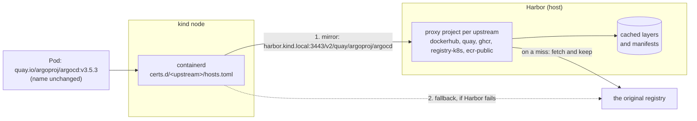

# Update setup 07: Harbor as a mirror for every registry the cluster pulls from

| | |
| --- | --- |
| Date | 2026-09-19 |
| Status | **Planned, not yet applied** |
| Scope | `/home/leo/dev/kind`, builds on [`update-setup-02.md`](update-setup-02.md) (Harbor, `registry/kind-trust.sh`), where a Docker Hub mirror was listed as a follow-up |

## Goals

1. **Every image the cluster pulls goes through Harbor,** which keeps a copy — for
   all five registries the cluster uses today: Docker Hub, quay.io, ghcr.io,
   registry.k8s.io and public.ecr.aws. A second pull, on the next cluster
   rebuild or on another node, comes from the host, not from the internet.
2. **Transparent:** image names stay as they are. `nginx:1.27`,
   `quay.io/argoproj/argocd:v3.5.3` and `registry.k8s.io/pause:3.10` keep working;
   no manifest, chart or `values` changes.
3. **No new single point of failure:** if Harbor is down, the nodes pull from the
   original registry directly, as today.
4. **Independent of Docker Hub's rate limits** as far as possible, with optional
   Docker Hub credentials.

## What was verified before writing this

Checked on 2026-09-19 against the running Harbor and cluster:

- **Harbor v2.15.2 reaches all five upstreams with the planned adapters.**
  Harbor's own endpoint check (`POST /api/v2.0/registries/ping`, which creates
  nothing) answered `200` for each:

  | Upstream | Adapter | URL | Ping |
  | --- | --- | --- | --- |
  | Docker Hub | `docker-hub` | `https://hub.docker.com` | 200 |
  | quay.io | `docker-registry` | `https://quay.io` | 200 |
  | ghcr.io | `github-ghcr` | `https://ghcr.io` | 200 |
  | registry.k8s.io | `docker-registry` | `https://registry.k8s.io` | 200 |
  | public.ecr.aws | `docker-registry` | `https://public.ecr.aws` | 200 |

  A ping proves reachability, not a full proxied pull (token exchanges,
  registry.k8s.io's redirects to its storage backends); Step 4 pulls an image
  through each mirror.
- **Harbor has no proxy cache yet:** no registry endpoints, and its only project
  is `library`, an ordinary one.
- **The nodes run containerd v2.3.4 with `config_path = "/etc/containerd/certs.d"`**
  (set in `cluster/cluster-config.yaml` for update-setup-02). Today that
  directory holds only `harbor.kind.local:3443`, so every other pull goes to the
  internet.
- **What the cluster pulls, by registry** (images on the three nodes):

  | Registry | Images | Examples |
  | --- | --- | --- |
  | `docker.io` | 13 | `grafana/grafana`, `grafana/loki`, `curlimages/curl` |
  | `registry.k8s.io` | 11 | control plane, CoreDNS — mostly preloaded in the node image |
  | `quay.io` | 9 | Argo CD, cert-manager |
  | `ghcr.io` | 2 | ESO, Dex |
  | `public.ecr.aws` | 1 | Argo CD's Redis |

## The mirrors

One proxy-cache project per upstream, named after it, and one containerd
directory per upstream on every node:

| Upstream | Harbor endpoint (adapter) | Proxy project | Node config | Fallback `server` |
| --- | --- | --- | --- | --- |
| Docker Hub | `docker-hub` | `dockerhub` | `certs.d/docker.io/` | `https://registry-1.docker.io` |
| quay.io | `docker-registry` | `quay` | `certs.d/quay.io/` | `https://quay.io` |
| ghcr.io | `github-ghcr` | `ghcr` | `certs.d/ghcr.io/` | `https://ghcr.io` |
| registry.k8s.io | `docker-registry` | `registry-k8s` | `certs.d/registry.k8s.io/` | `https://registry.k8s.io` |
| public.ecr.aws | `docker-registry` | `ecr-public` | `certs.d/public.ecr.aws/` | `https://public.ecr.aws` |

This table is also a file, **`registry/mirrors.tsv`**, read by both scripts
below — Harbor's side and the nodes' side cannot drift apart:

```
# upstream          adapter          url                        project        fallback
docker.io           docker-hub       https://hub.docker.com     dockerhub      https://registry-1.docker.io
quay.io             docker-registry  https://quay.io            quay           https://quay.io
ghcr.io             github-ghcr      https://ghcr.io            ghcr           https://ghcr.io
registry.k8s.io     docker-registry  https://registry.k8s.io    registry-k8s   https://registry.k8s.io
public.ecr.aws      docker-registry  https://public.ecr.aws     ecr-public     https://public.ecr.aws
```

## How it works



- containerd rewrites a pull such as `quay.io/argoproj/argocd:v3.5.3` to
  `https://harbor.kind.local:3443/v2/quay/argoproj/argocd/...`
  (`override_path = true`). Harbor's proxy project answers from its cache, or
  fetches from the upstream once and keeps a copy.
- Docker Hub's official images work the same way: `nginx:1.27` is
  `docker.io/library/nginx`, which becomes `dockerhub/library/nginx` in Harbor.
- If Harbor does not answer, containerd falls back to the `server` in the same
  file — the original registry.
- Images already on a node are not pulled at all; that includes what the kind
  node image preloads (most of `registry.k8s.io`). The mirror serves every pull
  that does happen.

## Decisions

- **Harbor proxy-cache projects, one per upstream,** named after it. It is
  Harbor's built-in feature for exactly this, and the cache lives on the host, so
  it survives `cluster/cluster.sh down`.
- **All five registries at once,** not Docker Hub alone: the mechanism is the
  same for each, and the other four supply two thirds of the cluster's images.
- **One table drives both sides.** `registry/mirrors.tsv` is read by the Harbor
  script and by `registry/kind-trust.sh`, so adding a sixth registry is one line.
- **Transparent mirroring through containerd,** not rewritten image names.
  Rewriting would touch every chart and manifest and break upstream defaults; a
  `hosts.toml` per upstream changes nothing else.
- **The original registry stays the fallback.** The `server` line in each
  `hosts.toml` keeps pulls working when Harbor is stopped — which the README
  recommends when memory is tight.
- **The projects are public,** so the nodes pull without credentials, like from
  `library`. Anyone who reaches Harbor could pull through them; on this host
  that is only the host and the cluster.
- **Anonymous upstreams, with optional Docker Hub credentials.** Harbor pulls as
  this host's IP, exactly as the nodes do today — no worse, and far fewer pulls.
  Only Docker Hub rate-limits anonymous pulls noticeably; a Docker Hub access
  token, if provided, is read from `registry/out/dockerhub-credentials`
  (`user:token`, mode 600) and never enters git.
- **Configured by a script through Harbor's API** (`registry/proxy-cache.sh`),
  like the OIDC settings (`registry/oidc-setup.sh`). Harbor also has a Terraform
  provider; one script per Harbor concern keeps `registry/` consistent. The
  configuration lives in Harbor's database, so the script runs once and is
  idempotent.
- **The node side belongs in `registry/kind-trust.sh`,** which already writes
  Harbor's own `hosts.toml` after every `cluster.sh up`.
- **The host's own Docker is not changed** (see *Known limitations*).

## Step 1: `registry/mirrors.tsv`

The table above, as a file: whitespace-separated columns, `#` comments. Adding a
registry later means adding a line and re-running both scripts.

## Step 2: The proxy caches in Harbor

`registry/proxy-cache.sh`, idempotent, through Harbor's API with the local admin
(in the style of `registry/oidc-setup.sh`, including its wait for Harbor). For
every line of `mirrors.tsv`:

1. **Registry endpoint** named after the project — create it unless it exists:

   ```json
   POST /api/v2.0/registries
   {
     "name": "dockerhub",
     "type": "docker-hub",
     "url": "https://hub.docker.com",
     "insecure": false,
     "credential": { "type": "basic", "access_key": "<user>", "access_secret": "<token>" }
   }
   ```

   The `credential` block only for Docker Hub, and only when
   `registry/out/dockerhub-credentials` exists. Then
   `POST /api/v2.0/registries/ping` with the endpoint's id must succeed.

2. **Proxy-cache project** — create it unless it exists:

   ```json
   POST /api/v2.0/projects
   {
     "project_name": "dockerhub",
     "registry_id": <id of the endpoint>,
     "public": true,
     "metadata": { "public": "true" }
   }
   ```

3. **Print the result:** one line per upstream — endpoint status (`healthy`) and
   the project's `registry_id`.

## Step 3: containerd on the nodes

`registry/kind-trust.sh` writes, for every line of `mirrors.tsv` whose project
exists in Harbor (it asks Harbor), a `hosts.toml` on every node:

```toml
# /etc/containerd/certs.d/quay.io/hosts.toml
server = "https://quay.io"                          # the fallback: the original registry

[host."https://harbor.kind.local:3443/v2/quay"]
  capabilities = ["pull", "resolve"]
  ca = "/etc/containerd/certs.d/harbor.kind.local:3443/ca.crt"
  override_path = true                              # the path already contains /v2/quay
```

- `harbor.kind.local` already resolves on the nodes (their `/etc/hosts`, written
  by the same script), and the CA file is the one the script already copies.
- containerd reads `certs.d` on every pull: **no restart**, and existing pods are
  untouched.
- Only mirrors whose project exists get a file, so a Harbor without the proxy
  caches does not send pulls on a detour.

## Step 4: Wiring

- `registry/proxy-cache.sh` runs once after `registry/setup-host.sh`, and again
  after a change to `mirrors.tsv` or to the credentials.
- `registry/kind-trust.sh` runs after every `cluster/cluster.sh up`, as before —
  it now writes one file per mirror as well.
- README: the *Registry* section gains the mirrors, how to add Docker Hub
  credentials and further registries, and how to see what Harbor has cached.

## Step 5: Verification

**Harbor side:**

```bash
registry/proxy-cache.sh      # twice: the second run changes nothing
# five endpoints healthy, five proxy projects with a registry_id
```

**One pull through each mirror, with the image name unchanged** — images the
nodes do not have yet, for example (confirm the tags exist when implementing):

| Upstream | Test image |
| --- | --- |
| Docker Hub | `docker.io/library/alpine:3.22` |
| quay.io | `quay.io/prometheus/busybox:latest` |
| ghcr.io | `ghcr.io/stefanprodan/podinfo` (a current tag) |
| registry.k8s.io | `registry.k8s.io/pause:3.9` (the node image has 3.10) |
| public.ecr.aws | `public.ecr.aws/docker/library/alpine:3.22` |

```bash
docker exec dev-worker crictl pull <image>
curl -s -u "admin:$PW" https://harbor.kind.local:3443/api/v2.0/projects/<project>/repositories
# -> the repository appears in the matching proxy project
```

This is where each upstream's token exchange and, for registry.k8s.io, its
redirects to storage are proven.

**The second pull is served from the cache:** remove an image from one node and
pull it again; Harbor's artifact `pull_time` advances, and the pull is faster.
Timing both pulls gives the numbers for the implementation notes.

**Pods are unaffected:** `kubectl run mirror-test --image=alpine:3.22 ... -- sleep
60` runs, with the image name unchanged.

**The fallback works:** stop Harbor
(`docker compose -f registry/out/harbor/docker-compose.yml stop`), pull an image
the nodes do not have — it must still succeed, from the original registry —
then start Harbor again.

**Real workloads through the mirrors:** remove the images of one workload per
registry from its node (Grafana for Docker Hub, Argo CD for quay.io, ESO for
ghcr.io, Argo CD's Redis for public.ecr.aws) and restart them; each image comes
back through its proxy project.

## Step 6: Documentation

- `architecture.md`: the *Registry* section and its diagram gain the proxy caches
  and the fallback; the C4 relation "Pulls images" from the cluster to Harbor
  covers all upstreams; **ADR-0025** below.
- README: as in Step 4.
- This file: status, implementation notes and evidence, as for the earlier
  plans.

## Planned ADR

**ADR-0025: Harbor as a transparent pull-through cache for every upstream
registry.** Context: every cluster rebuild pulls the same images again from five
registries, subject to their availability and to Docker Hub's rate limits,
although Harbor already runs on the host. Decision: one proxy-cache project in
Harbor per upstream (Docker Hub, quay.io, ghcr.io, registry.k8s.io,
public.ecr.aws), used by the nodes through a containerd `hosts.toml` per upstream
with `override_path`, the original registry as the fallback, image names
unchanged, one table (`registry/mirrors.tsv`) driving both sides, optional Docker
Hub credentials kept out of git. Consequences: repeat pulls come from the host
and survive cluster rebuilds; no chart or manifest changes; Harbor is on the pull
path but not a single point of failure; the first pull of each image still goes
upstream; the host's own Docker is not covered.

## Known limitations and open points

- **The first pull still goes upstream.** The mirrors pay off from the second
  pull on — which is exactly the cluster-rebuild case.
- **Preloaded images are not pulled.** The kind node image carries most of
  `registry.k8s.io` already; its mirror serves whatever is not preloaded.
- **Tags are checked upstream.** For a tag, Harbor asks the upstream whether it
  changed; pulls by digest are served from the cache alone. **To verify:**
  Harbor's documented behaviour of serving the cached copy when the upstream is
  unreachable.
- **Cache size.** Cached images take space in Harbor's data volume on the host.
  **To verify:** the retention Harbor applies to proxy-cache projects by default
  (reported as removing artifacts not pulled for 7 days); if absent, a tag
  retention rule per project is the next step.
- **The host's Docker is not covered.** Harbor, Keycloak, Vault and the test
  containers are pulled by the host's Docker, whose `registry-mirrors` setting
  in `/etc/docker/daemon.json` works for Docker Hub only and needs sudo and a
  Docker restart.
- **Anonymous rate limits still apply to Harbor's own upstream pulls** unless
  Docker Hub credentials are configured — but Harbor makes far fewer of them.
- **Five public projects** can be pulled through by anything that reaches
  Harbor; acceptable on this host.
