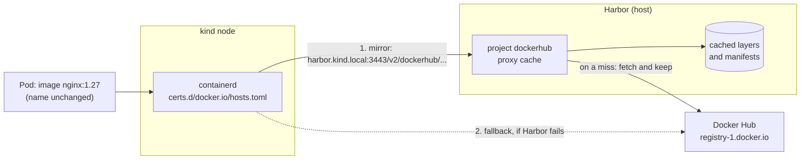

# Update setup 07: Harbor as a Docker Hub mirror for the cluster

| | |
| --- | --- |
| Date | 2026-09-19 |
| Status | **Planned, not yet applied** |
| Scope | `/home/leo/dev/kind`, builds on [`update-setup-02.md`](update-setup-02.md) (Harbor, `registry/kind-trust.sh`), where this was listed as a follow-up |

## Goals

1. **Docker Hub images are pulled through Harbor,** which keeps a copy: a second
   pull — on the next cluster rebuild, or on another node — comes from the host,
   not from the internet.
2. **Transparent:** image names stay as they are. `nginx:1.27` and
   `grafana/grafana:13.2.2` keep working; no manifest, chart or `values` changes.
3. **No new single point of failure:** if Harbor is down, the nodes pull from
   Docker Hub directly, as today.
4. **Independent of Docker Hub's rate limits** as far as possible, with optional
   Docker Hub credentials.

## What was verified before writing this

Checked on 2026-09-19 against the running Harbor and cluster:

- **Harbor v2.15.2 has a `docker-hub` adapter** for registry endpoints (the list
  also has `docker-registry`, `github-ghcr` and others, which is how further
  registries would follow).
- **Harbor can reach Docker Hub:** from the `harbor-core` container,
  `https://registry-1.docker.io/v2/` answers `401` (the normal "authenticate
  first") in 0.5 s.
- **Harbor has no proxy cache yet:** no registry endpoints, and its only project
  is `library`, an ordinary one.
- **The nodes run containerd v2.3.4 with `config_path = "/etc/containerd/certs.d"`**
  (set in `cluster/cluster-config.yaml` for update-setup-02). Today that
  directory holds only `harbor.kind.local:3443`, so `docker.io` pulls go to
  Docker Hub.
- **What the cluster pulls, by registry** (images on the three nodes):

  | Registry | Images | Examples |
  | --- | --- | --- |
  | `docker.io` | 13 | `grafana/grafana`, `grafana/loki`, `curlimages/curl` |
  | `registry.k8s.io` | 11 | control plane, CoreDNS — mostly preloaded in the node image |
  | `quay.io` | 9 | Argo CD, cert-manager |
  | `ghcr.io` | 2 | ESO, Dex |
  | `public.ecr.aws` | 1 | Argo CD's Redis |

  A Docker Hub mirror covers about a third; *Later* shows how the rest follows.

## How it works



- containerd rewrites a `docker.io` pull such as `library/nginx:1.27` to
  `https://harbor.kind.local:3443/v2/dockerhub/library/nginx/...`
  (`override_path = true`). Harbor's proxy project `dockerhub` answers from its
  cache, or fetches from Docker Hub once and keeps a copy.
- If Harbor does not answer, containerd falls back to the `server` in the same
  file — Docker Hub itself.

## Decisions

- **A Harbor proxy-cache project, `dockerhub`,** backed by a `docker-hub`
  registry endpoint. It is Harbor's built-in feature for exactly this, and the
  cache lives on the host, so it survives `cluster/cluster.sh down`.
- **Transparent mirroring through containerd,** not rewritten image names.
  Rewriting would touch every chart and manifest and break upstream defaults; a
  `hosts.toml` for `docker.io` changes nothing else.
- **Docker Hub stays the fallback.** The `server` line in `hosts.toml` keeps pulls
  working when Harbor is stopped — which the README recommends when memory is
  tight.
- **The project is public,** so the nodes pull without credentials, like from
  `library`. Anyone who reaches Harbor could pull through it; on this host that
  is only the host and the cluster.
- **Anonymous upstream by default, credentials optional.** Harbor then pulls
  from Docker Hub as this host's IP, exactly as the nodes do today — no worse,
  and far fewer pulls. A Docker Hub access token, if provided, lifts the
  anonymous rate limit; it is read from `registry/out/dockerhub-credentials` and
  never enters git.
- **Configured by a script through Harbor's API** (`registry/proxy-cache.sh`),
  like the OIDC settings (`registry/oidc-setup.sh`). Harbor also has a Terraform
  provider; one script per Harbor concern keeps `registry/` consistent. The
  configuration lives in Harbor's database, so the script runs once and is
  idempotent.
- **The node side belongs in `registry/kind-trust.sh`,** which already writes
  Harbor's own `hosts.toml` after every `cluster.sh up`.
- **Docker Hub only, for now.** The other registries follow the same pattern
  (see *Later*); the host's own Docker is not changed (see *Known limitations*).

## Step 1: The proxy cache in Harbor

`registry/proxy-cache.sh`, idempotent, through Harbor's API with the local admin
(in the style of `registry/oidc-setup.sh`, including its wait for Harbor):

1. **Registry endpoint** `dockerhub` — create it unless it exists:

   ```json
   POST /api/v2.0/registries
   {
     "name": "dockerhub",
     "type": "docker-hub",
     "url": "https://hub.docker.com",
     "insecure": false,
     "credential": { "type": "basic", "access_key": "<user>", "access_secret": "<token>" }
   }
   ```

   The `credential` block only when `registry/out/dockerhub-credentials` exists
   (`user:token`, mode 600). Then `POST /api/v2.0/registries/ping` with the
   endpoint's id must succeed — that is Harbor reaching Docker Hub.

2. **Proxy-cache project** `dockerhub` — create it unless it exists:

   ```json
   POST /api/v2.0/projects
   {
     "project_name": "dockerhub",
     "registry_id": <id of the endpoint>,
     "public": true,
     "metadata": { "public": "true" }
   }
   ```

3. **Print the result:** the endpoint's status (`healthy`) and the project's
   `registry_id`.

## Step 2: containerd on the nodes

`registry/kind-trust.sh` gains a second `hosts.toml` per node:

```toml
# /etc/containerd/certs.d/docker.io/hosts.toml
server = "https://registry-1.docker.io"          # the fallback: Docker Hub itself

[host."https://harbor.kind.local:3443/v2/dockerhub"]
  capabilities = ["pull", "resolve"]
  ca = "/etc/containerd/certs.d/harbor.kind.local:3443/ca.crt"
  override_path = true                           # the path already contains /v2/dockerhub
```

- `harbor.kind.local` already resolves on the nodes (their `/etc/hosts`, written
  by the same script), and the CA file is the one the script already copies.
- containerd reads `certs.d` on every pull: **no restart**, and existing pods are
  untouched.
- Official images keep working: containerd asks for `library/nginx`, which
  becomes `dockerhub/library/nginx` in Harbor and `library/nginx` upstream.

The file is written only when the `dockerhub` project exists (the script asks
Harbor), so a Harbor without the proxy cache does not send every pull on a
detour.

## Step 3: Wiring

- `registry/proxy-cache.sh` runs once after `registry/setup-host.sh`, and again
  only to change credentials.
- `registry/kind-trust.sh` runs after every `cluster/cluster.sh up`, as before —
  it now writes both files.
- README: the *Registry* section gains the mirror, how to add Docker Hub
  credentials, and how to see what Harbor has cached.

## Step 4: Verification

**Harbor side:**

```bash
registry/proxy-cache.sh      # twice: the second run changes nothing
# endpoint "dockerhub" healthy, project "dockerhub" with a registry_id
```

**A pull goes through Harbor, with the image name unchanged** — an image the
cluster does not have yet:

```bash
docker exec dev-worker crictl pull docker.io/library/alpine:3.22
curl -s -u "admin:$PW" https://harbor.kind.local:3443/api/v2.0/projects/dockerhub/repositories
# -> dockerhub/library/alpine appears
```

**The second pull is served from the cache:** remove the image from one node and
pull it on another (or the same) node again; Harbor's artifact `pull_time`
advances, and the pull is faster. Timing both pulls gives the number for the
implementation notes.

**Pods are unaffected:** `kubectl run mirror-test --image=alpine:3.22 ... -- sleep
60` runs, with the image name unchanged.

**The fallback works:** stop Harbor
(`docker compose -f registry/out/harbor/docker-compose.yml stop`), pull an image
the nodes do not have — it must still succeed, directly from Docker Hub — then
start Harbor again.

**A real workload through the mirror:** remove Grafana's image from its node and
restart the Deployment; the image comes back through `dockerhub`.

## Step 5: Documentation

- `architecture.md`: the *Registry* section and its diagram gain the proxy cache
  and the fallback; the C4 relation "Pulls images" from the cluster to Harbor
  covers Docker Hub images too; **ADR-0025** below.
- README: as in Step 3.
- This file: status, implementation notes and evidence, as for the earlier
  plans.

## Planned ADR

**ADR-0025: Harbor as a transparent pull-through cache for Docker Hub.**
Context: every cluster rebuild pulls the same Docker Hub images again, subject to
Docker Hub's rate limits and availability, although Harbor already runs on the
host. Decision: a proxy-cache project `dockerhub` in Harbor, used by the nodes
through a containerd `hosts.toml` for `docker.io` with `override_path`, Docker
Hub itself as the fallback, image names unchanged, optional Docker Hub
credentials kept out of git. Consequences: repeat pulls come from the host and
survive cluster rebuilds; no chart or manifest changes; Harbor is on the pull
path but not a single point of failure; the first pull of each image still goes
to Docker Hub; the host's own Docker is not covered.

## Known limitations and open points

- **The first pull still goes to Docker Hub.** The mirror pays off from the
  second pull on — which is exactly the cluster-rebuild case.
- **Tags are checked upstream.** For a tag, Harbor asks Docker Hub whether it
  changed; pulls by digest are served from the cache alone. **To verify:**
  Harbor's documented behaviour of serving the cached copy when Docker Hub is
  unreachable.
- **Cache size.** Cached images take space in Harbor's data volume on the host.
  **To verify:** the retention Harbor applies to proxy-cache projects by default
  (reported as removing artifacts not pulled for 7 days); if absent, a tag
  retention rule is the next step.
- **Only `docker.io`.** 13 of the cluster's ~36 images; see *Later*.
- **The host's Docker is not covered.** Harbor, Keycloak, Vault and the test
  containers are pulled by the host's Docker, which would need `registry-mirrors`
  in `/etc/docker/daemon.json` — sudo and a Docker restart, `docker.io` only.
- **Anonymous rate limits still apply to Harbor's own upstream pulls** unless
  credentials are configured — but Harbor makes far fewer of them.

## Later

The same two pieces — a proxy project in Harbor and a `hosts.toml` on the nodes
— for the other registries:

| Registry | Harbor adapter | Images today |
| --- | --- | --- |
| `quay.io` | `docker-registry` (`https://quay.io`) | 9 |
| `ghcr.io` | `github-ghcr` | 2 |
| `registry.k8s.io` | `docker-registry` | 11, mostly preloaded in the node image |
| `public.ecr.aws` | `docker-registry` | 1 |
