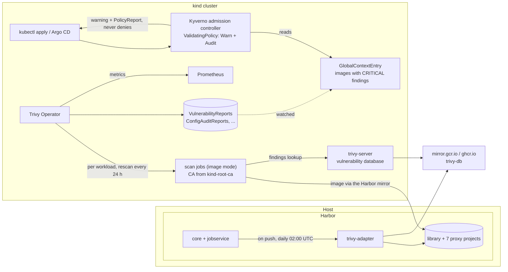

# Update setup 08: Vulnerability scanning — Trivy in Harbor and in the cluster, Kyverno warnings at admission

| | |
| --- | --- |
| Date | 2026-09-19 |
| Status | **Planned, not yet applied** |
| Scope | `/home/leo/dev/kind`, builds on [`update-setup-01.md`](update-setup-01.md) (platform services, trust-manager), [`update-setup-02.md`](update-setup-02.md) (Harbor, `registry/setup-host.sh`), [`update-setup-03.md`](update-setup-03.md) (Harbor's Keycloak login), [`update-setup-05.md`](update-setup-05.md) (metrics) and [`update-setup-07.md`](update-setup-07.md) (the proxy caches, whose images are now the cluster's images) |

## Goals

1. **Every image in Harbor is scanned** for known vulnerabilities, regularly:
   our own images in `library`, and every image the cluster pulls through the
   proxy caches. New images are scanned when they arrive, and everything is
   rescanned daily, so a CVE published tomorrow shows up in an image cached last
   week.
2. **Every workload running in the cluster is scanned too,** by the Trivy
   Operator. That includes images Harbor never sees (the kind node image's
   preloaded ones), plus configuration audits and exposed secrets. The results
   are Kubernetes resources, and the counts are metrics in Prometheus.
3. **Deploying an image with known CRITICAL vulnerabilities produces a warning**
   (`kubectl apply` prints it) and a policy report. It is not blocked. Kyverno is
   the admission controller, installed as its own platform service, so it is
   also available for future policies.
4. **Nothing here can stop the cluster:** no pull is refused, no admission
   denied, and a Kyverno outage lets everything through.
5. **Enabling Harbor's scanner must not break Harbor's Keycloak login.** This is
   a real risk, found while preparing this plan; see below.

## Why scanning is not itself an admission webhook

A natural idea is to let Trivy scan an image while the API server admits the
pod. Nobody does it that way, for four reasons:

- **Time.** The API server waits at most 30 s for a webhook (10 s by default). A
  scan must fetch the whole image, often hundreds of MB, and analyse it:
  seconds to minutes.
- **Availability.** A webhook is on the path of every pod creation. A slow or
  broken scanner means either nothing deploys (`failurePolicy: Fail`,
  including kube-system and the scanner itself), or the check is silently
  skipped (`Ignore`).
- **Results age.** A scan is a snapshot of today's vulnerability database. New
  CVEs appear daily for images that are already running, so continuous scanning
  is needed anyway, and an admission scan would repeat that work.
- **Tags are not content.** Admission sees `nginx:1.27`; scan results belong to a
  digest.

So the usual split, and this plan's: **scan asynchronously** (Harbor, Trivy
Operator), and **decide at admission from stored results** (Kyverno, in
milliseconds). The consequence to accept: the first deployment of an image
nobody has scanned yet passes without a warning. Its scan follows within
minutes, and the next deployment gets the warning.

## What was verified before writing this

Checked on 2026-09-19 against the running Harbor v2.15.2 and cluster, the charts
and the sources named below.

### Harbor

- **Harbor has no scanner.** `GET /api/v2.0/scanners` returns `[]`, and the
  scan-all schedule answers `412 no scanner is configured, it's not possible to
  scan`. The Compose project has nine containers, none of them Trivy.
- **`prepare --with-trivy`** exists (`prepare --help` of
  `goharbor/prepare:v2.15.2`). `registry/setup-host.sh` calls `sudo ./prepare`
  without it today.
- **What it renders.** I ran a dry run of `prepare --with-trivy` without root,
  into throwaway Docker volumes, with this `harbor.yml`:
  - **Service:** a Compose service `trivy-adapter`, image
    `goharbor/trivy-adapter-photon:v2.15.2` (amd64, about 164 MB compressed),
    with `cap_drop: ALL`, only the `harbor` network and no ports. The image runs
    as `uid=10000(scanner)`.
  - **Data:** `registry/out/data/trivy-adapter/{trivy,reports}`, created by
    `prepare` as uid 10000, so running stays unprivileged (ADR-0015).
  - **Registration:** core gets `WITH_TRIVY=True` and
    `TRIVY_ADAPTER_URL=http://trivy-adapter:8080`, and registers the scanner by
    itself.
  - **Database:** downloaded from `ghcr.io/aquasecurity/trivy-db`. All
    severities are reported, fixed or not.
- **The trap: `prepare` wipes Harbor's trust folder.** `prepare_trust_ca()` runs
  `shutil.rmtree` on `common/config/shared/trust-certificates` and refills it
  only from Harbor's own settings. That folder holds `kind-dev-root-ca.crt`,
  copied there with sudo by `registry/oidc-setup.sh` (update-setup-03), which
  core needs to reach Keycloak over TLS. Re-running `prepare` unchanged would
  silently break the Harbor login through Keycloak.
- **The fix, dry-run tested:** `storage_service.ca_bundle` pointing at
  `pki/out/root-ca.crt`. `prepare` then copies the kind root CA into the trust
  folder itself, as `storage_ca_bundle.crt` (`CN=kind-dev Root CA`), on every
  run. Six containers mount the folder at `/harbor_cust_cert`, among them core
  and `trivy-adapter`. The registry's storage stays `filesystem`.
- **`prepare` keeps Harbor's secret key.** `_get_secret()` loads an existing
  `data/secret/keys/secretkey` and generates one only when none exists, so
  values encrypted in Harbor's database stay readable.
- **The API:**
  - `/system/scanAll/schedule` (`Hourly`, `Daily`, `Weekly`, `Custom`,
    `Manual`, `None`);
  - `POST …/artifacts/{reference}/scan`;
  - the project flags `auto_scan`, `auto_sbom_generation`, `prevent_vul` and
    `severity`;
  - `/security/summary`, `/security/vul` and `/scans/all/metrics`.

  No project sets `auto_scan` today.

### Trivy Operator (chart `trivy-operator` 0.36.0, operator 0.34.0, Trivy 0.74.0)

- **The chart has no admission webhook**, neither Validating nor Mutating. It
  scans after the fact and writes `VulnerabilityReport`,
  `ConfigAuditReport`, `ExposedSecretReport` and other resources
  (`aquasecurity.github.io/v1alpha1`).
- **In the default `image` mode, the scan job's Trivy fetches the image itself**
  over the network, not through containerd. Without configuration it would
  bypass the Harbor mirrors of update-setup-07.
- **`trivy.registry.mirror` fixes that.** The source (`GetMirroredImage`,
  `pkg/plugins/trivy/image.go`) normalises the image with go-containerregistry
  (`nginx:1.27` → `index.docker.io/library/nginx:1.27`) and replaces a
  matching prefix. So `"index.docker.io": harbor.kind.local:3443/dockerhub`
  maps Docker Hub onto the proxy project, path included.
- **Reports keep the original image name,** not the mirrored one:
  `ParseReportData` is called with the workload's `containerImage`, and
  `ParseImageRef` records `RegistryStr()`/`RepositoryStr()` of it.
- **`trivy.sslCertDir` is a hostPath on the node, which doesn't suit us.**
  `trivyOperator.scanJobCustomVolumes` / `scanJobCustomVolumesMount` can mount
  trust-manager's `kind-root-ca` ConfigMap instead. It holds only the root CA
  (`ca.crt`), and trust-manager provides it in every namespace.
- **`filesystem` mode** (scanning the node's copy of the image) needs scan
  containers running as root, so it is not used.
- **A rendered test with the planned values** (`kubectl kustomize --enable-helm`,
  kustomize v5.8.1):
  - **ClientServer mode:** `operator.builtInTrivyServer: true` switches to it.
    A `trivy-server` StatefulSet (`mirror.gcr.io/aquasec/trivy:0.74.0`,
    512 Mi–1 Gi, a 5 Gi volume) keeps the database, which comes from
    `mirror.gcr.io/aquasec/trivy-db`, and scan jobs stop downloading it one by
    one.
  - **ConfigMaps:** the mirror map and the CA volume land in the operator's
    ConfigMaps.
  - **CRDs** come only with `includeCRDs: true`, since they sit in the chart's
    `crds/` folder.
  - **Compliance specs** render from `compliance.specs` even with compliance
    off, so `specs: []`.
- **Defaults kept:**
  - `scannerReportTTL: 24h`, so each workload is rescanned daily;
  - `vulnerabilityScannerScanOnlyCurrentRevisions: true`;
  - scan-job resources 100 m/100 MB requested, 500 m/500 MB limit;
  - the `trivy-system` namespace.

### Kyverno (chart 3.9.1, Kyverno v1.19.1)

- **`policies.kyverno.io/v1` `ValidatingPolicy` is served** (storage `v1beta1`).
  Its `validationActions` are `Deny`, `Audit` and `Warn`, and its
  `failurePolicy` is `Ignore` or `Fail`. `autogen.podControllers` extends a Pod
  rule to Deployments and other controllers. `matchConstraints` has
  `namespaceSelector`.
- **`GlobalContextEntry` (`kyverno.io/v2`)** watches a Kubernetes resource
  (`kubernetesResource: group/version/resource`) and keeps named JMESPath
  `projections` in memory. CEL reads them with `globalContext.Get(name,
  projection)` (kyverno/sdk `extensions/cel/libs/globalcontext`). So admission
  doesn't list the full reports, each of which carries every finding.
- **CEL `image()`** (kyverno/sdk `libs/image`) exposes `registry()`,
  `repository()`, `tag()` and `digest()`. It uses the same go-containerregistry
  functions as the Trivy Operator's reports, so both sides agree on
  `index.docker.io` + `library/nginx`.
- **RBAC** is extended through ClusterRoles labelled
  `rbac.kyverno.io/aggregate-to-admission-controller` (and
  `…-reports-controller`).
- **Webhook scope:** the chart's webhooks skip `kube-system` and Kyverno's own
  namespace.
- **The render:**
  - four Deployments: admission, background, cleanup and reports controllers,
    one replica each, 64–128 Mi requested, 128–384 Mi limit;
  - 22 CRDs;
  - policy reports in `wgpolicyk8s.io` (openreports off);
  - three Helm hook Jobs and five test Pods, which `skipHooks: true` and
    `skipTests: true` remove from the render.

### Registries and the host

- **Images:**
  - the Trivy Operator's come from `mirror.gcr.io` (tags `0.34.0` and `0.74.0`
    exist);
  - Kyverno's come from `reg.kyverno.io` (`v1.19.1` exists), a front for
    ghcr.io whose token realm is `https://ghcr.io/token`;
  - neither registry is mirrored yet. Harbor's endpoint check
    (`POST /registries/ping`, `docker-registry`) answered 200 for both.
- **Pods can't resolve `harbor.kind.local` yet.**
  `cluster/host-services-dns.sh` adds Keycloak and Vault to CoreDNS, not
  Harbor. The scan jobs need it.
- **Metrics:** the OTel collector scrapes pods annotated with
  `prometheus.io/scrape`/`port`/`path` (job `kubernetes-pods`).
- **Memory:** the host has 15 GB, of which 4–6.5 GB was available with
  everything running. New requests add up to about 1.5 GB: Trivy server 512 Mi,
  Kyverno 320 Mi, the operator, Harbor's adapter, and up to two scan jobs of
  100 MB. Measured in Step 11.

## How it works



- **Harbor** scans what it stores: on arrival, and all of it daily.
- **The Trivy Operator** scans what *runs*:
  - **When:** each workload's images, soon after the workload appears, and
    again when its report expires after 24 hours.
  - **How:** the scan job fetches the image through the same Harbor proxy
    project the node used, and the trivy-server matches it against the
    database.
  - **Results:** reports are stored next to the workload, in its namespace.
- **Kyverno** warns at admission when a Pod, or a Deployment, StatefulSet,
  DaemonSet, Job or CronJob, uses an image that already has a report with
  CRITICAL findings anywhere in the cluster. The warning shows in `kubectl
  apply`, and an Audit entry lands in the namespace's PolicyReport.

## Decisions

- **Scanning in two places,** because they answer different questions. Harbor:
  "is anything I store vulnerable?", including images no longer running. The
  operator: "is anything that runs vulnerable?", including images Harbor never
  saw, plus configuration and secrets. Both use Trivy and the same database.
- **Harbor: the bundled adapter,** installed by `prepare --with-trivy`. It has
  the same version as Harbor, needs no extra lifecycle, and scans exactly what
  Harbor stores. A standalone Trivy CLI script was rejected: it keeps no
  results and has no UI.
- **Harbor: a daily scan-all at 02:00 UTC** (`Custom`, cron `0 0 2 * * *`). It
  runs after the daily retention run (00:00) and the weekly garbage collection
  (Sunday 01:00), so it doesn't scan artifacts about to be deleted. As with the
  garbage collection, the schedule is set only when none exists.
- **Harbor: `auto_scan` on `library` and on every proxy project** from
  `registry/mirrors.tsv`.
- **Harbor: the kind root CA through `storage_service.ca_bundle`,** no longer a
  manual `sudo cp`. That defuses the trap for every future `prepare` run.
- **Harbor: a switch, `HARBOR_WITH_TRIVY=true`** in `versions.env`, because
  memory on this laptop is limited.
- **Operator: image mode through the Harbor mirrors,** not `filesystem` mode.
  Image mode runs unprivileged and reuses the cache from update-setup-07.
  Filesystem mode would need root scan containers. It would reuse the node's
  copy of the image, but the Harbor pull is local anyway.
- **Operator: ClientServer with the built-in trivy-server,** so the database
  (tens of MB) is downloaded once, not by every scan job.
- **Operator: vulnerabilities, config audit, RBAC assessment and exposed secrets
  on;** infra assessment, CIS compliance and SBOM reports off:
  - **Infra assessment:** its node-collector jobs read node files, and CIS
    findings about kind's own control plane can't be acted on;
  - **SBOM reports:** large objects in etcd; see *Later*.
- **Operator: at most two scan jobs at once** (`scanJobsConcurrentLimit: 2`,
  default 10), for the laptop.
- **Kyverno as its own platform service** (`platformservices/kyverno/`), not a
  part of the scanning setup. It is the general policy engine for this cluster:
  the vulnerability warning is its first policy, and Pod Security or image
  signature policies can follow.
- **Kyverno: the CEL-based `ValidatingPolicy` (`policies.kyverno.io/v1`),** not
  the older `ClusterPolicy`. It is Kyverno's current policy type, uses the same
  CEL as Kubernetes' own ValidatingAdmissionPolicies, and has `Warn` as a
  native action.
- **Kyverno: `Warn` + `Audit`, `failurePolicy: Ignore`.** Admission never
  fails because of this policy, not even when Kyverno is down. Moving to `Deny`
  later is one field.
- **Kyverno: judge by CRITICAL findings only.** HIGH findings are common in base
  images, and a warning on every deploy teaches everyone to ignore it.
- **Kyverno: the lookup through a `GlobalContextEntry`** projected down to
  image name and count, not a `resource.List` of the full reports per request.
- **Kyverno: `trivy-system` is excluded** from the policy: its scan jobs use the
  Trivy image, and warnings about them are noise. `kube-system` and `kyverno`
  are excluded by the chart's webhook scope.
- **Two more mirrors:** `mirror.gcr.io` and `reg.kyverno.io` become rows in
  `registry/mirrors.tsv`, so the new components' images are cached like all
  others, with the chart defaults untouched.
- **Report, never block**, in all three places: no Harbor `prevent_vul`, no
  `Deny`. This is a dev cluster, and CVEs nobody here can fix shouldn't stop
  work.

## Part A: Harbor

### Step 1: `versions.env`

```bash
HARBOR_WITH_TRIVY=true      # false: Harbor without the scanner (one container and its memory less)
```

### Step 2: `registry/setup-host.sh`

1. **Render `storage_service.ca_bundle`** into `harbor.yml`. The template has
   the block commented out, so the script inserts an active one:

   ```yaml
   storage_service:
     # The kind root CA. prepare copies it into common/config/shared/trust-certificates,
     # which every Harbor container mounts - core needs it for Keycloak (update-setup-08).
     ca_bundle: /home/leo/dev/kind/pki/out/root-ca.crt     # from $SCRIPT_DIR, not hardcoded
     filesystem:
       maxthreads: 100                                     # the template's default
   ```

2. **Pass `--with-trivy`** when `HARBOR_WITH_TRIVY=true`.
3. **Hash the flags with `harbor.yml`.** `prepare` re-runs only when the hash
   changes, so the flag has to be part of it:

   ```bash
   prepare_args=(); [[ ${HARBOR_WITH_TRIVY:-true} == true ]] && prepare_args+=(--with-trivy)
   config_hash=$( { cat harbor.yml; echo "prepare ${prepare_args[*]}"; } | sha256sum | cut -d' ' -f1)
   ...
   sudo ./prepare "${prepare_args[@]}"
   ```

The group-read step already uses `common/config/*/env`, so it covers
`trivy-adapter/env`.

**This run needs sudo** (`prepare`, then `chgrp`/`chmod` on the env files), so
you run it: `! registry/setup-host.sh`. Harbor is down for a moment while
Compose recreates the changed containers; meanwhile the nodes fall back to the
original registries (update-setup-07).

### Step 3: `registry/oidc-setup.sh` and the README

- **`oidc-setup.sh`:** drop the `sudo cp` of the root CA. Instead, check that
  `trust-certificates/storage_ca_bundle.crt` exists, and if it doesn't, point
  to `registry/setup-host.sh`.
- **README (*Identity*):** remove the manual `sudo cp … kind-dev-root-ca.crt`
  step and the restart that follows it.

### Step 4: `registry/scanning.sh` (new)

Idempotent, through Harbor's API, like `proxy-cache.sh`:

1. **Wait for the scanner.** `Trivy` must be registered and the default, and
   `GET /scanners/{id}/metadata` must answer. With `HARBOR_WITH_TRIVY=false`,
   print that scanning is off and exit 0.
2. **Scan-all schedule:** if none exists, set `Custom` `0 0 2 * * *`.
3. **`auto_scan: "true"`** on `library` and every project in
   `registry/mirrors.tsv`.
4. **Report:** the scanner and its version, the schedule, the flag per project,
   and the totals from `/security/summary`.

## Part B: The cluster

### Step 5: Two more mirrors

`registry/mirrors.tsv` gains:

```
mirror.gcr.io     docker-registry   https://mirror.gcr.io     mirror-gcr     https://mirror.gcr.io
reg.kyverno.io    docker-registry   https://reg.kyverno.io    kyverno        https://reg.kyverno.io
```

Then run `registry/proxy-cache.sh` and `registry/kind-trust.sh`, and
`registry/scanning.sh` for their `auto_scan`. If Harbor's proxy can't follow
`reg.kyverno.io`'s token realm on ghcr.io (the ping doesn't prove a pull), the
alternative is Kyverno's chart value for its image registry, set to `ghcr.io`,
which is already mirrored.

### Step 6: `cluster/host-services-dns.sh`

Add `harbor.kind.local` to the CoreDNS hosts block when `registry/out/` exists,
like Keycloak and Vault. The name points at the kind gateway, where Harbor
publishes 3443.

### Step 7: `platformservices/trivy-operator/` (new)

- **`namespace.yaml`:** `trivy-system`, `istio-injection: disabled`.
- **`kustomization.yaml`:** `helmCharts`, `trivy-operator` 0.36.0 from
  `https://aquasecurity.github.io/helm-charts/`, `includeCRDs: true`:

  ```yaml
  valuesInline:
    podAnnotations:                       # scraped by the OTel collector (update-setup-05)
      prometheus.io/scrape: "true"
      prometheus.io/port: "8080"
      prometheus.io/path: /metrics
    resources:
      requests: {cpu: 50m, memory: 128Mi}
      limits: {memory: 512Mi}             # confirmed or adjusted in Step 11
    operator:
      builtInTrivyServer: true            # ClientServer: one database, in trivy-server
      scanJobsConcurrentLimit: 2
      sbomGenerationEnabled: false
      infraAssessmentScannerEnabled: false
      clusterComplianceEnabled: false
    compliance:
      specs: []
    trivy:
      registry:
        mirror:                           # keys as go-containerregistry normalises them
          "index.docker.io": harbor.kind.local:3443/dockerhub
          "quay.io": harbor.kind.local:3443/quay
          "ghcr.io": harbor.kind.local:3443/ghcr
          "registry.k8s.io": harbor.kind.local:3443/registry-k8s
          "public.ecr.aws": harbor.kind.local:3443/ecr-public
          "mirror.gcr.io": harbor.kind.local:3443/mirror-gcr
          "reg.kyverno.io": harbor.kind.local:3443/kyverno
    trivyOperator:
      scanJobCustomVolumes:
        - {name: kind-root-ca, configMap: {name: kind-root-ca}}
      scanJobCustomVolumesMount:          # one more file in the image's CA directory
        - {name: kind-root-ca, mountPath: /etc/ssl/certs/kind-root-ca.crt, subPath: ca.crt, readOnly: true}
  ```

- **The mirror map repeats `registry/mirrors.tsv`** in another notation. A
  comment in both files points to the other. Generating it is in *Later*.
- **To verify:** that Trivy (Go) picks the extra file up from `/etc/ssl/certs`.
  Go reads the certificate directory as well as the bundle file. If it doesn't,
  a trust-manager Bundle with `useDefaultCAs` and `SSL_CERT_FILE` is the
  fallback.

### Step 8: `platformservices/kyverno/` (new)

- **`namespace.yaml`:** `kyverno`, `istio-injection: disabled`.
- **`kustomization.yaml`:** `helmCharts`, `kyverno` 3.9.1 from
  `https://kyverno.github.io/kyverno/`, with `skipHooks: true` and
  `skipTests: true`. Values stay at the chart defaults: one replica per
  controller, `kube-system` and `kyverno` outside the webhooks.
- **`kyverno/policies/`**, applied after both charts:
  - **`rbac.yaml`:** a ClusterRole to `get`/`list`/`watch`
    `aquasecurity.github.io` `vulnerabilityreports`, labelled
    `rbac.kyverno.io/aggregate-to-admission-controller: "true"` and
    `…/aggregate-to-reports-controller: "true"`.
  - **`trivy-vulnerabilities.yaml`:** the `GlobalContextEntry`:

    ```yaml
    apiVersion: kyverno.io/v2
    kind: GlobalContextEntry
    metadata:
      name: trivy-vulnerabilities
    spec:
      kubernetesResource:
        group: aquasecurity.github.io
        version: v1alpha1
        resource: vulnerabilityreports       # all namespaces
      projections:
        - name: critical
          jmesPath: >-
            [?report.summary.criticalCount > `0`].{registry: report.registry.server,
            repository: report.artifact.repository, tag: report.artifact.tag,
            critical: report.summary.criticalCount}
    ```

  - **`warn-critical-vulnerabilities.yaml`:** the policy. This is a sketch; the
    exact CEL is settled against live reports in Step 11:

    ```yaml
    apiVersion: policies.kyverno.io/v1
    kind: ValidatingPolicy
    metadata:
      name: warn-critical-vulnerabilities
    spec:
      validationActions: [Warn, Audit]
      failurePolicy: Ignore
      matchConstraints:
        resourceRules:
          - apiGroups: [""]
            apiVersions: [v1]
            operations: [CREATE, UPDATE]
            resources: [pods]
        namespaceSelector:
          matchExpressions:
            - {key: kubernetes.io/metadata.name, operator: NotIn, values: [trivy-system]}
      autogen:
        podControllers:
          controllers: [deployments, statefulsets, daemonsets, jobs, cronjobs]
      variables:
        - name: known
          expression: globalContext.Get("trivy-vulnerabilities", "critical")
        - name: images
          expression: >-
            object.spec.containers.map(c, c.image) +
            (has(object.spec.initContainers) ? object.spec.initContainers.map(c, c.image) : [])
        - name: flagged
          expression: >-
            variables.images.filter(i, variables.known.exists(r,
              r.registry == image(i).registry() && r.repository == image(i).repository()
              && r.tag == image(i).tag()))
      validations:
        - expression: size(variables.flagged) == 0
          messageExpression: >-
            'image(s) with known CRITICAL vulnerabilities (Trivy Operator): ' +
            variables.flagged.join(', ')
    ```

### Step 9: Wiring

- **`platformservices/kustomization.yaml`:** add `trivy-operator`, `kyverno` and
  `kyverno/policies` after `monitoring`.
- **`platformservices/deploy.sh`,** after monitoring:

  ```bash
  apply trivy-operator;    available trivy-system
  kubectl -n trivy-system rollout status statefulset/trivy-server --timeout=300s
  apply kyverno;           available kyverno
  apply kyverno/policies   # needs the CRDs of both
  ```

- **README:**
  - *Quick start:* `registry/scanning.sh`;
  - *Registry:* a *Scanning* subsection;
  - *Platform services:* Trivy Operator and Kyverno, with how to read the
    reports (`kubectl get vulnerabilityreports -A`, `kubectl get policyreports
    -A`), how to see a warning, and how to switch the policy to `Deny`.

## Step 10: Verification — Harbor

**`prepare` and the CA:**
- **Trust folder:** `common/config/shared/trust-certificates/` holds
  `storage_ca_bundle.crt` (`CN=kind-dev Root CA`), with no manual copy.
- **Containers:** `docker compose ps` shows ten, with `trivy-adapter` healthy,
  user 10000 and `CapDrop ALL`.

**Harbor is otherwise unchanged:**
- **Mirror config:** `proxy-cache.sh` reports the same healthy endpoints, and
  the garbage collection schedule stays.
- **Images:** a mirror pull works.
- **Keycloak login:** `tests/run.sh` passes, including the Harbor suite. This
  proves core still trusts Keycloak.

**The scanner:**
- **Setup:** `registry/scanning.sh` twice; the second run changes nothing.
- **A single scan:** `dockerhub/library/busybox:1.37` reaches `Success`,
  `…/additions/vulnerabilities` lists the findings, and the adapter's log shows
  the database download (record duration and size).
- **Scan on push:** a skopeo container copies an image into
  `library/scan-test:1`, which is scanned without a request. Delete it
  afterwards.
- **Open point:** does a proxy project's caching trigger `auto_scan`? Pull an
  image no node has, wait until Harbor has cached it (about six minutes), then
  check for a report.
- **Scan all:** the schedule reads `0 0 2 * * *`. A manual run
  (`{"schedule": {"type": "Manual"}}`), polled through `/scans/all/metrics`,
  leaves every artifact with a report, and `/security/summary` gives the totals.

## Step 11: Verification — cluster

**The new mirrors:** the Trivy Operator's and Kyverno's images arrive through
`mirror-gcr` and `kyverno` with no `trying next host`, and the repositories
appear in Harbor. If `reg.kyverno.io` fails, switch to `ghcr.io` as in Step 5.

**DNS:** `harbor.kind.local` resolves in a test pod, to the kind gateway.

**Trivy Operator:**
- **Running:** the operator and `trivy-server` are Ready, and the server's log
  shows the database download.
- **Reports:** within minutes, `kubectl get vulnerabilityreports -A` lists
  reports for the workloads, including kube-system and the preloaded
  `registry.k8s.io` images. The same goes for `configauditreports` and
  `exposedsecretreports`.
- **Scan jobs go through Harbor:** they pull from Harbor, with `trivy-system`
  job logs free of certificate errors, and the scanned images show up in
  Harbor's access to the proxy projects. Reports carry the original image name
  (`report.registry.server` is `index.docker.io`, not Harbor).
- **Metrics:** Prometheus has `trivy_image_vulnerabilities`, per severity,
  through the collector.

**Kyverno:**
- **Running:** four controllers Ready; the policy and the GlobalContextEntry are
  Ready.
- **The warning:** find an image with CRITICAL findings from the reports. A
  known-old image works: for example, deploy a Deployment on an old
  `nginx:1.16`, wait for its report, then apply the same Deployment again.
  `kubectl apply` must print the warning naming the image, the Deployment must
  still be created, and the namespace's PolicyReport must hold a `fail` result
  for the policy.
- **No false alarms:** a clean image (the podinfo test image, if its report has
  no CRITICAL findings) applies without a warning.
- **Fail-open:** scale the Kyverno admission controller to 0 and apply the old
  image again. It is admitted, since `failurePolicy: Ignore` covers the webhook.
  Scale back to 1.
- **Clean up:** delete the test Deployment.

**Memory and CPU:**
- `kubectl top` for `trivy-system` and `kyverno`, idle and during the first full
  scan;
- `docker stats trivy-adapter` during Harbor's scan-all;
- the host's available memory before and after.

**Everything else:** `platformservices/deploy.sh` runs end to end, twice, and
the browser suite passes.

## Step 12: Documentation

- **`architecture.md`:**
  - the *Registry* section: ten containers, the scanner, the daily run, the CA
    through `ca_bundle`, seven mirrors;
  - a new *Security scanning and policies* section with the diagram above;
  - the C4 diagram: Trivy Operator, Kyverno, trivy-db;
  - **ADR-0026 to ADR-0028** below.
- **README:** as in Steps 3 and 9.
- **This file:** status, implementation notes and evidence.

## Planned ADRs

**ADR-0026: Trivy in Harbor, scanning every stored image daily, report only.**
- **Context:** since update-setup-07, every pulled image is stored in Harbor,
  but nothing scans it. Enabling Harbor's scanner needs `prepare`, which
  deletes the trust folder holding the kind root CA that the Keycloak login
  depends on.
- **Decision:** the bundled adapter, switched by `HARBOR_WITH_TRIVY`; scan on
  push for `library` and the proxy projects; a daily scan-all at 02:00 UTC; no
  `prevent_vul`; the CA through `storage_service.ca_bundle`.
- **Consequences:**
  - one place shows vulnerabilities in every stored image, kept current daily;
  - one more container, and a daily database download;
  - only the pulled platform is scanned;
  - the manual CA copy is gone, but the CA now depends on how `prepare` handles
    `ca_bundle`, re-checked on upgrades.

**ADR-0027: The Trivy Operator for what runs, scanning through the Harbor
mirrors.**
- **Context:** Harbor sees only what it stores; the cluster also runs preloaded
  images, and configuration and secrets are unchecked. In image mode, the
  operator's scan jobs fetch images themselves, past the node's mirrors.
- **Decision:**
  - the operator in `trivy-system`, in ClientServer mode with the built-in
    server;
  - image mode with `trivy.registry.mirror` onto the Harbor proxy projects;
  - the kind root CA mounted from trust-manager's ConfigMap;
  - scanners for vulnerabilities, config audit, RBAC and secrets; no infra,
    CIS or SBOM;
  - two concurrent scan jobs; a 24 h rescan;
  - metrics through the collector.
- **Consequences:**
  - every running image is scanned, including kube-system;
  - scans reuse Harbor's cache and don't hit Docker Hub's rate limit;
  - reports live next to the workloads as Kubernetes resources;
  - the mirror map duplicates `mirrors.tsv`;
  - pods now resolve `harbor.kind.local`.

**ADR-0028: Kyverno as the policy engine; warn on known CRITICAL
vulnerabilities at admission.**
- **Context:**
  - scanning at admission is impractical: webhook time limits, the
    availability risk, and results that go stale;
  - the operator's reports make a fast lookup possible;
  - the cluster has no policy engine, and future policies (Pod Security, image
    signatures) will need one.
- **Decision:**
  - Kyverno 1.19 as its own platform service;
  - a CEL `ValidatingPolicy` with `Warn` + `Audit` and
    `failurePolicy: Ignore`, matching Pods and, through autogen, their
    controllers;
  - it reads a `GlobalContextEntry` projection of the VulnerabilityReports and
    flags images with CRITICAL findings;
  - `trivy-system` excluded.
- **Consequences:**
  - a warning in `kubectl apply` and an audit trail in PolicyReports, without
    blocking;
  - an image nobody has scanned yet passes silently: its report exists only
    after its first run;
  - Kyverno adds four controllers and 22 CRDs;
  - moving to `Deny` is one field, once the warnings have proven useful.

## Known limitations and open points

- **First deployment of a new image: no warning.** The report is created after
  the workload exists, so the warning applies from the second apply on, or to
  any other workload using an image already scanned.
- **Harbor scans only what it stores:** not the preloaded images, not pulls made
  while Harbor was down, not the host's own Docker. The operator covers what
  runs in the cluster; the host's containers (Harbor, Keycloak, Vault) stay
  unscanned.
- **Only the pulled platform (amd64)** in both.
- **The database comes from the internet** (`mirror.gcr.io`, ghcr.io). Without
  internet, scans use the last database.
- **`ca_bundle` is used for more than its documented purpose:** the registry's
  trust store, which `prepare` 2.15.2 also shares with every container. Check
  the trust folder on every Harbor upgrade.
- **Argo CD doesn't surface admission warnings prominently.** For synced
  applications, the PolicyReports are where the results are.
- **The tag match:** the policy compares registry, repository and tag. An image
  pinned by digest only has no tag and is not matched (to verify, and extend to
  `digest()` if needed).
- **To verify:**
  - Harbor's `auto_scan` on proxy caching;
  - that Trivy reads the CA file from `/etc/ssl/certs`;
  - that `reg.kyverno.io` works through Harbor's proxy;
  - the exact CEL and JMESPath against live reports.
- **To measure:** memory and CPU of the adapter, the operator, trivy-server and
  Kyverno.

## Later

- **Generate the operator's mirror map from `registry/mirrors.tsv`** (for
  example a small script writing a values patch), so the table is the only
  source again.
- **The Trivy database through Harbor's `mirror-gcr` project,** for Harbor's
  adapter and the trivy-server, once Harbor is verified to proxy that non-image
  OCI artifact.
- **Grafana:** a Trivy Operator dashboard over `trivy_image_vulnerabilities`,
  and Kyverno's own metrics.
- **More Kyverno policies:** Pod Security Standards (baseline first, in `Audit`),
  a required-labels policy, and signed images with `ImageValidatingPolicy`.
- **SBOMs:** Harbor's `auto_sbom_generation`, or the operator's SBOM reports
  with `clusterSbomCacheEnabled`.
- **`Deny` for CRITICAL findings,** once the warnings have proven accurate, with
  `PolicyException`s for the platform.
- **Notifications:** Harbor's webhooks, or the operator's
  `webhookBroadcastURL`, into Grafana's alerting.
