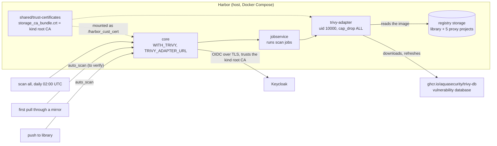

# Update setup 08: Regular image scanning in Harbor with Trivy

| | |
| --- | --- |
| Date | 2026-09-19 |
| Status | **Planned, not yet applied** |
| Scope | `/home/leo/dev/kind`, builds on [`update-setup-02.md`](update-setup-02.md) (Harbor, `registry/setup-host.sh`), [`update-setup-03.md`](update-setup-03.md) (Harbor's Keycloak login) and [`update-setup-07.md`](update-setup-07.md) (the proxy caches, whose images are now the cluster's images) |

## Goals

1. **Every image in Harbor is scanned for known vulnerabilities:** our own images
   in `library`, and every image the cluster pulls through the five proxy caches.
2. **Regularly, not only once:** a daily rescan of everything against the current
   vulnerability database, so a CVE published tomorrow shows up in an image
   cached last week.
3. **New images are scanned when they arrive,** not only at the next scheduled
   run.
4. **Report, don't block:** results are visible in Harbor's UI and API; no pull
   is refused.
5. **Enabling it must not break Harbor's Keycloak login.** This is a real risk,
   found while preparing this plan; see below.

## What was verified before writing this

Checked on 2026-09-19 against the running Harbor v2.15.2 and its installer:

- **Harbor has no scanner.** `GET /api/v2.0/scanners` returns `[]`, and the
  scan-all schedule answers `412 no scanner is configured, it's not possible to
  scan`. The running Compose project has nine containers, none of them Trivy.
- **The installer supports Trivy through `prepare --with-trivy`** (`prepare
  --help` of `goharbor/prepare:v2.15.2`). `registry/setup-host.sh` calls
  `sudo ./prepare` without it today.
- **What `--with-trivy` renders.** I ran a dry run of `prepare --with-trivy`
  without root, into throwaway Docker volumes, with this `harbor.yml`:
  - **Service:** one more Compose service, `trivy-adapter`, image
    `goharbor/trivy-adapter-photon:v2.15.2` (amd64, about 164 MB compressed),
    with `cap_drop: ALL`, no ports and only the `harbor` network. The image runs
    as `uid=10000(scanner)`.
  - **Data:** the Trivy cache and reports go to
    `registry/out/data/trivy-adapter/{trivy,reports}`. `prepare` creates both
    directories as uid 10000, like Harbor's other data directories, so running
    stays unprivileged (ADR-0015).
  - **Registration:** core gets `WITH_TRIVY=True` and
    `TRIVY_ADAPTER_URL=http://trivy-adapter:8080`, and registers the scanner
    by itself.
  - **Vulnerability database:** the adapter downloads it from
    `ghcr.io/aquasecurity/trivy-db` (`skip_update: false`, the `trivy:`
    section's defaults). It reports vulnerabilities of all severities, fixed or
    not (`ignore_unfixed: false`).
- **The trap: `prepare` wipes Harbor's trust folder.** `prepare_trust_ca()` in
  the prepare image runs `shutil.rmtree` on `common/config/shared/trust-certificates`
  and refills it only from Harbor's own settings. That folder holds
  `kind-dev-root-ca.crt`, which `registry/oidc-setup.sh` copied there with sudo
  (update-setup-03), and which core needs to reach Keycloak over TLS. Without a
  change, re-running `prepare` to enable Trivy would silently break the Harbor
  login through Keycloak.
- **The fix, dry-run tested:** `storage_service.ca_bundle` in `harbor.yml`,
  pointing at `pki/out/root-ca.crt`. `prepare` then copies the kind root CA into
  the trust folder itself, as `storage_ca_bundle.crt` (subject `CN=kind-dev Root
  CA`), on every run. Six containers mount the folder at `/harbor_cust_cert`,
  among them core and `trivy-adapter`. The registry's storage stays
  `filesystem`.
- **`prepare` keeps Harbor's secret key.** `_get_secret()` loads an existing
  `data/secret/keys/secretkey` (present since 2026-09-16) and generates one only
  when none exists. So the values encrypted in Harbor's database, like the OIDC
  client secret and the endpoint credentials, stay readable.
- **The API has everything needed:**
  - `POST/PUT /system/scanAll/schedule`, with schedule types `Hourly`, `Daily`,
    `Weekly`, `Custom`, `Manual` and `None`;
  - `POST .../artifacts/{reference}/scan` for a single artifact;
  - the project flags `auto_scan`, `auto_sbom_generation`, `prevent_vul` and
    `severity`;
  - the Security Hub endpoints `/security/summary` and `/security/vul`, plus
    `/scans/all/metrics` for the progress of a scan-all run.

  None of the six projects sets `auto_scan` today.
- **Memory:** 15 GB total, about 4 GB available with the cluster, Harbor,
  Keycloak and Vault running. The adapter's footprint is measured in Step 6, not
  guessed.

## How it works



- **Scan on arrival:** a push to a project with `auto_scan` starts a scan job.
  Whether a proxy project's cached copy triggers one too is an open point for
  Step 6. The daily run covers the proxy projects either way.
- **Scan all:** once a day, every artifact is scanned again against the current
  database. Results replace the previous report.
- **Where the results are:**
  - Harbor's UI: *Projects → repository → artifact*, plus the Security Hub under
    *Interrogation Services*;
  - the API: `/security/summary`, `/security/vul` and each artifact's
    `scan_overview`.

## Decisions

- **Trivy as Harbor's built-in adapter,** installed by `prepare --with-trivy`. It
  has the same version as Harbor, needs no extra lifecycle, and scans exactly
  what Harbor stores. Two alternatives were considered:
  - **The Trivy Operator in the cluster.** It scans what *runs* rather than what
    is stored and adds a controller and CRDs. It is a complement, not a
    replacement; see *Later*.
  - **A Trivy CLI script.** It has no storage of results and no UI.
- **A daily scan-all at 02:00 UTC** (`Custom`, cron `0 0 2 * * *`). It runs
  after the daily retention run (00:00 UTC) and the weekly garbage collection
  (Sunday 01:00 UTC), so it doesn't scan artifacts that are about to be deleted.
  Daily because the database changes several times a day and the cache is small.
  As with the garbage collection, the script sets the schedule only when none
  exists, so a schedule chosen in the UI stays.
- **`auto_scan` on `library` and on the five proxy projects.** The proxy project
  names come from `registry/mirrors.tsv`, so a sixth mirror is scanned as well.
- **Report only: no `prevent_vul`.** Blocking by severity would stop workloads
  in a dev cluster for CVEs nobody here can fix. On a proxy project, the node's
  fallback to the original registry would get around the block anyway, so the
  block would do nothing but slow pulls down (not verified, and not needed).
- **The kind root CA comes from `prepare` itself** (`storage_service.ca_bundle`),
  no longer from a manual `sudo cp`. This defuses the trap for every future
  `prepare` run, whether for Trivy, a port change or an upgrade. It also removes
  a root step from update-setup-03.
- **A switch in `versions.env`: `HARBOR_WITH_TRIVY=true`.** On a laptop with 4 GB
  headroom, dropping the scanner must be one line and one `setup-host.sh` run.
- **Configured by a script through Harbor's API,** as for the proxy caches and
  the OIDC settings: `registry/scanning.sh`, idempotent.
- **The vulnerability database comes from ghcr.io directly,** anonymously. Going
  through Harbor's own `ghcr` mirror is possible in principle, since the adapter
  now trusts the kind root CA, but it is unverified; see *Later*.

## Step 1: `versions.env`

```bash
HARBOR_WITH_TRIVY=true      # false: Harbor without the scanner (one container and its memory less)
```

## Step 2: `registry/setup-host.sh`

Three changes:

1. **Render `storage_service.ca_bundle`** into `harbor.yml`, next to the other
   substitutions. The template has the block commented out, so the script
   inserts an active one:

   ```yaml
   storage_service:
     # The kind root CA. prepare copies it into common/config/shared/trust-certificates,
     # which every Harbor container mounts - core needs it for Keycloak (update-setup-08).
     ca_bundle: /home/leo/dev/kind/pki/out/root-ca.crt     # from $SCRIPT_DIR, not hardcoded
     filesystem:
       maxthreads: 100                                     # the template's default
   ```

2. **Pass `--with-trivy`** when `HARBOR_WITH_TRIVY=true`.
3. **Hash the flags with `harbor.yml`.** The script re-runs `prepare` only when
   the hash of `harbor.yml` changes. Switching Trivy on or off changes only the
   flag, so the flag has to be part of the hash:

   ```bash
   prepare_args=(); [[ ${HARBOR_WITH_TRIVY:-true} == true ]] && prepare_args+=(--with-trivy)
   config_hash=$( { cat harbor.yml; echo "prepare ${prepare_args[*]}"; } | sha256sum | cut -d' ' -f1)
   ...
   sudo ./prepare "${prepare_args[@]}"
   ```

The existing group-read step already uses the glob `common/config/*/env`, so it
covers the new `trivy-adapter/env` without a change.

**This run needs sudo** (`prepare`, then `chgrp`/`chmod` on the env files), so
you run it: `! registry/setup-host.sh`. `docker compose up -d` then recreates
the containers whose configuration changed. Harbor is down for a moment; the
nodes fall back to the original registries meanwhile (update-setup-07).

## Step 3: `registry/oidc-setup.sh` and the README

- **`oidc-setup.sh`:** drop the `sudo cp` of the root CA. Instead, check that
  `trust-certificates/storage_ca_bundle.crt` exists, and if it doesn't, point
  to `registry/setup-host.sh`.
- **README (*Identity*):** remove the manual `sudo cp … kind-dev-root-ca.crt`
  step and the restart that follows it.

## Step 4: `registry/scanning.sh` (new)

Idempotent, through Harbor's API, with the admin credentials from `harbor.yml`,
like `proxy-cache.sh`:

1. **Wait for the scanner.** Poll `GET /scanners` until `Trivy` is registered,
   then check that it is the default and that `GET /scanners/{id}/metadata`
   answers (the adapter is up). With `HARBOR_WITH_TRIVY=false`, print that
   scanning is off and exit 0.
2. **Scan-all schedule:** if none exists, set `Custom` `0 0 2 * * *`, the same
   rule as for the garbage collection.
3. **`auto_scan: "true"`** on `library` and on every project in
   `registry/mirrors.tsv`, through `PUT /projects/{name}` with only that
   metadata key.
4. **Report:** the scanner and its version, the schedule, the flag per project,
   and the totals from `/security/summary`.

## Step 5: Wiring

- **README quick start:** `registry/scanning.sh` after `registry/proxy-cache.sh`,
  once.
- **README (*Registry*):** a *Scanning* subsection:
  - where the results are (UI, Security Hub, API);
  - how to scan one image now (`POST …/scan`);
  - how to switch scanning off (`HARBOR_WITH_TRIVY=false`, then
    `setup-host.sh`).

## Step 6: Verification

**`prepare` and the CA:**

```bash
ls -l registry/out/harbor/common/config/shared/trust-certificates/
# -> storage_ca_bundle.crt, subject CN=kind-dev Root CA (no manual copy needed)
docker compose -f registry/out/harbor/docker-compose.yml ps
# -> ten containers, trivy-adapter healthy; docker inspect: user 10000, CapDrop ALL
```

**Harbor is otherwise unchanged:**
- **Mirror config:** `registry/proxy-cache.sh` reports the same five healthy
  endpoints, and the garbage collection schedule is unchanged.
- **Images:** a pull through a mirror still works.
- **Keycloak login:** `tests/run.sh` passes, including the Harbor suite. This
  proves core still trusts Keycloak with the CA from `ca_bundle`.

**The scanner:**

```bash
registry/scanning.sh          # twice: the second run changes nothing
# GET /scanners -> Trivy, is_default true; metadata answers
```

**A single scan:** scan `dockerhub/library/busybox:1.37` (cached in
update-setup-07) with `POST …/artifacts/1.37/scan`. Its `scan_overview` must
reach `Success`, `…/additions/vulnerabilities` must list the findings, and the
adapter's log must show the database download (record its duration and size).

**Scan on push:** copy an image into `library` with a skopeo container (no
change to the host's Docker), for example `library/scan-test:1`. It must be
scanned without a request. Delete it afterwards.

**Scan on proxy caching (open point):** pull an image through a mirror that no
node has. After Harbor has cached it (about six minutes, update-setup-07), check
whether it carries a report without a request. Either result is recorded; the
daily run covers the proxy projects regardless.

**Scan all:** check the schedule (`0 0 2 * * *`). Then start one run by hand
(`{"schedule": {"type": "Manual"}}`) and poll `/scans/all/metrics` until it is
done. Every artifact must then carry a report, and `/security/summary` gives the
totals for the implementation notes.

**Memory:** `docker stats trivy-adapter` idle, and at its peak during the
scan-all run (Grafana's image is the largest cached one). Also record the host's
free memory before and after.

**The switch:** check with a dry run of `prepare` into throwaway volumes, as in
*What was verified*, that `HARBOR_WITH_TRIVY=false` renders no
`trivy-adapter`. Scanning is not actually turned off on the live Harbor.

## Step 7: Documentation

- **`architecture.md`:**
  - the *Registry* section: ten containers, the scanner, the daily run, the CA
    through `ca_bundle`;
  - the C4 diagram: Harbor's description, and a relation to ghcr.io for the
    database;
  - **ADR-0026** below.
- **README:** as in Steps 3 and 5.
- **This file:** status, implementation notes and evidence.

## Planned ADR

**ADR-0026: Trivy in Harbor, scanning every stored image daily, report only.**

- **Context:** since update-setup-07, every image the cluster pulls is stored in
  Harbor, but nothing checks those images for known vulnerabilities. Harbor
  supports scanners, and none is installed. Enabling one needs `prepare` again,
  and `prepare` deletes the trust folder that holds the kind root CA, on which
  Harbor's Keycloak login depends.
- **Decision:**
  - Harbor's bundled Trivy adapter, switched by `HARBOR_WITH_TRIVY`, set as the
    default scanner;
  - scan on push for `library` and the proxy projects, plus a daily scan of
    everything at 02:00 UTC;
  - results are reported, never enforced (`prevent_vul` off);
  - the kind root CA reaches Harbor through `storage_service.ca_bundle`, so
    `prepare` restores it on every run;
  - the Trivy Operator in the cluster was considered: it scans running workloads
    rather than stored images, and it remains a possible complement.
- **Consequences:**
  - **Visibility:** vulnerabilities in every cached and pushed image are visible
    in one place and kept current daily.
  - **Cost:** one more container and its memory, plus a daily download of the
    vulnerability database from ghcr.io.
  - **Gaps:** images Harbor does not store go unscanned. That covers the kind
    node image's preloaded images, pulls made while Harbor was down, and the
    host's own Docker.
  - **Platforms:** only the pulled platform is scanned, since the cache holds no
    other.
  - **CA and login:** the manual CA copy for the Keycloak login disappears; the
    CA now depends on how `prepare` handles `ca_bundle`, which is re-checked on
    every Harbor upgrade.

## Known limitations and open points

- **Only what Harbor stores is scanned.** The kind node image preloads most of
  `registry.k8s.io`, those images are never pulled, and so never scanned.
  Neither are images pulled while Harbor was down, or the host's own Docker
  images (Harbor, Keycloak, Vault).
- **Only the pulled platform.** Harbor caches amd64 only (update-setup-07), so
  the report covers amd64.
- **The database comes from the internet.** Trivy refreshes it from ghcr.io.
  Without internet, scans use the last database, and `skip_update` plus a
  manually supplied database would be the offline route.
- **`ca_bundle` is a documented field used for more than its stated purpose:**
  the registry's trust store, which `prepare` 2.15.2 also shares with every
  container. **On every Harbor upgrade:** check the rendered trust folder before
  starting.
- **To verify:** whether a proxy project's caching triggers `auto_scan` (Step 6).
- **To measure:** the adapter's memory, idle and while scanning (Step 6).

## Later

- **The Trivy database through Harbor's `ghcr` mirror**
  (`db_repository: harbor.kind.local:3443/ghcr/aquasecurity/trivy-db`). The
  adapter now trusts the kind root CA. Still to verify: that Harbor's proxy
  cache serves this non-image OCI artifact.
- **SBOMs:** `auto_sbom_generation` per project. Harbor generates them with the
  same Trivy.
- **The Trivy Operator in the cluster,** for running workloads, including the
  preloaded images and configuration audits.
- **Notifications:** Harbor's webhooks for scan results, for example into
  Grafana's alerting.
