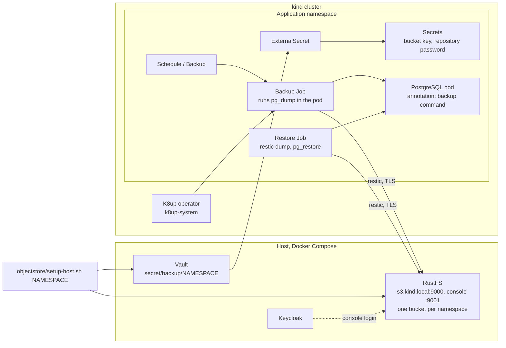

# Update setup 09: Backup and restore for application databases — RustFS on the host, K8up in the cluster, a demo application through Argo CD

| | |
| --- | --- |
| Date | 2026-09-30 |
| Status | **Planned, not yet applied** |
| Scope | `/home/leo/dev/kind`, builds on [`update-setup-01.md`](update-setup-01.md) (platform services, trust-manager, Argo CD), [`update-setup-02.md`](update-setup-02.md) (TopoLVM), [`update-setup-03.md`](update-setup-03.md) (Keycloak), [`update-setup-06.md`](update-setup-06.md) (Vault, External Secrets) and [`update-setup-07.md`](update-setup-07.md) (Harbor mirrors). Implements ADR-0029 and ADR-0030 in [`architecture.md`](architecture.md) |

## Goals

1. **An object store on the host:** RustFS in Docker Compose, as the local user
   without `sudo`, with a certificate from the local CA, at `s3.kind.local`. It
   exists before the cluster and survives `cluster/cluster.sh down` and a
   rebuild of the TopoLVM volume group.
2. **A backup operator in the cluster:** K8up as a platform service. An
   application asks for a backup with a `Backup` or `Schedule` resource in its
   own namespace.
3. **Applications own their backups.** The platform gives each namespace a
   bucket, a key and a repository password through Vault and the External
   Secrets Operator. What is backed up, when, how long it is kept and when it is
   restored is the application's decision.
4. **No cluster or deployment state is backed up.** No etcd snapshot, no copy of
   Kubernetes objects. The cluster and the applications come back from git.
5. **A demo application shows the whole round trip:** `backup-demo`, a
   PostgreSQL database deployed by Argo CD, with a nightly `Schedule`, a backup
   on request and a restore on request. It has to survive
   `cluster/cluster.sh down` and `up`.
6. **People log in to the RustFS console through Keycloak,** like everywhere
   else.
7. **Cluster images come through the Harbor mirrors.** No new registry, no image
   names rewritten.

## What was verified before writing this

Checked on 2026-09-30 with a throwaway RustFS container on the host and a
temporary K8up installation in the running cluster. Everything was removed
again afterwards; nothing of it is in the repository.

### RustFS (`rustfs/rustfs:1.0.0`)

- **Runs as the local user.** The image's own user is uid 10001, but
  `--user 1000:1000` with bind-mounted `/data` and `/logs` works; every file it
  writes belongs to the local user. No `chown`, no root.
- **TLS from the local CA.** `RUSTFS_TLS_PATH` names a directory that must
  contain `rustfs_cert.pem` and `rustfs_key.pem`. Other file names are ignored
  and the server then refuses to start (`TLS is explicitly configured … but no
  server certificates were found`). `rustfs tls inspect --path` shows what it
  finds. With the chain of the issuing CA in `rustfs_cert.pem`, `curl --cacert
  pki/out/root-ca.crt` accepts both ports.
- **Ports and paths.** S3 API on 9000, console on 9001 at `/rustfs/console/`
  (the bare `/` answers 403). `/health` on the API port answers 200 without
  credentials. Both host ports are free here.
- **Root credentials** come from `RUSTFS_ACCESS_KEY` and `RUSTFS_SECRET_KEY`, or
  from files with `RUSTFS_ACCESS_KEY_FILE` and `RUSTFS_SECRET_KEY_FILE`.
- **Memory:** 104 to 151 MiB with two small repositories.
- **Administration with `rc`** (`rustfs/rc:v0.1.36`, RustFS's own client, also
  run as the local user with `HOME` on a mounted directory and `SSL_CERT_FILE`
  for the CA): `rc alias set`, `rc bucket create`, `rc admin policy create`,
  `rc admin user add`, `rc admin policy attach --user` all worked.
- **A key limited to one bucket works.** A user with a policy for bucket `myapp`
  only could initialise and use a restic repository there, got `Access Denied`
  on another bucket, and could not create a new one.
- **restic 0.19.1 works against it** over TLS with `--cacert`: `init`, `backup`,
  `backup --stdin`, `snapshots`, `forget --prune`, `dump`.
- **Keycloak: discovery works, the login is not tested.** RustFS reads OIDC
  settings from `RUSTFS_IDENTITY_OPENID_*` or from `rc admin idp openid set`.
  Two things are needed before it talks to Keycloak:
  - `RUSTFS_OUTBOUND_ALLOW_ORIGINS=https://keycloak.kind.local:8443`. RustFS
    blocks outbound requests to private addresses; without this the log says
    `outbound DNS resolution for 'keycloak.kind.local' returned no allowed
    addresses`.
  - `SSL_CERT_FILE` pointing at the root CA.

  With both, `rc admin idp openid validate` against the realm `localdev` returns
  `Valid: true` with the right issuer and endpoints. There is no `rustfs` client
  in the realm yet, so the login itself and the mapping from groups to policies
  are open (Step 4).

### K8up (chart `k8up` 4.10.0, operator `ghcr.io/k8up-io/k8up:v2.16.0`)

- **The chart has no CRDs.** They are a separate file of the release,
  `k8up-crd.yaml`, with nine CRDs. It needs a server-side apply, which
  `platformservices/deploy.sh` already does.
- **The chart contains a Helm hook Job, `k8up-cleanup`.** Rendered through
  Kustomize it becomes an ordinary Job that runs `kubectl` over all namespaces.
  It is only meant for upgrades from old versions; the plan removes it from the
  render.
- **`k8up.envVars` must not repeat a variable the chart sets itself,** or the
  server-side apply fails with `duplicate entries for key`.
- **The operator uses 30 MB.** Backups run as a Job in the application's
  namespace with the same image; K8up creates a ServiceAccount `pod-executor`
  and a RoleBinding there.
- **The backup command works.** With the annotation
  `k8up.io/backupcommand: … pg_dump -Fc -Z0` on a PostgreSQL 18 pod, a `Backup`
  finished in seven seconds. The dump is one file in the repository named
  **`/<namespace>-<container name><file-extension>`**, here
  `/k8up-test-postgres.dump`. K8up shows it as a `Snapshot` resource with that
  path.
- **The local CA works** with `backend.tlsOptions.caCert`, a
  `backend.volumeMounts` entry and `spec.volumes` with trust-manager's
  ConfigMap `kind-root-ca`, which exists in every namespace. K8up passes
  `--cacert` to restic.
- **The PVC annotation `k8up.io/backup: "false"` works:** the data volume was
  skipped (`PVC skipped due to annotation`).
- **The restore Job works.** After `drop table`, a Job with `restic/restic:0.19.1`
  (`restic dump --path … latest …`) and `postgres:18-alpine` (`pg_restore
  --clean --if-exists --no-owner --exit-on-error`) brought both rows back.
- **A wrong repository password fails clearly:** `Fatal: wrong password or no
  key found`. The bucket and its password belong together.

### Images and the mirrors

- **The cluster already pulls these images through Harbor.** The pulls of
  `ghcr.io/k8up-io/k8up` and `docker.io/library/postgres` went to
  `harbor.kind.local:3443/v2/ghcr/…` and `/v2/dockerhub/…`; the nodes' containerd
  does that for every registry in `registry/mirrors.tsv`. Nothing has to be
  added.
- **The first pull is slow.** Today the first pull of the K8up image took nine
  minutes and the PostgreSQL pull timed out once before it succeeded; later
  pulls come from Harbor's cache. `deploy.sh` needs a longer wait for this step.

### Not verified

- A `Schedule` with `prune` (only a one-off `Backup` was run).
- The Argo CD part: the Applications, the sync hooks for backup and restore.
- The RustFS login through Keycloak and the group mapping.
- RustFS after a host reboot.
- Writing the keys to Vault and reading them through an `ExternalSecret`; the
  test used plain Secrets.

## Versions

| Component | Version | Where it is pinned |
| --- | --- | --- |
| RustFS | 1.0.0 | `versions.env` (`RUSTFS_VERSION`) |
| RustFS client `rc` | v0.1.36 | `versions.env` (`RUSTFS_RC_VERSION`) |
| K8up chart / operator | 4.10.0 / v2.16.0 | `platformservices/k8up/kustomization.yaml` |
| restic, for restore Jobs | 0.19.1 | the application's manifest |
| PostgreSQL, demo | 18-alpine | the application's manifest |

## How it works



One restic repository per namespace, in a bucket with the namespace's name. The
bucket, its key and the repository password are created once on the host and
live in RustFS and Vault, so they are still there after the cluster is rebuilt.
A rebuilt application gets the same three values again through its
`ExternalSecret` and finds its old backups.

## Decisions

The two architecture decisions are ADR-0029 (K8up; applications manage their
backups) and ADR-0030 (RustFS). This plan adds the following.

- **`objectstore/` as the directory,** not `rustfs/`: the directory names say
  what a service is for (`registry/`, `identity/`), so the product can change.
- **One bucket, one user, one policy per namespace,** all named after the
  namespace. A key can read and write its own bucket and nothing else.
- **Secrets in Vault at `secret/backup/<namespace>`** with the properties
  `access-key`, `secret-key` and `repo-password`. The existing policy `eso-read`
  already covers the path.
- **`objectstore/setup-host.sh` writes to Vault itself,** with `vault kv put` in
  the Vault container. The Terraform project stays for Vault's configuration;
  generated keys in its state would only add a second copy of each secret.
- **Namespaces are given to the script as arguments,** and it remembers them in
  `objectstore/out/namespaces`. A new application is one command.
- **The CA comes from trust-manager's `kind-root-ca` ConfigMap,** mounted into
  the K8up jobs and the restore Job. No CA in an image, no `--insecure-tls`.
- **Backup and restore on request are Argo CD applications with manual sync.**
  Syncing `backup-demo-backup` runs a backup, syncing `backup-demo-restore` runs
  the restore. That keeps "by Kubernetes resource" and "through Argo CD" in one
  mechanism, and both are visible in the Argo CD UI.
- **Argo CD reads this repository from GitHub over https.** It is public, so no
  credential is needed. The consequence: the demo is deployed from what is
  pushed, not from the working tree.

## Layout

```
objectstore/                      # new: RustFS via Docker Compose
├── compose.yaml
├── create-cert.sh                # rustfs_cert.pem, rustfs_key.pem from the local CA
├── setup-host.sh                 # start; with arguments: bucket, key, Vault secret per namespace
├── rc.sh                         # the rc client in a container, as the local user
└── out/                          # git-ignored: data, logs, tls, admin credentials, namespaces
platformservices/k8up/            # new
├── kustomization.yaml            # CRDs, chart 4.10.0, without the hook Job
└── namespace.yaml
applications/backup-demo/         # new
├── deploy.sh                     # bucket and key, then the three Argo CD Applications
├── argocd/                       # Application manifests, applied by deploy.sh
├── base/                         # namespace, ExternalSecrets, PostgreSQL, Schedule
├── backup/                       # a Backup as a sync hook
└── restore/                      # the restore Job as a sync hook
```

## Part A: The host

### Step 1: `versions.env`

```bash
# update-setup-09: RustFS as the object store for backups, outside the cluster
RUSTFS_VERSION=1.0.0
RUSTFS_RC_VERSION=v0.1.36
RUSTFS_HOSTNAME=s3.kind.local
RUSTFS_PORT=9000
RUSTFS_CONSOLE_PORT=9001
```

### Step 2: `objectstore/create-cert.sh` and `compose.yaml`

`create-cert.sh` has the shape of `vault/create-cert.sh`: a certificate for
`s3.kind.local` and `localhost` from the issuing CA, kept while it is valid for
more than 30 days. The difference is the file names RustFS insists on:

```bash
cat "$OUT/server.crt" "$PKI/issuing-ca.crt" > "$OUT/rustfs_cert.pem"
mv "$OUT/tls.key" "$OUT/rustfs_key.pem"
chmod 644 "$OUT/rustfs_cert.pem"; chmod 600 "$OUT/rustfs_key.pem"
install -m 644 "$PKI/root-ca.crt" "$OUT/ca.crt"       # for outbound TLS to Keycloak
```

`compose.yaml`:

```yaml
# RustFS outside the cluster (update-setup-09): the object store for backups. Like Harbor,
# Keycloak and Vault, it exists before the cluster and survives "cluster/cluster.sh down".
# Variables come from ./.env, written by objectstore/setup-host.sh.
name: objectstore

services:
  rustfs:
    image: rustfs/rustfs:${RUSTFS_VERSION:?run objectstore/setup-host.sh}
    restart: unless-stopped
    # The host user, so data, logs and keys stay owned by it (the image's own user is 10001).
    user: "${HOST_UID:?}:${HOST_GID:?}"
    environment:
      RUSTFS_ACCESS_KEY_FILE: /secrets/admin-access-key
      RUSTFS_SECRET_KEY_FILE: /secrets/admin-secret-key
      RUSTFS_CONSOLE_ENABLE: "true"
      RUSTFS_TLS_PATH: /tls            # needs rustfs_cert.pem and rustfs_key.pem
      SSL_CERT_FILE: /tls/ca.crt       # the local root CA, for the requests to Keycloak
      # RustFS refuses outbound requests to private addresses unless the origin is listed
      RUSTFS_OUTBOUND_ALLOW_ORIGINS: https://${KEYCLOAK_HOSTNAME}:${KEYCLOAK_HTTPS_PORT}
    volumes:
      - ./out/data:/data
      - ./out/logs:/logs
      - ./out/tls:/tls:ro
      - ./out/secrets:/secrets:ro
    ports:
      # The browser on this host, and the pods via the kind bridge gateway (the host).
      - "127.0.0.1:${RUSTFS_PORT}:9000"
      - "${KIND_GATEWAY:?}:${RUSTFS_PORT}:9000"
      - "127.0.0.1:${RUSTFS_CONSOLE_PORT}:9001"
      - "${KIND_GATEWAY}:${RUSTFS_CONSOLE_PORT}:9001"
    extra_hosts:
      - "${KEYCLOAK_HOSTNAME}:${KIND_GATEWAY}"
```

The console is published on the gateway address as well, because `hosts.sh`
points every host-side name there.

### Step 3: `objectstore/setup-host.sh` and `rc.sh`

`rc.sh` runs the client the way `vault/tf.sh` runs Terraform: a container as the
local user, `HOME` on `objectstore/out/rc` so the alias is kept, `SSL_CERT_FILE`
for the CA, `--add-host s3.kind.local:<gateway>`.

`setup-host.sh [namespace …]`, safe to re-run:

1. Refuse to start without the `kind` network (the gateway address is needed),
   like `vault/setup-host.sh`.
2. `mkdir -p out/{data,logs,tls,secrets,rc}`, `chmod 700 out`; run
   `create-cert.sh`.
3. Generate the admin access key and secret key once into `out/secrets/`
   (`umask 077`, `openssl rand`).
4. Write `.env` (versions, ports, gateway, uid, gid, Keycloak host and port) and
   `docker compose up -d`.
5. Wait for `https://s3.kind.local:9000/health` to answer 200.
6. `rc alias set kind https://s3.kind.local:9000 <admin key> <admin secret>`.
7. For every namespace given as an argument, and every one already listed in
   `out/namespaces`:
   - `rc bucket create kind/<ns>` unless it exists;
   - the policy `backup-<ns>` from the template below;
   - the user `<ns>` with a generated secret, kept in `out/secrets/<ns>`, and
     `rc admin policy attach kind backup-<ns> --user <ns>`;
   - a repository password, generated once into `out/secrets/<ns>.repo`;
   - `vault kv put secret/backup/<ns> access-key=… secret-key=… repo-password=…`
     through `docker compose -f vault/compose.yaml exec`, when Vault is set up
     and unsealed. When it is not, say so and go on.
8. Print the endpoint, the console URL and where the admin credentials are.

The policy, verified in this form:

```json
{"Version":"2012-10-17","Statement":[
 {"Effect":"Allow","Action":["s3:ListBucket","s3:GetBucketLocation"],"Resource":["arn:aws:s3:::NAMESPACE"]},
 {"Effect":"Allow","Action":["s3:GetObject","s3:PutObject","s3:DeleteObject"],"Resource":["arn:aws:s3:::NAMESPACE/*"]}]}
```

The repository password is never regenerated: a restic repository cannot be
opened with another one.

### Step 4: Keycloak

- **`identity/realm/localdev.yaml`:** a client `rustfs`, confidential, standard
  flow, with the default client scopes of the other clients (including
  `groups`). The redirect URI is the one RustFS reports after
  `rc admin idp openid set`; take it from `rc admin idp openid get` instead of
  guessing it.
- **`identity/setup-host.sh`:** `gen rustfs-client-secret` and pass it to
  keycloak-config-cli as `RUSTFS_CLIENT_SECRET`, like the other four.
- **`objectstore/setup-host.sh`,** when `identity/out/rustfs-client-secret`
  exists:

  ```bash
  # rc.sh mounts identity/out read-only at /identity; rc takes the secret from a file only
  rc admin idp openid set kind keycloak \
      --config-url "https://keycloak.kind.local:8443/realms/localdev" \
      --client-id rustfs --client-secret-file /identity/rustfs-client-secret \
      --display-name Keycloak \
      --scope openid --scope profile --scope email --scope groups \
      --groups-claim groups
  ```

- **Rights:** members of `platform-admins` get the built-in policy
  `consoleAdmin`, everyone else `readonly`. RustFS offers `--groups-claim`,
  `--claim-name`, `--role-policy` and `rc admin policy attach --group`; which
  combination maps a Keycloak group to a policy is to be found out here. If it
  cannot be done in an hour, the fallback is `--role-policy readonly` for
  everyone who logs in, and the admin key from `out/secrets/` for changes.
- **The local admin stays,** as with the other services: it is what the scripts
  use.
- **`tests/specs/rustfs.spec.ts`:** a Playwright suite like the other four:
  open the console, log in through Keycloak as `dev`, see the bucket list.

### Step 5: Names

- **`hosts.sh`:** one more block, `[[ -d objectstore/out ]]` →
  `$gateway_ip ${RUSTFS_HOSTNAME:-s3.kind.local}`.
- **`cluster/host-services-dns.sh`:** the same condition adds the name to the
  CoreDNS hosts block, so pods reach RustFS at the gateway.

## Part B: The cluster

### Step 6: `platformservices/k8up/`

`namespace.yaml` creates `k8up-system`. `kustomization.yaml`:

```yaml
apiVersion: kustomize.config.k8s.io/v1beta1
kind: Kustomization
# K8up (update-setup-09, ADR-0029): the backup operator. Applications create Backup and
# Schedule resources in their own namespace; the operator itself backs nothing up.
namespace: k8up-system
resources:
- namespace.yaml
# The chart ships no CRDs; they are a file of the same release. Too large for a
# client-side apply - platformservices/deploy.sh applies server-side.
- https://github.com/k8up-io/k8up/releases/download/k8up-4.10.0/k8up-crd.yaml
helmCharts:
- name: k8up
  repo: https://k8up-io.github.io/k8up
  version: 4.10.0
  releaseName: k8up
  namespace: k8up-system
patches:
# A Helm post-install hook that deletes leftovers of K8up 1.x in every namespace. Rendered
# by Kustomize it would be an ordinary Job running on every apply.
- target: {kind: Job, name: k8up-cleanup}
  patch: |
    $patch: delete
    apiVersion: batch/v1
    kind: Job
    metadata: {name: k8up-cleanup}
```

The chart's defaults stay: 128 Mi requested, 256 Mi limit, measured use 30 MB.

### Step 7: Wiring

- **`platformservices/deploy.sh`,** a new last step:

  ```bash
  # 8. Backup (update-setup-09): the K8up operator. The first pull of its image through the
  # Harbor mirror can take several minutes, hence the longer wait.
  apply k8up
  kubectl -n k8up-system rollout status deployment/k8up --timeout=900s
  ```

- **`platformservices/kustomization.yaml`:** add `- k8up`.
- **`.gitignore`:** `/objectstore/out/` and `/objectstore/.env`.
- **Images:** `ghcr.io/k8up-io/k8up`, `docker.io/library/postgres` and
  `docker.io/restic/restic` are covered by the existing mirrors in
  `registry/mirrors.tsv` and by the Trivy Operator's `registry.mirror` map. No
  change. RustFS and `rc` run on the host's Docker, which the mirrors do not
  cover (ADR-0025); they are pulled from Docker Hub directly.

## Part C: The demo application

### Step 8: `applications/backup-demo/base/`

The namespace `backup-demo`, a Service, and:

```yaml
# What the platform provides for this namespace (objectstore/setup-host.sh backup-demo)
apiVersion: external-secrets.io/v1
kind: ExternalSecret
metadata:
  name: backup
  namespace: backup-demo
spec:
  refreshInterval: 1h
  secretStoreRef: {kind: ClusterSecretStore, name: vault}
  target: {name: backup}
  dataFrom:
  - extract: {key: backup/backup-demo}     # access-key, secret-key, repo-password
```

```yaml
apiVersion: apps/v1
kind: StatefulSet
metadata:
  name: postgres
  namespace: backup-demo
spec:
  serviceName: postgres
  selector: {matchLabels: {app: postgres}}
  template:
    metadata:
      labels: {app: postgres}
      annotations:
        # How this database is backed up: K8up runs the command in the container and stores
        # its output as /backup-demo-postgres.dump (namespace, container name, extension).
        k8up.io/backupcommand: sh -c 'PGDATABASE="$POSTGRES_DB" PGUSER="$POSTGRES_USER" PGPASSWORD="$POSTGRES_PASSWORD" pg_dump -Fc -Z0'
        k8up.io/file-extension: .dump
    spec:
      containers:
      - name: postgres
        image: postgres:18-alpine
        env:
        - {name: POSTGRES_DB, value: demo}
        - {name: POSTGRES_USER, value: demo}
        - {name: POSTGRES_PASSWORD, valueFrom: {secretKeyRef: {name: postgres, key: password}}}
        - {name: PGDATA, value: /var/lib/postgresql/data/pgdata}
        volumeMounts: [{name: data, mountPath: /var/lib/postgresql/data}]
  volumeClaimTemplates:
  - metadata:
      name: data
      annotations:
        k8up.io/backup: "false"      # no file copy of a running server
    spec:
      accessModes: [ReadWriteOnce]
      resources: {requests: {storage: 1Gi}}
```

The database password is a second `ExternalSecret` from `secret/backup-demo/db`
in Vault, written once by the application's `deploy.sh`. It has to be the same
after a rebuild: the restored dump does not contain it, but the application's
clients use it.

The nightly backup, with the backend every K8up resource of this namespace
repeats:

```yaml
apiVersion: k8up.io/v1
kind: Schedule
metadata:
  name: nightly
  namespace: backup-demo
spec:
  backend: &backend
    repoPasswordSecretRef: {name: backup, key: repo-password}
    s3:
      endpoint: https://s3.kind.local:9000
      bucket: backup-demo
      accessKeyIDSecretRef: {name: backup, key: access-key}
      secretAccessKeySecretRef: {name: backup, key: secret-key}
    tlsOptions:
      caCert: /mnt/ca/ca.crt
    volumeMounts:
    - {name: ca, mountPath: /mnt/ca/}
  backup:
    schedule: '0 2 * * *'
    volumes: &ca
    - name: ca
      configMap: {name: kind-root-ca}     # trust-manager puts it into every namespace
  prune:
    schedule: '0 4 * * 0'
    retention: {keepLast: 5, keepDaily: 7}
    volumes: *ca
```

Whether `backup` and `prune` inherit `spec.backend` and accept `volumes` in this
form is to be checked against the CRD when writing the file; both fields exist
in the schema.

A small web page or a `psql` one-liner in the README is enough to write and read
rows; the demo is about the data, not about an application around it.

### Step 9: Backup and restore on request

`backup/backup.yaml`, a `Backup` that Argo CD creates anew on every sync:

```yaml
apiVersion: k8up.io/v1
kind: Backup
metadata:
  generateName: on-request-
  namespace: backup-demo
  annotations:
    argocd.argoproj.io/hook: Sync
spec:
  failedJobsHistoryLimit: 2
  successfulJobsHistoryLimit: 2
  backend: {}        # as in the Schedule
  volumes: []        # the ca volume, as in the Schedule
```

`restore/job.yaml`, the Job from ADR-0029 in the form that was run:

```yaml
apiVersion: batch/v1
kind: Job
metadata:
  generateName: restore-db-
  namespace: backup-demo
  annotations:
    argocd.argoproj.io/hook: Sync
spec:
  backoffLimit: 0
  template:
    spec:
      restartPolicy: Never
      volumes:
      - {name: dump, emptyDir: {}}
      - {name: ca, configMap: {name: kind-root-ca}}
      initContainers:
      - name: fetch
        image: restic/restic:0.19.1
        command: ["sh", "-c"]
        args: ['restic --cacert /ca/ca.crt dump --path "$DUMP_FILE" "$SNAPSHOT" "$DUMP_FILE" > /dump/db.dump']
        env:
        - {name: DUMP_FILE, value: /backup-demo-postgres.dump}
        - {name: SNAPSHOT, value: latest}      # or an id from "kubectl get snapshots"
        - {name: RESTIC_REPOSITORY, value: "s3:https://s3.kind.local:9000/backup-demo"}
        - {name: RESTIC_PASSWORD, valueFrom: {secretKeyRef: {name: backup, key: repo-password}}}
        - {name: AWS_ACCESS_KEY_ID, valueFrom: {secretKeyRef: {name: backup, key: access-key}}}
        - {name: AWS_SECRET_ACCESS_KEY, valueFrom: {secretKeyRef: {name: backup, key: secret-key}}}
        volumeMounts:
        - {name: dump, mountPath: /dump}
        - {name: ca, mountPath: /ca}
      containers:
      - name: load
        image: postgres:18-alpine
        command: ["sh", "-c"]
        args: ['pg_restore --clean --if-exists --no-owner --exit-on-error -d "$PGDATABASE" /dump/db.dump']
        env:
        - {name: PGHOST, value: postgres}
        - {name: PGDATABASE, value: demo}
        - {name: PGUSER, value: demo}
        - {name: PGPASSWORD, valueFrom: {secretKeyRef: {name: postgres, key: password}}}
        volumeMounts:
        - {name: dump, mountPath: /dump}
```

### Step 10: Argo CD

Three `Application` resources in `applications/backup-demo/argocd/`, all in
project `default`, all with
`repoURL: https://github.com/leopold2410/devcluster.git` and
`targetRevision: main`:

| Application | Path | Sync | What a sync does |
| --- | --- | --- | --- |
| `backup-demo` | `applications/backup-demo/base` | automated, self-heal | deploys the database and the `Schedule` |
| `backup-demo-backup` | `applications/backup-demo/backup` | manual | one backup now |
| `backup-demo-restore` | `applications/backup-demo/restore` | manual | restores the newest backup |

`applications/backup-demo/deploy.sh`:

```bash
"$ROOT/objectstore/setup-host.sh" backup-demo      # bucket, key, repository password -> Vault
# the database password, once
kubectl apply -f "$SCRIPT_DIR/argocd/"
kubectl -n argocd wait application/backup-demo --for=jsonpath='{.status.health.status}'=Healthy --timeout=900s
```

It is not added to `applications/deploy.sh`: it needs RustFS and Vault, which
are optional, and the pushed repository.

K8up adds Jobs, `Snapshot` resources, a ServiceAccount and a RoleBinding to the
namespace. Argo CD does not track them, so they do not show as drift; with
automated pruning they are left alone for the same reason. Check that in the
verification.

## Step 11: Verification — the host

```bash
objectstore/setup-host.sh backup-demo
docker compose -f objectstore/compose.yaml ps            # Up, as uid 1000
ls -ln objectstore/out/data | head                       # owned by the local user
curl --cacert pki/out/root-ca.crt https://s3.kind.local:9000/health
objectstore/rc.sh bucket list kind                       # backup-demo
objectstore/rc.sh admin user info kind backup-demo       # policy backup-backup-demo
docker compose -f vault/compose.yaml exec vault vault kv get secret/backup/backup-demo
docker stats --no-stream objectstore-rustfs-1            # memory; about 100 to 150 MiB expected
grep -c sudo objectstore/*.sh                            # 0
```

In the browser: `https://s3.kind.local:9001/rustfs/console/`, log in with
Keycloak as `dev`. Then `tests/run.sh specs/rustfs.spec.ts`.

After a reboot of the host: is the container up again by itself
(`restart: unless-stopped`)? If not, `objectstore/setup-host.sh` has to bring it
back, and the README says so.

## Step 12: Verification — the cluster

```bash
./hosts.sh && cluster/host-services-dns.sh
./deploy.sh
kubectl -n k8up-system get deploy k8up                   # 1/1
kubectl get crd | grep -c k8up.io                        # 9
kubectl -n k8up-system get jobs                          # none: the hook Job is not rendered
kubectl run -it --rm dns --image=busybox:1.37 --restart=Never -- nslookup s3.kind.local
```

## Step 13: Verification — the round trip

```bash
git push                                                 # Argo CD deploys what is on GitHub
applications/backup-demo/deploy.sh
kubectl -n backup-demo get externalsecret,pods,schedule

# 1. data
kubectl -n backup-demo exec postgres-0 -- psql -U demo -d demo \
  -c "create table notes(id serial primary key, body text); insert into notes(body) values ('before the rebuild');"

# 2. backup on request
argocd app sync backup-demo-backup          # or the Sync button in the UI
kubectl -n backup-demo get backups,snapshots
#   -> one Snapshot with the path /backup-demo-postgres.dump

# 3. restore into the running database
kubectl -n backup-demo exec postgres-0 -- psql -U demo -d demo -c "drop table notes;"
argocd app sync backup-demo-restore
kubectl -n backup-demo exec postgres-0 -- psql -U demo -d demo -c "select * from notes;"

# 4. the real case: the cluster goes away
cluster/cluster.sh down && cluster/cluster.sh up
registry/kind-trust.sh && cluster/host-services-dns.sh && vault/setup-host.sh
./deploy.sh && applications/backup-demo/deploy.sh
kubectl -n backup-demo exec postgres-0 -- psql -U demo -d demo -c "select * from notes;"
#   -> relation "notes" does not exist: a new, empty database
argocd app sync backup-demo-restore
kubectl -n backup-demo exec postgres-0 -- psql -U demo -d demo -c "select * from notes;"
#   -> before the rebuild

# 5. the key is limited to its bucket
#    a restic call with backup-demo's key against another bucket -> Access Denied

# 6. the schedule: set it to '*/5 * * * *' on a branch, wait, see a second Snapshot and a
#    prune Job; set it back
```

Also check: the Argo CD application `backup-demo` stays *Synced* while K8up's
Jobs and Snapshots come and go, and the Trivy Operator scans the new workloads
without pull errors.

## Step 14: Documentation

- **`README.md`:** the quick start (`objectstore/setup-host.sh`), the layout, a
  section *Backup* with: what the platform provides, what an application has to
  do (the list from ADR-0029), the demo, how to add a namespace, where the admin
  credentials are, what to do after a reboot.
- **`architecture.md`:** a section *Backup* after *Secrets* with the diagram
  above; RustFS and K8up in the C4 diagram; the quality goal "Disposable
  cluster, durable data" now names application data. ADR-0029 and ADR-0030
  change to *Accepted*, with the measured values and whatever the verification
  corrected.
- **`update-setup-09.md`:** status, and implementation notes for what differed.

## Known limitations and open points

- **The restore is a Job, not a K8up resource.** K8up's `Restore` does not
  handle dumps made by a backup command (ADR-0029).
- **Nothing is backed up unless the application asks.** Data written after the
  last backup is lost with the cluster.
- **The demo is deployed from GitHub.** Changes have to be pushed before Argo CD
  sees them; a local-only test needs `kubectl apply -k` on the same paths.
- **Every K8up resource repeats the backend block** (endpoint, bucket, Secret
  names, CA). K8up has global defaults through operator environment variables
  (`BACKUP_GLOBALS3ENDPOINT` and others); using them for the endpoint would
  shorten the manifests. Not checked yet, so not planned.
- **RustFS is two weeks past 1.0.0.** One error appeared in its log at start
  that was not explained: `failed to verify TLS certificate: invalid peer
  certificate: UnknownIssuer`, while all client requests worked. Find out what
  RustFS connects to there.
- **The Keycloak group mapping is open** (Step 4), with a stated fallback.
- **The admin key of RustFS and all bucket keys lie in `objectstore/out/`,**
  readable by the local user, like Vault's unseal key. Acceptable only for a dev
  cluster.
- **The backups are on the same disk as the data.** This protects against
  rebuilding the cluster and the volume group, not against losing the laptop.
- **Host images bypass Harbor.** RustFS and `rc` are pulled from Docker Hub by
  the host's Docker.

## Later

- CloudNativePG with the Barman Cloud plugin against the same object store, when
  an application wants point-in-time recovery.
- A second copy of the buckets outside the laptop (`rc mirror` to another
  S3 endpoint).
- K8up's metrics in Prometheus and a rule for failed backups
  (`metrics.serviceMonitor` and `prometheusRule` exist in the chart; this
  cluster has no Prometheus Operator, so it would go through the collector).
