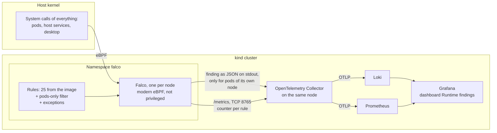

# Update setup 10: Runtime monitoring — Falco in the cluster, findings in Grafana

| | |
| --- | --- |
| Date | 2026-09-30 |
| Status | **Planned, not yet applied** |
| Scope | `/home/leo/dev/kind`, builds on [`update-setup-01.md`](update-setup-01.md) (platform services), [`update-setup-05.md`](update-setup-05.md) (OpenTelemetry Collector, Prometheus, Loki, Grafana), [`update-setup-07.md`](update-setup-07.md) (Harbor mirrors) and [`update-setup-08.md`](update-setup-08.md) (image and configuration scanning). Implements ADR-0031 in [`architecture.md`](architecture.md) |

## Goals

1. **Falco watches what containers do at run time,** on every node, with the
   stable default ruleset of the Falco project.
2. **Monitoring, not enforcement.** Nothing is killed or blocked. Falco cannot
   stop the cluster, and a broken Falco stops nothing.
3. **Only the cluster's pods are reported.** Not the developer's desktop, not
   Harbor, Keycloak, Vault or RustFS, and each finding once.
4. **Findings are visible in Grafana,** through the telemetry path the platform
   already has: as logs in Loki and as counters in Prometheus, on one dashboard.
   No Falcosidekick, no further UI.
5. **Little to maintain.** The rules come from the Falco project with the pinned
   image. The repository holds the filter of goal 3 and a short file of
   exceptions.
6. **It fits the laptop,** with requests set from what was measured.

## What was verified before writing this

Checked on 2026-09-30 with a temporary Falco installation in the running
cluster (chart `falco` 9.2.0, Falco 0.45.0), removed again afterwards. Nothing
of it is in the repository.

### Falco in a kind node

- **The modern eBPF driver works.** The host has kernel 7.0 with BTF; Falco
  logs `Opening 'syscall' source with modern BPF probe`. Nothing is built or
  loaded.
- **Least-privileged mode works.** With `driver.modernEbpf.leastPrivileged:
  true` the pod is not privileged; it gets the capabilities `BPF`, `PERFMON`,
  `SYS_RESOURCE` and `SYS_PTRACE`.
- **The default rules are in the image.** With both falcoctl containers switched
  off (`artifact.install` and `artifact.follow`), Falco loads
  `/etc/falco/falco_rules.yaml` from the image: 25 rules, all tagged
  `maturity_stable`. No download at start or at run time.
- **Falco crashes with the chart defaults:** `Error: could not initialize
  inotify handler`. It watches its configuration files with inotify, and this
  host allows 128 inotify instances per user (a known limit, see `README.md`).
  With `falco.watch_config_files: false` it starts.
- **Falco sees less of the process tree than on a real node.** It logs `disabled
  BPF iterators (not running in the root PID namespace)`, and findings show
  `parent=<NA>`. A node is a container with its own process namespace.

### One kernel, three instances

The expectation of ADR-0031 was measured with `cat /etc/shadow` in a pod on
`dev-worker2` and in a container of the host's Docker (Keycloak's database):

| Without a filter | Reported by |
| --- | --- |
| The read in the pod | all three instances. Only the one on `dev-worker2` names the pod and the image; the other two know the container id and nothing else |
| The read in the host's container | all three instances, none with a name |

So every system call on the machine reaches every instance, and an instance can
only name the containers of its own node.

- **The filter works.** With the condition `and k8s.pod.name exists` appended to
  every rule, the read in the pod was reported once, by the instance on its
  node, and the read in the host's container by none. A second pod on another
  node was reported once by that node's instance.
- **There is no single place for the filter.** Falco has no global condition,
  and the 25 rules share no common macro: 11 use `container`, the rest apply to
  the host as well. The condition has to be appended rule by rule, in a local
  rules file with one `override` entry per rule. The file was loaded from
  `/etc/falco/rules.d` through the chart's `customRules`.
- **The cost is CPU.** Each instance still processes the whole machine's system
  calls before the filter drops the finding: about 2.5 million events in the
  first minutes, 12 % of one core per instance (`falcosecurity_falco_cpu_usage_ratio`),
  no dropped events. Memory is 160 MiB resident per instance, far below the
  chart's 512 Mi request.

### The way into Grafana

- **Logs arrive without any change.** Falco's JSON lines were in Loki within a
  minute, shipped by the OpenTelemetry Collector like every pod log, with the
  labels `k8s_namespace_name`, `k8s_pod_name`, `k8s_container_name` and
  `service_name="falco"`. `| json` in a query gives `rule`, `priority`, `output`
  and the fields of the finding as `output_fields_k8s_pod_name`,
  `output_fields_k8s_ns_name` and so on.
- **Metrics arrive with two annotations.** With `metrics.enabled: true` and the
  pod annotations `prometheus.io/scrape: "true"` and `prometheus.io/port:
  "8765"`, the collector scraped Falco and
  `falcosecurity_falco_rules_matches_total` was in Prometheus, with the labels
  `rule_name`, `priority` and `k8s_node_name`. The priority is a number there
  (4 is Warning). The counter only counts what passed the filter.
- **Images come through Harbor.** `docker.io/falcosecurity/falco:0.45.0` was
  pulled through the `dockerhub` mirror; nothing has to be added.

### Not verified

- The behaviour over hours: which default rules fire on the platform's normal
  work, and therefore which exceptions are needed.
- Rules that depend on a process's parent, given the limited process tree.
- *Terminal shell in container*, which needs a terminal (`kubectl exec -it`).
- What Falco does when an `override` names a rule that no longer exists.
- The dashboard.

## Versions

| Component | Version | Where it is pinned |
| --- | --- | --- |
| Falco chart | 9.2.0 | `platformservices/falco/kustomization.yaml` |
| Falco | 0.45.0 (rules file in the image, engine 0.65) | through the chart |

## How it works



## Decisions

The architecture decision is ADR-0031: Falco for monitoring, without
Falcosidekick. This plan adds the following.

- **A DaemonSet with the pods-only filter,** as measured above. One instance on
  one node would use a third of the CPU but could only name the pods of that
  node, so it is not an alternative.
- **The filter is a file with one override per rule,** `10-pods-only.yaml`. It
  is the one piece that follows the upstream ruleset: a rule added by a new
  Falco version has no filter until it is added here. A check script compares
  the two lists, and the verification runs it.
- **Exceptions in a second file,** `20-exceptions.yaml`, empty at first and
  filled from what the first day shows.
- **No falcoctl:** no init container that downloads rules, no sidecar that
  follows updates. The rules are those of the pinned image.
- **`watch_config_files: false`,** because of the host's inotify limit. A
  changed rules file takes effect with a rollout, which `kubectl apply` of a
  changed ConfigMap does not trigger by itself; the ConfigMap name carries a
  hash for that.
- **Requests from the measurement:** 50m CPU and 192 Mi memory requested, 512 Mi
  limit, no CPU limit.
- **Minimum priority `notice`.** The rule *System user interactive* is
  informational and fires on ordinary work.
- **The namespace is `falco`,** with Istio injection disabled like the other
  platform namespaces.

## Layout

```
platformservices/falco/           # new
├── kustomization.yaml            # chart 9.2.0 and its values
├── namespace.yaml
├── rules/
│   ├── 10-pods-only.yaml         # every rule: only for a pod this instance can name
│   └── 20-exceptions.yaml        # what the platform does normally
└── check-rules.sh                # every rule of the image has its filter
platformservices/monitoring/grafana/dashboards/
└── runtime-findings.json         # new
```

## Step 1: `platformservices/falco/`

`namespace.yaml` creates `falco` with `istio-injection: disabled`.

`kustomization.yaml`:

```yaml
apiVersion: kustomize.config.k8s.io/v1beta1
kind: Kustomization
# Falco (update-setup-10, ADR-0031): runtime monitoring. It reports, it does not block.
# Findings leave through the platform's telemetry path: JSON on stdout to Loki, rule counters
# on /metrics to Prometheus, both through the OpenTelemetry Collector. No Falcosidekick.
namespace: falco
resources:
- namespace.yaml
helmCharts:
- name: falco
  repo: https://falcosecurity.github.io/charts
  version: 9.2.0              # Falco 0.45.0
  releaseName: falco
  namespace: falco
  valuesInline:
    driver:
      # Fixed, not "auto": a kind node cannot load a kernel module. Needs BTF on the host.
      kind: modern_ebpf
      modernEbpf:
        leastPrivileged: true   # capabilities BPF, PERFMON, SYS_RESOURCE, SYS_PTRACE; not privileged
    # The rules are the ones in the pinned image. No download at start, no updates at run time.
    falcoctl:
      artifact:
        install: { enabled: false }
        follow: { enabled: false }
    falco:
      json_output: true
      priority: notice
      # Falco watches its files with inotify; the host allows 128 instances per user, too few
      # with three kind nodes on it. Without this Falco exits with "could not initialize
      # inotify handler". Changed rules arrive with a rollout instead (hashed ConfigMap name).
      watch_config_files: false
    metrics:
      enabled: true             # /metrics on 8765, with a counter per rule
    podAnnotations:
      # The collector on the same node scrapes annotated pods (update-setup-05)
      prometheus.io/scrape: "true"
      prometheus.io/port: "8765"
    resources:
      # Measured: 160 Mi resident, 12 % of a core per instance
      requests: { cpu: 50m, memory: 192Mi }
      limits: { memory: 512Mi }
    mounts:
      volumes:
        - name: local-rules
          configMap:
            name: falco-local-rules
      volumeMounts:
        - name: local-rules
          mountPath: /etc/falco/rules.d
configMapGenerator:
- name: falco-local-rules
  namespace: falco
  files:
  - rules/10-pods-only.yaml
  - rules/20-exceptions.yaml
```

The rules are files here, mounted through the chart's `mounts`, so they can be
read and checked as YAML. The test used the chart's `customRules` value instead,
which puts the same files into the same directory; if `mounts` does not work
with the generated ConfigMap name, `customRules` is the fallback.

## Step 2: The rules

`rules/10-pods-only.yaml`, one entry for each of the 25 rules:

```yaml
# Every Falco instance sees the system calls of the whole machine, because all kind nodes
# share one kernel. Without this file each finding is reported three times, and the host's
# own processes and containers are reported as well. An instance can name a pod only if the
# container runs on its node, so "k8s.pod.name exists" keeps exactly one report per finding
# and drops everything that is not a pod of this cluster.
# One entry per rule of /etc/falco/falco_rules.yaml; check-rules.sh compares the two lists.
- rule: Directory traversal monitored file read
  condition: and k8s.pod.name exists
  override:
    condition: append
- rule: Read sensitive file trusted after startup
  condition: and k8s.pod.name exists
  override:
    condition: append
# ... and so on for all 25
```

The 25 rule names of Falco 0.45.0:

| | | |
| --- | --- | --- |
| Directory traversal monitored file read | Read sensitive file trusted after startup | Read sensitive file untrusted |
| Run shell untrusted | System user interactive | Terminal shell in container |
| Contact K8S API Server From Container | Netcat Remote Code Execution in Container | Search Private Keys or Passwords |
| Clear Log Activities | Remove Bulk Data from Disk | Create Symlink Over Sensitive Files |
| Create Hardlink Over Sensitive Files | Packet socket created in container | Redirect STDOUT/STDIN to Network Connection in Container |
| Linux Kernel Module Injection Detected | Debugfs Launched in Privileged Container | Detect release_agent File Container Escapes |
| PTRACE attached to process | PTRACE anti-debug attempt | Find AWS Credentials |
| Execution from /dev/shm | Drop and execute new binary in container | Disallowed SSH Connection Non Standard Port |
| Fileless execution via memfd_create | | |

`rules/20-exceptions.yaml` starts with a comment only. *Contact K8S API Server
From Container* is the likely first entry: operators do exactly that.
Exceptions are written as `override` entries that append a condition naming the
namespace or image, not by disabling a rule.

`check-rules.sh` reads the rule names from a running Falco pod
(`kubectl -n falco exec ds/falco -- cat /etc/falco/falco_rules.yaml`) and from
`rules/10-pods-only.yaml`, and prints the rules that are in one list and not in
the other. It exits non-zero when they differ.

## Step 3: Wiring

- **`platformservices/deploy.sh`,** a new last step:

  ```bash
  # 9. Runtime monitoring (update-setup-10): Falco reports what containers do. It needs the
  # collector (step 6) for its findings to reach Loki and Prometheus, but runs without it.
  apply falco
  kubectl -n falco rollout status daemonset/falco --timeout=600s
  ```

- **`platformservices/kustomization.yaml`:** add `- falco`.
- **Trivy Operator:** nothing to do; Docker Hub is in its mirror map.

## Step 4: The dashboard

`platformservices/monitoring/grafana/dashboards/runtime-findings.json`, added to
the `configMapGenerator` of `platformservices/monitoring/grafana/kustomization.yaml`
next to `cluster-overview.json`. It lands in the folder *Platform*.

| Panel | Source | Query |
| --- | --- | --- |
| Findings over time, by priority | Prometheus | `sum by (priority) (increase(falcosecurity_falco_rules_matches_total[$__rate_interval]))`, with value mappings for the priority numbers (2 Critical, 3 Error, 4 Warning, 5 Notice) |
| Findings in the selected range, total | Prometheus | `sum(increase(falcosecurity_falco_rules_matches_total[$__range]))` |
| Top rules | Prometheus | `topk(10, sum by (rule_name) (increase(falcosecurity_falco_rules_matches_total[$__range])))` |
| Findings by namespace | Loki | `sum by (output_fields_k8s_ns_name) (count_over_time({k8s_namespace_name="falco"} \| json \| rule != "" [$__range]))` |
| The findings | Loki | `{k8s_namespace_name="falco"} \| json \| rule != "" \| line_format "{{.priority}} {{.rule}} {{.output_fields_k8s_ns_name}}/{{.output_fields_k8s_pod_name}}: {{.output}}"` |
| Falco itself: events per second, dropped events, memory | Prometheus | `rate(falcosecurity_scap_n_evts_total[$__rate_interval])`, `falcosecurity_scap_n_drops_total`, `falcosecurity_falco_memory_rss_bytes`, by `k8s_node_name` |

Variables: namespace and priority, applied to the two Loki panels. The counters
start at zero when a Falco pod restarts, hence `increase` everywhere.

The Loki panels carry a data link from the pod name to that pod's logs in
*Explore*, so a finding leads to what the pod wrote at that time.

## Step 5: Verification

```bash
./deploy.sh
kubectl -n falco get ds,pods -o wide                       # 3/3, one per node
kubectl -n falco get pod -o jsonpath='{.items[0].spec.containers[0].securityContext}'
#   -> capabilities, no "privileged"
kubectl -n falco logs ds/falco | grep -E 'modern BPF|rules.d|Error'
platformservices/falco/check-rules.sh                       # no difference

# 1. a finding in a pod: reported once, by the instance of its node
kubectl -n testapp exec deploy/nginx -- cat /etc/shadow >/dev/null
for p in $(kubectl -n falco get pods -o name); do
  kubectl -n falco logs "$p" --since=1m | grep -c 'Read sensitive file untrusted'
done
#   -> 1, 0, 0 in some order

# 2. the same on the host: reported by nobody
docker exec identity-postgres-1 cat /etc/shadow >/dev/null
sudo cat /etc/shadow >/dev/null
#   -> no new line in any instance

# 3. a shell in a pod
kubectl -n testapp exec -it deploy/nginx -- sh -c 'exit'
#   -> "Terminal shell in container", priority Notice

# 4. in Grafana: dashboard "Runtime findings" shows both, within a minute
# 5. in Prometheus: falcosecurity_falco_rules_matches_total has two series
```

Then leave it running for a day of normal use, including a full `./deploy.sh`, a
backup and restore of `backup-demo`, and a Trivy scan cycle. Every finding that
is normal platform behaviour becomes an entry in `rules/20-exceptions.yaml`;
every other one is looked at.

Also check: the memory of the three pods against the request, the CPU of the
nodes before and after (`docker stats`), that `tests/run.sh` still passes, and
that the Trivy Operator scans the Falco image without pull errors.

## Step 6: Documentation

- **`README.md`:** the list at the top, the layout, a short section *Runtime
  monitoring*: what Falco reports, where to look, how to add an exception, what
  to do after a Falco upgrade (`check-rules.sh`). The inotify limit under *Known
  limitations* gets a second consequence.
- **`architecture.md`:** the section *Security scanning* gets the third layer
  with the diagram above; Falco in the C4 container diagram; the interface
  tables get Falco to the collector (metrics, TCP 8765). ADR-0031 changes to
  *Accepted*, with the measured values and whatever the verification corrected.
- **`update-setup-10.md`:** status, and implementation notes for what differed.

## Known limitations and open points

- **Three instances each process everything.** 12 % of a core per instance was
  measured on a quiet system, about a third of a core in total, for a filter
  that then drops two of three findings. It rises with activity on the laptop,
  including activity that has nothing to do with the cluster. If that is too
  much, Falco can be removed without consequence for anything else:
  `kubectl delete -k` is not enough for a Helm render, so the way is
  `kubectl delete namespace falco` and taking the step out of `deploy.sh`.
- **Falco still reads every system call on the machine,** including the
  desktop's. The filter decides what is reported, not what is seen.
- **The filter follows the upstream ruleset by hand.** A rule added by a new
  Falco version reports three times and includes the host until it has its
  entry. `check-rules.sh` shows the gap; it has to be run after an upgrade.
- **Less process context than on a real node.** Findings show `parent=<NA>`.
  Rules that judge a process by its parents may fire more or less often than
  they should; the day of observation has to show which.
- **No notification.** Findings are on a dashboard; nobody is told. That is the
  monitoring-only decision of ADR-0031.
- **Falco is blind to the host-side services,** by the filter's design. Harbor,
  Keycloak, Vault and RustFS are not monitored at run time.
- **No Kubernetes audit events.** Falco's `k8saudit` source would need an audit
  webhook on the API server and a changed cluster configuration.

## Later

- Falcosidekick, when findings have to go to a chat or to Alertmanager.
- A higher `fs.inotify.max_user_instances` on the host would allow
  `watch_config_files` and removes a limit the README already lists.
- Tetragon, if the need moves from monitoring to enforcement (ADR-0031).
